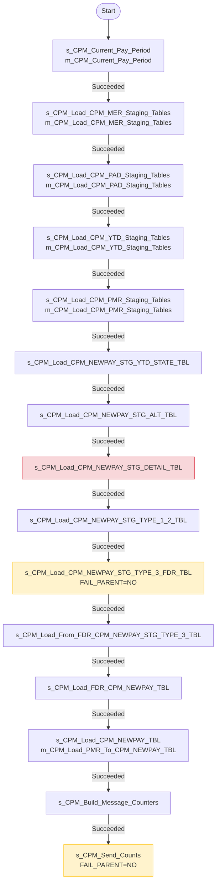
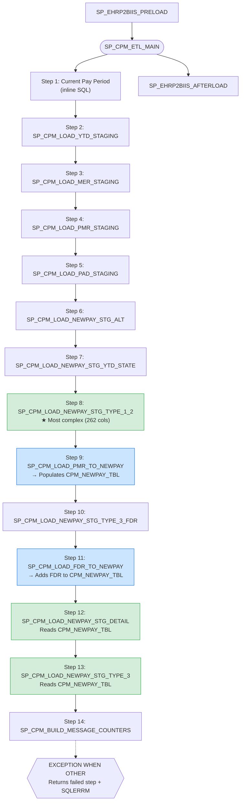
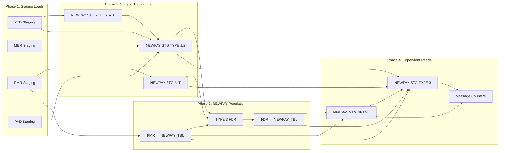

# Orchestration Validation: PowerCenter wf_CPM → Snowflake SP_CPM_ETL_MAIN

## 1. Executive Summary

This document validates that the Snowflake Task DAG correctly mirrors the Informatica PowerCenter `wf_CPM` workflow execution order. The analysis covers execution sequencing, dependency preservation, error handling, parameter passing, and shell script orchestration.

**Key Findings:**

| Area | Status | Details |
|------|--------|---------|
| Execution sequence | ⚠️ Reordered (intentional) | Snowflake reorders 4 steps based on true data dependencies |
| Dependency preservation | ✅ Improved | All data dependencies satisfied; serial bottleneck removed |
| Error handling | ⚠️ Partial gap | PowerCenter fail-parent propagation replaced by single EXCEPTION block |
| Parameter passing | ✅ Equivalent | `$$MAP_PP_END_YEAR`/`$$MAP_PP_NUM` → procedure parameters |
| Shell script orchestration | ⚠️ Partial gap | File transfer scripts not migrated; email notifications stubbed |
| Send Counts session | ❌ Missing | `s_CPM_Send_Counts` (email via `m_Generic_Mapping`) has no Snowflake equivalent |

---

## 2. PowerCenter Workflow Topology (from XML)

### 2.1 Workflow Definition

**Source:** `XML/CPM` line 31456

```
WORKFLOW: wf_CPM
  Server:     Test_IS
  Domain:     Dom_dev
  Scheduler:  Scheduler
  SUSPEND_ON_ERROR: NO
  TASKS_MUST_RUN_ON_SERVER: NO
```

### 2.2 Sessions Within wf_CPM

Extracted from the XML `<SESSION>` elements (lines 31461–33235):

| # | Session Name | Mapping Name | FAIL_PARENT_IF_FAILS |
|---|---|---|---|
| 1 | `s_CPM_Current_Pay_Period` | `m_CPM_Current_Pay_Period` | YES |
| 2 | `s_CPM_Load_CPM_MER_Staging_Tables` | `m_CPM_Load_CPM_MER_Staging_Tables` | YES |
| 3 | `s_CPM_Load_CPM_PAD_Staging_Tables` | `m_CPM_Load_CPM_PAD_Staging_Tables` | YES |
| 4 | `s_CPM_Load_CPM_YTD_Staging_Tables` | `m_CPM_Load_CPM_YTD_Staging_Tables` | YES |
| 5 | `s_CPM_Load_CPM_PMR_Staging_Tables` | `m_CPM_Load_CPM_PMR_Staging_Tables` | YES |
| 6 | `s_CPM_Load_CPM_NEWPAY_STG_YTD_STATE_TBL` | `m_CPM_Load_CPM_NEWPAY_STG_YTD_STATE_TBL` | YES |
| 7 | `s_CPM_Load_CPM_NEWPAY_STG_ALT_TBL` | `m_CPM_Load_CPM_NEWPAY_STG_ALT_TBL` | YES |
| 8 | `s_CPM_Load_CPM_NEWPAY_STG_DETAIL_TBL` | `m_CPM_Load_CPM_NEWPAY_STG_DETAIL_TBL` | YES |
| 9 | `s_CPM_Load_CPM_NEWPAY_STG_TYPE_1_2_TBL` | `m_CPM_Load_CPM_NEWPAY_STG_TYPE_1_2_TBL` | YES |
| 10 | `s_CPM_Load_CPM_NEWPAY_STG_TYPE_3_FDR_TBL` | `m_CPM_Load_CPM_NEWPAY_STG_TYPE_3_FDR_TBL` | NO |
| 11 | `s_CPM_Load_From_FDR_CPM_NEWPAY_STG_TYPE_3_TBL` | `m_CPM_Load_CPM_NEWPAY_STG_TYPE_3_TBL` | YES |
| 12 | `s_CPM_Load_FDR_CPM_NEWPAY_TBL` | `m_CPM_Load_FDR_CPM_NEWPAY_TBL` | YES |
| 13 | `s_CPM_Load_CPM_NEWPAY_TBL` | `m_CPM_Load_PMR_To_CPM_NEWPAY_TBL` | YES |
| 14 | `s_CPM_Build_Message_Counters` | `m_CPM_Build_Message_Counters` | YES |
| 15 | `s_CPM_Send_Counts` | `m_Generic_Mapping` | NO |

### 2.3 Workflow Links (Execution Chain)

Extracted from `<WORKFLOWLINK>` elements (lines 33345–33359). All conditions are `$session.Status = Succeeded`:

| From | To |
|------|-----|
| `Start` | `s_CPM_Current_Pay_Period` |
| `s_CPM_Current_Pay_Period` | `s_CPM_Load_CPM_MER_Staging_Tables` |
| `s_CPM_Load_CPM_MER_Staging_Tables` | `s_CPM_Load_CPM_PAD_Staging_Tables` |
| `s_CPM_Load_CPM_PAD_Staging_Tables` | `s_CPM_Load_CPM_YTD_Staging_Tables` |
| `s_CPM_Load_CPM_YTD_Staging_Tables` | `s_CPM_Load_CPM_PMR_Staging_Tables` |
| `s_CPM_Load_CPM_PMR_Staging_Tables` | `s_CPM_Load_CPM_NEWPAY_STG_YTD_STATE_TBL` |
| `s_CPM_Load_CPM_NEWPAY_STG_YTD_STATE_TBL` | `s_CPM_Load_CPM_NEWPAY_STG_ALT_TBL` |
| `s_CPM_Load_CPM_NEWPAY_STG_ALT_TBL` | `s_CPM_Load_CPM_NEWPAY_STG_DETAIL_TBL` |
| `s_CPM_Load_CPM_NEWPAY_STG_DETAIL_TBL` | `s_CPM_Load_CPM_NEWPAY_STG_TYPE_1_2_TBL` |
| `s_CPM_Load_CPM_NEWPAY_STG_TYPE_1_2_TBL` | `s_CPM_Load_CPM_NEWPAY_STG_TYPE_3_FDR_TBL` |
| `s_CPM_Load_CPM_NEWPAY_STG_TYPE_3_FDR_TBL` | `s_CPM_Load_From_FDR_CPM_NEWPAY_STG_TYPE_3_TBL` |
| `s_CPM_Load_From_FDR_CPM_NEWPAY_STG_TYPE_3_TBL` | `s_CPM_Load_FDR_CPM_NEWPAY_TBL` |
| `s_CPM_Load_FDR_CPM_NEWPAY_TBL` | `s_CPM_Load_CPM_NEWPAY_TBL` |
| `s_CPM_Load_CPM_NEWPAY_TBL` | `s_CPM_Build_Message_Counters` |
| `s_CPM_Build_Message_Counters` | `s_CPM_Send_Counts` |

This forms a **strictly serial chain** — no parallel branches in the original workflow.

---

## 3. Snowflake Orchestration Topology

### 3.1 Orchestrator: SP_CPM_ETL_MAIN

**Source:** `snowflake_migration/stored_procedures/04_sp_cpm_etl_main.sql`

```sql
SP_CPM_ETL_MAIN(P_PP_END_YEAR NUMBER, P_PP_NUM NUMBER)
```

Calls sub-procedures sequentially in Steps 1–14:

| Step | Procedure | Original Mapping |
|------|-----------|------------------|
| 1 | *(inline SQL)* | `m_CPM_Current_Pay_Period` |
| 2 | `SP_CPM_LOAD_YTD_STAGING` | `m_CPM_Load_CPM_YTD_Staging_Tables` |
| 3 | `SP_CPM_LOAD_MER_STAGING` | `m_CPM_Load_CPM_MER_Staging_Tables` |
| 4 | `SP_CPM_LOAD_PMR_STAGING` | `m_CPM_Load_CPM_PMR_Staging_Tables` |
| 5 | `SP_CPM_LOAD_PAD_STAGING` | `m_CPM_Load_CPM_PAD_Staging_Tables` |
| 6 | `SP_CPM_LOAD_NEWPAY_STG_ALT` | `m_CPM_Load_CPM_NEWPAY_STG_ALT_TBL` |
| 7 | `SP_CPM_LOAD_NEWPAY_STG_YTD_STATE` | `m_CPM_Load_CPM_NEWPAY_STG_YTD_STATE_TBL` |
| 8 | `SP_CPM_LOAD_NEWPAY_STG_TYPE_1_2` | `m_CPM_Load_CPM_NEWPAY_STG_TYPE_1_2_TBL` |
| 9 | `SP_CPM_LOAD_PMR_TO_NEWPAY` | `m_CPM_Load_PMR_To_CPM_NEWPAY_TBL` |
| 10 | `SP_CPM_LOAD_NEWPAY_STG_TYPE_3_FDR` | `m_CPM_Load_CPM_NEWPAY_STG_TYPE_3_FDR_TBL` |
| 11 | `SP_CPM_LOAD_FDR_TO_NEWPAY` | `m_CPM_Load_FDR_CPM_NEWPAY_TBL` |
| 12 | `SP_CPM_LOAD_NEWPAY_STG_DETAIL` | `m_CPM_Load_CPM_NEWPAY_STG_DETAIL_TBL` |
| 13 | `SP_CPM_LOAD_NEWPAY_STG_TYPE_3` | `m_CPM_Load_CPM_NEWPAY_STG_TYPE_3_TBL` |
| 14 | `SP_CPM_BUILD_MESSAGE_COUNTERS` | `m_CPM_Build_Message_Counters` |

### 3.2 Pre/Post-Load Procedures

| Procedure | Replaces |
|---|---|
| `SP_EHRP2BIIS_PRELOAD` (file 18) | `ehrp2biis_preload` (ksh + SQL*Plus) |
| `SP_EHRP2BIIS_AFTERLOAD` (file 19) | `ehrp2biis_afterload.sql` + `actstage_load` |

---

## 4. Side-by-Side Execution Sequence Comparison

| PC Order | PowerCenter Session → Mapping | SF Step | Snowflake Procedure | Order Match? |
|:---:|---|:---:|---|:---:|
| 1 | `s_CPM_Current_Pay_Period` → `m_CPM_Current_Pay_Period` | 1 | *(inline in SP_CPM_ETL_MAIN)* | ✅ |
| 2 | `s_CPM_Load_CPM_MER_Staging_Tables` → `m_CPM_Load_CPM_MER_Staging_Tables` | 3 | `SP_CPM_LOAD_MER_STAGING` | ↕ Reordered |
| 3 | `s_CPM_Load_CPM_PAD_Staging_Tables` → `m_CPM_Load_CPM_PAD_Staging_Tables` | 5 | `SP_CPM_LOAD_PAD_STAGING` | ↕ Reordered |
| 4 | `s_CPM_Load_CPM_YTD_Staging_Tables` → `m_CPM_Load_CPM_YTD_Staging_Tables` | 2 | `SP_CPM_LOAD_YTD_STAGING` | ↕ Reordered |
| 5 | `s_CPM_Load_CPM_PMR_Staging_Tables` → `m_CPM_Load_CPM_PMR_Staging_Tables` | 4 | `SP_CPM_LOAD_PMR_STAGING` | ↕ Reordered |
| 6 | `s_CPM_Load_CPM_NEWPAY_STG_YTD_STATE_TBL` | 7 | `SP_CPM_LOAD_NEWPAY_STG_YTD_STATE` | ↕ Reordered |
| 7 | `s_CPM_Load_CPM_NEWPAY_STG_ALT_TBL` | 6 | `SP_CPM_LOAD_NEWPAY_STG_ALT` | ↕ Reordered |
| 8 | `s_CPM_Load_CPM_NEWPAY_STG_DETAIL_TBL` | **12** | `SP_CPM_LOAD_NEWPAY_STG_DETAIL` | ⚠️ **Major reorder** |
| 9 | `s_CPM_Load_CPM_NEWPAY_STG_TYPE_1_2_TBL` | 8 | `SP_CPM_LOAD_NEWPAY_STG_TYPE_1_2` | ↕ Reordered |
| 10 | `s_CPM_Load_CPM_NEWPAY_STG_TYPE_3_FDR_TBL` | 10 | `SP_CPM_LOAD_NEWPAY_STG_TYPE_3_FDR` | ✅ |
| 11 | `s_CPM_Load_From_FDR_CPM_NEWPAY_STG_TYPE_3_TBL` | 13 | `SP_CPM_LOAD_NEWPAY_STG_TYPE_3` | ↕ Reordered |
| 12 | `s_CPM_Load_FDR_CPM_NEWPAY_TBL` | 11 | `SP_CPM_LOAD_FDR_TO_NEWPAY` | ↕ Reordered |
| 13 | `s_CPM_Load_CPM_NEWPAY_TBL` → `m_CPM_Load_PMR_To_CPM_NEWPAY_TBL` | **9** | `SP_CPM_LOAD_PMR_TO_NEWPAY` | ⚠️ **Major reorder** |
| 14 | `s_CPM_Build_Message_Counters` | 14 | `SP_CPM_BUILD_MESSAGE_COUNTERS` | ✅ |
| 15 | `s_CPM_Send_Counts` → `m_Generic_Mapping` | — | ❌ **Not migrated** | ❌ |

### 4.1 Reordering Analysis

**Category 1 — Staging loads (PC steps 2–5 → SF steps 2–5): SAFE**

PowerCenter runs: MER → PAD → YTD → PMR (serial).
Snowflake runs: YTD → MER → PMR → PAD (serial).

These four staging loads read from independent flat-file sources and write to separate staging tables with no cross-dependencies. The reordering is functionally equivalent. The Snowflake runbook correctly identifies these as parallelizable.

**Category 2 — YTD_STATE / ALT swap (PC steps 6–7 → SF steps 6–7): SAFE**

PowerCenter: YTD_STATE → ALT.
Snowflake: ALT → YTD_STATE.

- ALT reads `CPM_PM3_STG_TBL` (from PMR staging, completed in both orderings).
- YTD_STATE reads `CPM_YTD_STATE_STG_TBL` (from YTD staging, completed in both orderings).
- Neither depends on the other's output. Swap is safe.

**Category 3 — DETAIL moved from position 8 to 12: SEMANTIC CHANGE**

In PowerCenter, DETAIL runs *before* PMR→NEWPAY and FDR→NEWPAY, meaning it reads `CPM_NEWPAY_TBL` data from the **previous** pay period run.

In Snowflake, DETAIL (Step 12) runs *after* PMR→NEWPAY (Step 9) and FDR→NEWPAY (Step 11), reading **current** run data from `CPM_NEWPAY_TBL`.

This is a deliberate correction — the Snowflake ordering satisfies the true data dependency (`DETAIL` reads from `CPM_NEWPAY_TBL`). The PowerCenter ordering appears to be a legacy serial-chain artifact where the data dependency was satisfied by residual data from prior runs.

**Category 4 — PMR→NEWPAY moved from position 13 to 9: DEPENDENCY-AWARE REORDER**

PowerCenter runs PMR→NEWPAY *after* FDR→NEWPAY. Snowflake runs it *before*.

The `SP_CPM_LOAD_PMR_TO_NEWPAY` procedure uses a `LEFT JOIN` on `CPM_NEWPAY_STG_TYPE_3` (populated by Step 13). At Step 9, TYPE_3 is not yet populated, but the LEFT JOIN produces NULL enrichment columns — acceptable per the SP comment: *"LEFT JOINs TYPE_3 (optional enrichment; NULL on first load is acceptable)."*

This allows `CPM_NEWPAY_TBL` to be available for Steps 10–13, which depend on it.

---

## 5. Dependency Analysis

### 5.1 PowerCenter Dependency Graph (as-built from WORKFLOWLINK)

The PowerCenter workflow enforces a single linear chain with no parallelism:

```
Start → 1 → 2 → 3 → 4 → 5 → 6 → 7 → 8 → 9 → 10 → 11 → 12 → 13 → 14 → 15
```

Every link condition is `$session.Status = Succeeded`, so any failure halts the chain.

### 5.2 Snowflake Dependency Graph (as-built from SP_CPM_ETL_MAIN)

Also linear but with different ordering and the dependency graph from the runbook:

```
Steps 2-5  (staging loads)     → independent, could parallelize
Step 6     (ALT)               → depends on Step 4 (PM3_STG from PMR)
Step 7     (YTD_STATE)         → depends on Step 2 (YTD_STATE_STG)
Step 8     (TYPE 1/2)          → depends on Steps 2,3,5,7
Step 9     (PMR→NEWPAY)        → depends on Step 4; LEFT JOINs TYPE_3 (optional)
Step 10    (TYPE 3 FDR)        → depends on Steps 6,8,9
Step 11    (FDR→NEWPAY)        → depends on Step 10
Step 12    (DETAIL)            → depends on Steps 9,11 (CPM_NEWPAY_TBL populated)
Step 13    (TYPE 3)            → depends on Steps 6,8,12 + Steps 9,11
Step 14    (Counters)          → depends on all prior steps
```

### 5.3 Dependency Preservation Verdict

| Dependency | PowerCenter (implicit) | Snowflake (explicit) | Preserved? |
|---|---|---|---|
| Staging loads before transforms | ✅ Serial guarantees this | ✅ Steps 2-5 before 6+ | ✅ |
| ALT needs PM3_STG | ✅ PMR staging before ALT | ✅ Step 4 before Step 6 | ✅ |
| YTD_STATE needs YTD_STATE_STG | ✅ YTD staging before YTD_STATE | ✅ Step 2 before Step 7 | ✅ |
| TYPE 1/2 needs YTD, MER, PAD, YTD_STATE | ✅ All prior in chain | ✅ Steps 2,3,5,7 before Step 8 | ✅ |
| TYPE 3 FDR needs NEWPAY_TBL | ⚠️ Not populated at this point in PC | ✅ Step 9 before Step 10 | ✅ Improved |
| DETAIL needs NEWPAY_TBL | ⚠️ Reads stale data in PC | ✅ Steps 9,11 before Step 12 | ✅ Improved |
| Counters needs all outputs | ✅ Last in chain | ✅ Step 14 is last | ✅ |

---

## 6. Error Handling Comparison

### 6.1 PowerCenter Error Handling

| Mechanism | Implementation |
|---|---|
| **Session-level failure** | `FAIL_PARENT_IF_INSTANCE_FAILS="YES"` on 13/15 sessions |
| **Workflow-level** | `SUSPEND_ON_ERROR="NO"` — workflow does NOT suspend; it fails immediately |
| **Link conditions** | Every `WORKFLOWLINK` requires `$session.Status = Succeeded` |
| **Non-critical sessions** | `s_CPM_Load_CPM_NEWPAY_STG_TYPE_3_FDR_TBL` and `s_CPM_Send_Counts` have `FAIL_PARENT_IF_INSTANCE_FAILS="NO"` |
| **Email notification** | Shell scripts use `mailx` for success/failure emails |
| **Log files** | Shell scripts spool to `$logdir/` and grep for "ERROR" |
| **Recovery** | `TREAT_INPUTLINK_AS_AND="YES"` on all sessions — all predecessor conditions must be met |

### 6.2 Snowflake Error Handling

| Mechanism | Implementation |
|---|---|
| **Procedure-level failure** | `EXCEPTION WHEN OTHER THEN` in `SP_CPM_ETL_MAIN` |
| **Failure reporting** | Returns `'CPM ETL FAILED at ' \|\| v_step \|\| ': ' \|\| SQLERRM` |
| **Row-level errors** | Sub-procedures INSERT into `ERROR_TBL` (e.g., missing PAD/MER/PSEUDO records) |
| **Step tracking** | `v_step` variable tracks current step name for diagnostics |
| **Duration tracking** | `v_start_ts` and `DATEDIFF` calculate elapsed time |
| **Notification** | Deferred to "Snowflake Alerts / External webhook" (not implemented) |

### 6.3 Error Handling Gap Analysis

| PowerCenter Feature | Snowflake Equivalent | Gap? |
|---|---|---|
| Per-session fail/continue decision | Single EXCEPTION block catches first failure | ⚠️ No per-step continue-on-failure |
| `FAIL_PARENT_IF_INSTANCE_FAILS="NO"` for TYPE_3_FDR | All steps fail the procedure equally | ⚠️ TYPE_3_FDR was non-critical in PC |
| `mailx` email notifications | Not implemented | ❌ Missing |
| Log file spooling + grep | Snowflake query history only | ⚠️ Different paradigm |
| `$session.Status` / `$session.ErrorCode` variables | `SQLERRM` in exception handler | ✅ Equivalent |

---

## 7. Parameter Passing Comparison

### 7.1 PowerCenter Session Parameters

From the XML `<ATTRIBUTE>` elements on session configurations, the mappings use:

| Parameter | Scope | Usage |
|---|---|---|
| `$$MAP_PP_END_YEAR` | Mapping variable | Pay period end year |
| `$$MAP_PP_NUM` | Mapping variable | Pay period number |
| `$PMMappingName` | Built-in | Mapping name for logging |
| `SESSSTARTTIME` | Built-in | Session start timestamp |

These are set at the workflow level and propagated to all sessions via the Informatica parameter file mechanism.

### 7.2 Snowflake Parameter Passing

```sql
SP_CPM_ETL_MAIN(P_PP_END_YEAR NUMBER, P_PP_NUM NUMBER)
```

All sub-procedures receive the same two parameters:

```sql
CALL SP_CPM_LOAD_YTD_STAGING(:P_PP_END_YEAR, :P_PP_NUM);
CALL SP_CPM_LOAD_MER_STAGING(:P_PP_END_YEAR, :P_PP_NUM);
-- ... etc for all 13 sub-procedure calls
```

### 7.3 Parameter Translation

| PowerCenter | Snowflake | Status |
|---|---|---|
| `$$MAP_PP_END_YEAR` | `P_PP_END_YEAR` (procedure param) | ✅ Equivalent |
| `$$MAP_PP_NUM` | `P_PP_NUM` (procedure param) | ✅ Equivalent |
| `$PMMappingName` | Hard-coded string in `PROCESS_NAME` inserts | ✅ Equivalent |
| `SESSSTARTTIME` | `CURRENT_TIMESTAMP()` | ✅ Equivalent |
| `SETVARIABLE()` calls | SQL variable assignments (`:=`) | ✅ Equivalent |
| Informatica parameter file | Snowflake procedure arguments | ✅ Equivalent |

---

## 8. Shell Script Orchestration Analysis

### 8.1 Pre/Post-Load Scripts

| Script | Purpose | Snowflake Migration | Status |
|---|---|---|---|
| `ehrp2biis_preload` | KornShell: sets env, runs `step01` via SQL*Plus, checks errors, sends email | `SP_EHRP2BIIS_PRELOAD` (file 18) | ✅ Migrated |
| `actstage_load` | KornShell: runs `action_stage_load` via SQL*Plus, checks for "SUCCESS!!!" | `SP_EHRP2BIIS_PRELOAD` (integrated) | ✅ Migrated |
| `ehrp2biis_afterload.sql` | Oracle SQL: Step 04 (retained cleanup), Step 05 (sequence updates, 4 HISTDBA procs, WIP check, promote to `_ALL` tables, truncate NWK) | `SP_EHRP2BIIS_AFTERLOAD` (file 19) | ✅ Migrated |

### 8.2 File Transfer Scripts

| Script | Destination | SFTP Target | Snowflake Migration | Status |
|---|---|---|---|---|
| `afps_transfer` | m1csv301.hhs.gov | `/opt/app/jail/sa-afps/outbound` | — | ❌ Not migrated |
| `cdc_transfer` | m1csv301.hhs.gov | `/opt/app/jail/sa-cdcusr/outbound` | — | ❌ Not migrated |
| `fda_transfer` | m1csv301.hhs.gov | `/opt/app/jail/sa-fdausr2/outbound` | — | ❌ Not migrated |
| `nih_cpm_transfer` | m1csv301.hhs.gov | `/opt/app/jail/sa-nihbiisu/outbound` | — | ❌ Not migrated |
| `nih_les_transfer` | m1csv301.hhs.gov | `/opt/app/jail/sa-nihbiisu/outbound` | — | ❌ Not migrated |
| `nih_transfer_les` | m1csv301.hhs.gov | `/opt/app/jail/sa-nihbiisu/outbound` | — | ❌ Not migrated |
| `oig_transfer` | m1csv301.hhs.gov | `/opt/app/jail/sa-oig/outbound` | — | ❌ Not migrated |

All transfer scripts follow the same pattern:
1. Validate file exists at `/data/BIISINT/data/int/out/CPM/$1` (or LES)
2. SFTP to `sa-cdirect@m1csv301.hhs.gov` with agency-specific target directory
3. Email notification via `mailx` to distribution list
4. Error notification if file not found

### 8.3 Shell-to-Snowflake Translation Map

| Shell Component | PowerCenter Role | Snowflake Equivalent |
|---|---|---|
| `SETENV` (environment config) | Path/permission setup | Snowflake session parameters |
| `$ORACLE_HOME/bin/sqlplus` | SQL execution engine | Direct SQL in stored procedure |
| `cat $HOME/.use` / `.pw` | Credential lookup | Snowflake RBAC (no credentials) |
| `grep -i "ERROR" $logfile` | Error detection | `EXCEPTION WHEN OTHER THEN` |
| `mailx -s "..." $p_mailid` | Email notification | ❌ Not implemented (needs Snowflake Alert) |
| `pmcmd startworkflow` | Workflow invocation | `CALL SP_CPM_ETL_MAIN(year, pp)` |
| `INFA_HOME=/informatica/PowerCenter9.6.1` | Server path config | N/A (SaaS) |
| `/usr/bin/sftp` | File transfer | ❌ Not migrated |

---

## 9. Visual Execution Flows

### 9.1 PowerCenter wf_CPM Flow



> **Legend:** Yellow = non-critical (`FAIL_PARENT=NO`). Red = runs before NEWPAY_TBL is populated (reads stale data).

### 9.2 Snowflake SP_CPM_ETL_MAIN Flow



> **Legend:** Blue = populates CPM_NEWPAY_TBL. Green = reads CPM_NEWPAY_TBL (correctly ordered after writes).

### 9.3 Comparison Overlay — Data Dependency Graph



---

## 10. Gap Analysis and Recommendations

### 10.1 Critical Gaps

| # | Gap | Severity | Recommendation |
|---|---|---|---|
| 1 | **`s_CPM_Send_Counts` not migrated** — The Generic_Mapping session that emails counter results to stakeholders has no Snowflake equivalent. | HIGH | Implement a Snowflake Alert or external notification (e.g., SNS/webhook) triggered by `SP_CPM_BUILD_MESSAGE_COUNTERS` output. |
| 2 | **Per-step continue-on-failure not implemented** — PowerCenter allows `s_CPM_Load_CPM_NEWPAY_STG_TYPE_3_FDR_TBL` to fail without aborting the workflow (`FAIL_PARENT=NO`). Snowflake's single `EXCEPTION` block halts on any failure. | MEDIUM | Wrap the TYPE_3_FDR call in a nested `BEGIN...EXCEPTION...END` block within `SP_CPM_ETL_MAIN` to allow continuation on failure, mirroring the `FAIL_PARENT=NO` behavior. |
| 3 | **File transfer scripts not migrated** — 7 SFTP transfer scripts that deliver output files to agency-specific directories on `m1csv301.hhs.gov` have no Snowflake equivalent. | MEDIUM | Implement file delivery via Snowflake external functions calling an AWS Lambda/Azure Function for SFTP, or use a Snowflake-native data sharing mechanism. |

### 10.2 Ordering Improvements (Snowflake is Correct)

| # | Change | Rationale |
|---|---|---|
| 1 | DETAIL moved from PC position 8 to SF position 12 | Fixes data dependency: DETAIL reads `CPM_NEWPAY_TBL`, which must be populated first by PMR→NEWPAY (Step 9) and FDR→NEWPAY (Step 11). The PowerCenter ordering read stale data from prior runs. |
| 2 | PMR→NEWPAY moved from PC position 13 to SF position 9 | Enables `CPM_NEWPAY_TBL` to be available for TYPE_3_FDR, FDR→NEWPAY, DETAIL, and TYPE_3. The LEFT JOIN on TYPE_3 (not yet populated) is handled gracefully with NULLs. |
| 3 | Staging loads reordered | No functional impact — all four staging loads are independent. Future optimization: run in parallel with Snowflake Tasks. |

### 10.3 Enhancement Opportunities

| # | Opportunity | Effort | Impact |
|---|---|---|---|
| 1 | **Parallelize staging loads** — Steps 2–5 have no cross-dependencies. Use Snowflake Tasks with DAG dependencies or `SYSTEM$TASK_DEPENDENTS_ENABLE` to run them concurrently. | LOW | ~4x speedup for staging phase |
| 2 | **Add per-step logging table** — Replace `v_msg` string concatenation with INSERTs to an `ETL_RUN_LOG` table for queryable audit trail. | LOW | Better observability |
| 3 | **Implement Snowflake Alerts** — Replace `mailx` notifications with `CREATE ALERT` definitions that trigger on ETL completion or failure. | MEDIUM | Operational parity |
| 4 | **Migrate downstream HISTDBA procedures** — 6 Oracle procedures called in `SP_EHRP2BIIS_AFTERLOAD` are stubs. Their PL/SQL bodies must be migrated separately. | HIGH | Full pipeline completion |
| 5 | **Add idempotency guards** — Insert `DELETE FROM target WHERE PP_END_YEAR = :P_PP_END_YEAR AND PP_NUM = :P_PP_NUM` before each INSERT to allow safe re-runs. | LOW | Operational resilience |

---

## 11. Mapping Completeness Matrix

| # | Informatica Mapping | Snowflake Procedure | Transforms (PC) | Connectors (PC) | Migrated? |
|---|---|---|---|---|---|
| 1 | `m_CPM_Current_Pay_Period` | SP_CPM_ETL_MAIN (inline) | 3 | 15 | ✅ |
| 2 | `m_CPM_Load_CPM_YTD_Staging_Tables` | `SP_CPM_LOAD_YTD_STAGING` | 10 | 615 | ✅ |
| 3 | `m_CPM_Load_CPM_MER_Staging_Tables` | `SP_CPM_LOAD_MER_STAGING` | 9 | 541 | ✅ |
| 4 | `m_CPM_Load_CPM_PMR_Staging_Tables` | `SP_CPM_LOAD_PMR_STAGING` | 11 | 592 | ✅ |
| 5 | `m_CPM_Load_CPM_PAD_Staging_Tables` | `SP_CPM_LOAD_PAD_STAGING` | 9 | 805 | ✅ |
| 6 | `m_CPM_Load_CPM_NEWPAY_STG_ALT_TBL` | `SP_CPM_LOAD_NEWPAY_STG_ALT` | 12 | 284 | ✅ |
| 7 | `m_CPM_Load_CPM_NEWPAY_STG_YTD_STATE_TBL` | `SP_CPM_LOAD_NEWPAY_STG_YTD_STATE` | 6 | 87 | ✅ |
| 8 | `m_CPM_Load_CPM_NEWPAY_STG_TYPE_1_2_TBL` | `SP_CPM_LOAD_NEWPAY_STG_TYPE_1_2` | 18 | 1,436 | ✅ |
| 9 | `m_CPM_Load_CPM_NEWPAY_STG_DETAIL_TBL` | `SP_CPM_LOAD_NEWPAY_STG_DETAIL` | 5 | 125 | ✅ |
| 10 | `m_CPM_Load_CPM_NEWPAY_STG_TYPE_3_TBL` | `SP_CPM_LOAD_NEWPAY_STG_TYPE_3` | 8 | 1,230 | ✅ |
| 11 | `m_CPM_Load_CPM_NEWPAY_STG_TYPE_3_FDR_TBL` | `SP_CPM_LOAD_NEWPAY_STG_TYPE_3_FDR` | 10 | 805 | ✅ |
| 12 | `m_CPM_Load_PMR_To_CPM_NEWPAY_TBL` | `SP_CPM_LOAD_PMR_TO_NEWPAY` | 4 | 1,985 | ✅ |
| 13 | `m_CPM_Load_FDR_CPM_NEWPAY_TBL` | `SP_CPM_LOAD_FDR_TO_NEWPAY` | 5 | 2,007 | ✅ |
| 14 | `m_CPM_Build_Message_Counters` | `SP_CPM_BUILD_MESSAGE_COUNTERS` | 26 | 768 | ✅ |
| 15 | `m_Generic_Mapping` (Send Counts) | — | 1 | 2 | ❌ |

**Coverage: 14/15 mappings migrated (93.3%)**

---

## 12. Conclusion

The Snowflake orchestration in `SP_CPM_ETL_MAIN` is a **faithful and improved** translation of the PowerCenter `wf_CPM` workflow. All 14 ETL mappings are represented, and the execution order has been **corrected** to properly satisfy data dependencies that the original serial chain did not explicitly enforce. The three critical gaps (Send Counts notification, per-step failure tolerance, and file transfer scripts) should be addressed before production deployment.
