# PowerCenter Data Lineage

Source-to-target data flow documentation for all mappings in the Informatica PowerCenter XML exports.
Each mapping section shows the source(s), transformation chain, and target(s) derived from CONNECTOR elements.

---

## COMPTIME

- **Repository**: `Test_Repo_Srvc`
- **Folder**: `COMP_TIME`

### `m_COMPTIME_Build_Message_Counters`

**Source(s):** U0287D01

**Target(s):** COUNTER_TBL, COMPTIME_MESSAGE_FILE

**Transformation Chain:**

1. U0287D01 (Source Definition)
2. SQ_U0287D01 (Source Qualifier)
3. exp_Initial (Expression)
4. fil_Detail (Filter)
5. agg_ALL_RECORDS (Aggregator)
6. exp_Detail_Count (Expression)
7. lkp_PAY_PERIOD (Lookup Procedure)
8. exp_Counters (Expression)
9. exp_Build_Message (Expression)
10. exp_Final (Expression)
11. exp_Final_Message (Expression)
12. COUNTER_TBL (Target Definition)
13. COMPTIME_MESSAGE_FILE (Target Definition)

<details>
<summary>Connector Details</summary>

| From Instance | To Instance |
|--------------|-------------|
| exp_Final | COUNTER_TBL |
| exp_Final_Message | COMPTIME_MESSAGE_FILE |
| exp_Build_Message | exp_Final_Message |
| exp_Counters | exp_Build_Message |
| exp_Initial | fil_Detail |
| fil_Detail | agg_ALL_RECORDS |
| SQ_U0287D01 | exp_Initial |
| agg_ALL_RECORDS | exp_Detail_Count |
| exp_Detail_Count | exp_Counters |
| exp_Detail_Count | lkp_PAY_PERIOD |
| lkp_PAY_PERIOD | exp_Counters |
| exp_Counters | exp_Final |
| U0287D01 | SQ_U0287D01 |

</details>

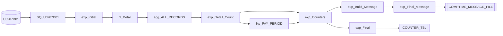

### `m_COMPTIME_Load_COMP_TIME_DAILY_TBL`

**Source(s):** U0287D01

**Target(s):** COMP_TIME_DAILY_TBL

**Transformation Chain:**

1. U0287D01 (Source Definition)
2. SQ_U0287D01 (Source Qualifier)
3. exp_Initial (Expression)
4. fil_Valid_Records (Filter)
5. lkp_PAY_PERIOD (Lookup Procedure)
6. exp_Convert (Expression)
7. exp_Final (Expression)
8. COMP_TIME_DAILY_TBL (Target Definition)

<details>
<summary>Connector Details</summary>

| From Instance | To Instance |
|--------------|-------------|
| exp_Final | COMP_TIME_DAILY_TBL |
| U0287D01 | SQ_U0287D01 |
| SQ_U0287D01 | exp_Initial |
| exp_Initial | fil_Valid_Records |
| exp_Convert | exp_Final |
| fil_Valid_Records | lkp_PAY_PERIOD |
| lkp_PAY_PERIOD | exp_Convert |
| fil_Valid_Records | exp_Convert |

</details>

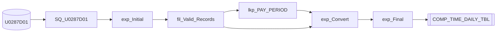

### `m_COMPTIME_Current_Pay_Period`

**Source(s):** PAY_PERIOD

**Target(s):** COMP_TIME_DATE_FILE

**Transformation Chain:**

1. PAY_PERIOD (Source Definition)
2. SQ_PAY_PERIOD (Source Qualifier)
3. exp_Build_Pay_Period (Expression)
4. exp_Final (Expression)
5. COMP_TIME_DATE_FILE (Target Definition)

<details>
<summary>Connector Details</summary>

| From Instance | To Instance |
|--------------|-------------|
| exp_Final | COMP_TIME_DATE_FILE |
| PAY_PERIOD | SQ_PAY_PERIOD |
| SQ_PAY_PERIOD | exp_Build_Pay_Period |
| exp_Build_Pay_Period | exp_Final |

</details>

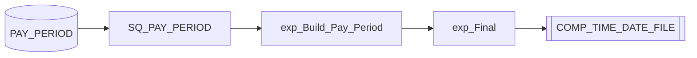

---

## CPM

- **Repository**: `Test_Repo_Srvc`
- **Folder**: `CPM`

### `m_CPM_Current_Pay_Period`

**Source(s):** PAY_PERIOD

**Target(s):** CPM_PAY_PERIOD_DATE_FILE

**Transformation Chain:**

1. PAY_PERIOD (Source Definition)
2. SQ_PAY_PERIOD (Source Qualifier)
3. exp_Build_Pay_Period (Expression)
4. exp_Final (Expression)
5. CPM_PAY_PERIOD_DATE_FILE (Target Definition)

<details>
<summary>Connector Details</summary>

| From Instance | To Instance |
|--------------|-------------|
| exp_Final | CPM_PAY_PERIOD_DATE_FILE |
| PAY_PERIOD | SQ_PAY_PERIOD |
| SQ_PAY_PERIOD | exp_Build_Pay_Period |
| exp_Build_Pay_Period | exp_Final |

</details>

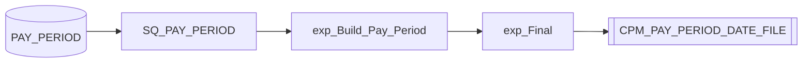

### `m_CPM_Load_CPM_NEWPAY_STG_ALT_TBL`

**Source(s):** CPM_PM3_STG_TBL

**Target(s):** ERROR_TBL, CPM_NEWPAY_STG_ALT_TBL

**Transformation Chain:**

1. CPM_PM3_STG_TBL (Source Definition)
2. SQ_CPM_PM3_STG_TBL (Source Qualifier)
3. exp_Initial (Expression)
4. lkp_PSEUDOSSN_TBL (Lookup Procedure)
5. exp_Determine_Allotments (Expression)
6. agg_Allotments (Aggregator)
7. fil_Bad_Records (Filter)
8. exp_Convert (Expression)
9. nrm_Errors (Normalizer)
10. mplt_Convert_Num_To_Prec7 (Mapplet)
11. fil_Error_Message (Filter)
12. exp_Stage_Converted_Fields (Expression)
13. exp_Final_Errors (Expression)
14. exp_Final (Expression)
15. ERROR_TBL (Target Definition)
16. CPM_NEWPAY_STG_ALT_TBL (Target Definition)

<details>
<summary>Connector Details</summary>

| From Instance | To Instance |
|--------------|-------------|
| exp_Final_Errors | ERROR_TBL |
| exp_Final | CPM_NEWPAY_STG_ALT_TBL |
| nrm_Errors | fil_Error_Message |
| fil_Error_Message | exp_Final_Errors |
| exp_Determine_Allotments | fil_Bad_Records |
| fil_Bad_Records | nrm_Errors |
| CPM_PM3_STG_TBL | SQ_CPM_PM3_STG_TBL |
| SQ_CPM_PM3_STG_TBL | exp_Initial |
| exp_Initial | exp_Determine_Allotments |
| exp_Initial | lkp_PSEUDOSSN_TBL |
| exp_Convert | exp_Final |
| exp_Stage_Converted_Fields | exp_Final |
| lkp_PSEUDOSSN_TBL | exp_Determine_Allotments |
| exp_Determine_Allotments | agg_Allotments |
| agg_Allotments | exp_Convert |
| exp_Convert | mplt_Convert_Num_To_Prec7 |
| mplt_Convert_Num_To_Prec7 | exp_Stage_Converted_Fields |

</details>

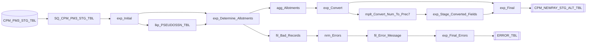

### `m_CPM_Load_CPM_YTD_Staging_Tables`

**Source(s):** YTD_FILE

**Target(s):** CPM_YTD_DETAIL_STG_TBL, CPM_YTD_HEADER_STG_TBL, CPM_YTD_STATE_STG_TBL

**Transformation Chain:**

1. YTD_FILE (Source Definition)
2. Norm_YTD_FILE (Normalizer)
3. exp_Initial (Expression)
4. rtr_YTD_Records (Router)
5. exp_Convert (Expression)
6. exp_Final_YTD_Detail (Expression)
7. exp_Final_YTD_State (Expression)
8. lkp_Current_Pay_Period (Lookup Procedure)
9. lkp_Pay_Period_Record_Date (Lookup Procedure)
10. exp_Verify_Header_Date (Expression)
11. exp_Final_YTD_Header (Expression)
12. CPM_YTD_DETAIL_STG_TBL (Target Definition)
13. CPM_YTD_STATE_STG_TBL (Target Definition)
14. CPM_YTD_HEADER_STG_TBL (Target Definition)

<details>
<summary>Connector Details</summary>

| From Instance | To Instance |
|--------------|-------------|
| exp_Final_YTD_Detail | CPM_YTD_DETAIL_STG_TBL |
| exp_Final_YTD_Header | CPM_YTD_HEADER_STG_TBL |
| exp_Final_YTD_State | CPM_YTD_STATE_STG_TBL |
| rtr_YTD_Records | exp_Final_YTD_Detail |
| lkp_Current_Pay_Period | exp_Verify_Header_Date |
| exp_Convert | lkp_Current_Pay_Period |
| lkp_Pay_Period_Record_Date | exp_Verify_Header_Date |
| exp_Convert | lkp_Pay_Period_Record_Date |
| exp_Convert | exp_Verify_Header_Date |
| rtr_YTD_Records | exp_Convert |
| exp_Verify_Header_Date | exp_Final_YTD_Header |
| YTD_FILE | Norm_YTD_FILE |
| Norm_YTD_FILE | exp_Initial |
| exp_Initial | rtr_YTD_Records |
| rtr_YTD_Records | exp_Final_YTD_State |

</details>

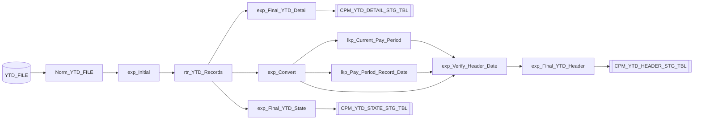

### `m_CPM_Load_CPM_NEWPAY_STG_YTD_STATE_TBL`

**Source(s):** CPM_YTD_STATE_STG_TBL

**Target(s):** CPM_NEWPAY_STG_YTD_STATE_TBL

**Transformation Chain:**

1. CPM_YTD_STATE_STG_TBL (Source Definition)
2. SQ_CPM_YTD_STATE_STG_TBL (Source Qualifier)
3. exp_Initial (Expression)
4. exp_Determine_YTD_States (Expression)
5. agg_YTD_State (Aggregator)
6. mplt_Convert_Num_To_Prec7 (Mapplet)
7. exp_Stage_Converted_Fields (Expression)
8. exp_Final (Expression)
9. CPM_NEWPAY_STG_YTD_STATE_TBL (Target Definition)

<details>
<summary>Connector Details</summary>

| From Instance | To Instance |
|--------------|-------------|
| exp_Final | CPM_NEWPAY_STG_YTD_STATE_TBL |
| SQ_CPM_YTD_STATE_STG_TBL | exp_Initial |
| exp_Initial | exp_Determine_YTD_States |
| agg_YTD_State | exp_Final |
| exp_Stage_Converted_Fields | exp_Final |
| exp_Determine_YTD_States | agg_YTD_State |
| agg_YTD_State | mplt_Convert_Num_To_Prec7 |
| CPM_YTD_STATE_STG_TBL | SQ_CPM_YTD_STATE_STG_TBL |
| mplt_Convert_Num_To_Prec7 | exp_Stage_Converted_Fields |

</details>

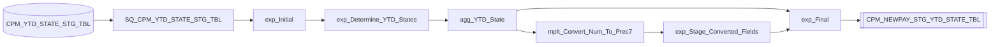

### `m_CPM_Load_CPM_MER_Staging_Tables`

**Source(s):** MER_FILE

**Target(s):** CPM_MER_DETAIL_STG_TBL, CPM_MER_HEADER_STG_TBL

**Transformation Chain:**

1. MER_FILE (Source Definition)
2. Norm_MER_FILE (Normalizer)
3. exp_Initial (Expression)
4. rtr_MER_Records (Router)
5. exp_Convert (Expression)
6. exp_Final_MER_Detail (Expression)
7. lkp_Current_Pay_Period (Lookup Procedure)
8. lkp_Pay_Period_Record_Date (Lookup Procedure)
9. exp_Verify_Header_Date (Expression)
10. exp_Final_MER_Header (Expression)
11. CPM_MER_DETAIL_STG_TBL (Target Definition)
12. CPM_MER_HEADER_STG_TBL (Target Definition)

<details>
<summary>Connector Details</summary>

| From Instance | To Instance |
|--------------|-------------|
| exp_Final_MER_Detail | CPM_MER_DETAIL_STG_TBL |
| exp_Final_MER_Header | CPM_MER_HEADER_STG_TBL |
| rtr_MER_Records | exp_Final_MER_Detail |
| lkp_Current_Pay_Period | exp_Verify_Header_Date |
| exp_Convert | lkp_Current_Pay_Period |
| lkp_Pay_Period_Record_Date | exp_Verify_Header_Date |
| exp_Convert | lkp_Pay_Period_Record_Date |
| exp_Verify_Header_Date | exp_Final_MER_Header |
| rtr_MER_Records | exp_Convert |
| exp_Convert | exp_Verify_Header_Date |
| Norm_MER_FILE | exp_Initial |
| exp_Initial | rtr_MER_Records |
| MER_FILE | Norm_MER_FILE |

</details>

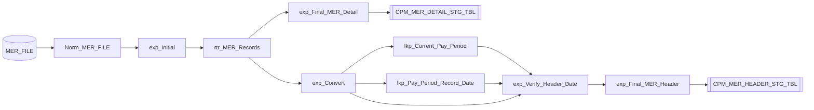

### `m_CPM_Load_CPM_NEWPAY_STG_TYPE_1_2_TBL`

**Source(s):** CPM_YTD_DETAIL_STG_TBL, PSEUDOSSN_TBL, CPM_PM1_STG_TBL, CPM_PM2_STG_TBL

**Target(s):** CPM_NEWPAY_STG_TYPE_1_2_TBL, ERROR_TBL

**Transformation Chain:**

1. CPM_PM1_STG_TBL (Source Definition)
2. CPM_PM2_STG_TBL (Source Definition)
3. CPM_YTD_DETAIL_STG_TBL (Source Definition)
4. PSEUDOSSN_TBL (Source Definition)
5. SQ_CPM_YTD_DETAIL_STG_TBL (Source Qualifier)
6. SQ_CPM_PM1_STG_TBL (Source Qualifier)
7. exp_Initial_YTD (Expression)
8. exp_Initial (Expression)
9. jnr_CPM_YTD (Joiner)
10. lkp_CPM_MER_DETAIL_STG_TBL (Lookup Procedure)
11. lkp_CPM_NEWPAY_STG_YTD_STATE_TBL (Lookup Procedure)
12. lkp_CPM_PAD_DETAIL_STG_TBL (Lookup Procedure)
13. exp_Convert_YTD (Expression)
14. exp_Convert_TYPE_1_PAD_MER (Expression)
15. exp_Determine_Errors (Expression)
16. mplt_Convert_Num_To_Prec71 (Mapplet)
17. mplt_Convert_Num_To_Prec72 (Mapplet)
18. mplt_Convert_Num_To_Prec73 (Mapplet)
19. mplt_Convert_Num_To_Prec74 (Mapplet)
20. mplt_Convert_Num_To_Prec75 (Mapplet)
21. mplt_Convert_Num_To_Prec7 (Mapplet)
22. fil_Bad_Records (Filter)
23. exp_Stg_YTD_Converted_Fields (Expression)
24. exp_Stage_PAD_MER_Converted_Fields (Expression)
25. nrm_Errors (Normalizer)
26. exp_Final (Expression)
27. fil_Error_Message (Filter)
28. exp_Final_Errors (Expression)
29. CPM_NEWPAY_STG_TYPE_1_2_TBL (Target Definition)
30. ERROR_TBL (Target Definition)

<details>
<summary>Connector Details</summary>

| From Instance | To Instance |
|--------------|-------------|
| exp_Final | CPM_NEWPAY_STG_TYPE_1_2_TBL |
| exp_Final_Errors | ERROR_TBL |
| fil_Bad_Records | nrm_Errors |
| exp_Determine_Errors | fil_Bad_Records |
| CPM_YTD_DETAIL_STG_TBL | SQ_CPM_YTD_DETAIL_STG_TBL |
| SQ_CPM_YTD_DETAIL_STG_TBL | exp_Initial_YTD |
| SQ_CPM_PM1_STG_TBL | exp_Initial |
| CPM_PM2_STG_TBL | SQ_CPM_PM1_STG_TBL |
| PSEUDOSSN_TBL | SQ_CPM_PM1_STG_TBL |
| CPM_PM1_STG_TBL | SQ_CPM_PM1_STG_TBL |
| exp_Convert_TYPE_1_PAD_MER | exp_Final |
| jnr_CPM_YTD | exp_Convert_TYPE_1_PAD_MER |
| lkp_CPM_PAD_DETAIL_STG_TBL | exp_Convert_TYPE_1_PAD_MER |
| lkp_CPM_MER_DETAIL_STG_TBL | exp_Convert_TYPE_1_PAD_MER |
| exp_Convert_TYPE_1_PAD_MER | mplt_Convert_Num_To_Prec7 |
| exp_Stg_YTD_Converted_Fields | exp_Final |
| exp_Convert_YTD | exp_Final |
| exp_Stage_PAD_MER_Converted_Fields | exp_Final |
| exp_Initial | jnr_CPM_YTD |
| fil_Error_Message | exp_Final_Errors |
| nrm_Errors | fil_Error_Message |
| jnr_CPM_YTD | exp_Convert_YTD |
| lkp_CPM_NEWPAY_STG_YTD_STATE_TBL | exp_Convert_YTD |
| exp_Convert_YTD | mplt_Convert_Num_To_Prec71 |
| exp_Convert_YTD | mplt_Convert_Num_To_Prec72 |
| exp_Convert_YTD | mplt_Convert_Num_To_Prec73 |
| exp_Convert_YTD | mplt_Convert_Num_To_Prec74 |
| exp_Convert_YTD | mplt_Convert_Num_To_Prec75 |
| jnr_CPM_YTD | lkp_CPM_MER_DETAIL_STG_TBL |
| lkp_CPM_MER_DETAIL_STG_TBL | exp_Determine_Errors |
| jnr_CPM_YTD | lkp_CPM_PAD_DETAIL_STG_TBL |
| lkp_CPM_PAD_DETAIL_STG_TBL | exp_Determine_Errors |
| jnr_CPM_YTD | lkp_CPM_NEWPAY_STG_YTD_STATE_TBL |
| jnr_CPM_YTD | exp_Determine_Errors |
| exp_Initial_YTD | jnr_CPM_YTD |
| mplt_Convert_Num_To_Prec7 | exp_Stage_PAD_MER_Converted_Fields |
| mplt_Convert_Num_To_Prec71 | exp_Stg_YTD_Converted_Fields |
| mplt_Convert_Num_To_Prec75 | exp_Stg_YTD_Converted_Fields |
| mplt_Convert_Num_To_Prec72 | exp_Stg_YTD_Converted_Fields |
| mplt_Convert_Num_To_Prec73 | exp_Stg_YTD_Converted_Fields |
| mplt_Convert_Num_To_Prec74 | exp_Stg_YTD_Converted_Fields |

</details>

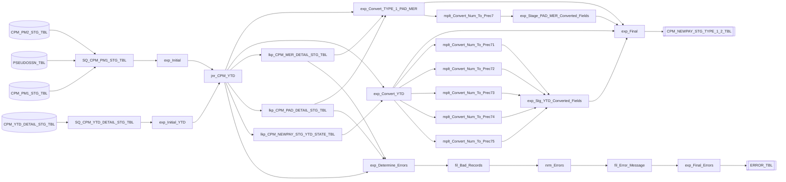

### `m_CPM_Load_CPM_NEWPAY_STG_DETAIL_TBL`

**Source(s):** CPM_PM3_STG_TBL

**Target(s):** CPM_NEWPAY_STG_DETAIL_TBL

**Transformation Chain:**

1. CPM_PM3_STG_TBL (Source Definition)
2. SQ_CPM_PM3_STG_TBL (Source Qualifier)
3. exp_Initial (Expression)
4. agg_PYF_EYE_ID_PP_NUM (Aggregator)
5. exp_Format_Fields (Expression)
6. exp_Final (Expression)
7. CPM_NEWPAY_STG_DETAIL_TBL (Target Definition)

<details>
<summary>Connector Details</summary>

| From Instance | To Instance |
|--------------|-------------|
| exp_Final | CPM_NEWPAY_STG_DETAIL_TBL |
| exp_Format_Fields | exp_Final |
| agg_PYF_EYE_ID_PP_NUM | exp_Format_Fields |
| CPM_PM3_STG_TBL | SQ_CPM_PM3_STG_TBL |
| SQ_CPM_PM3_STG_TBL | exp_Initial |
| exp_Initial | agg_PYF_EYE_ID_PP_NUM |
| agg_PYF_EYE_ID_PP_NUM | exp_Final |

</details>

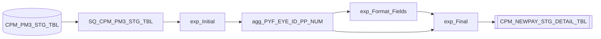

### `m_CPM_Build_Message_Counters`

**Source(s):** CPM_NEWPAY_TBL, ERROR_TBL, PAYMASTER_THREE, CPM_NEWPAY_TBL1

**Target(s):** COUNTER_TBL, CPM_MESSAGE_FILE

**Transformation Chain:**

1. CPM_NEWPAY_TBL (Source Definition)
2. CPM_NEWPAY_TBL1 (Source Definition)
3. ERROR_TBL (Source Definition)
4. PAYMASTER_THREE (Source Definition)
5. SQ_CPM_NEWPAY_TBL (Source Qualifier)
6. SQ_CPM_NEWPAY_TBL1 (Source Qualifier)
7. SQ_ERROR_TBL (Source Qualifier)
8. Norm_PAYMASTER_THREE (Normalizer)
9. exp_Initial_CPM (Expression)
10. exp_Initial_Multiple_Pay_Lines (Expression)
11. exp_Initial_Errors (Expression)
12. exp_Initial_Input (Expression)
13. lkp_CPM_MER_DETAIL_STG_TBL (Lookup Procedure)
14. lkp_CPM_PAD_DETAIL_STG_TBL (Lookup Procedure)
15. lkp_CPM_YTD_DETAIL_STG_TBL (Lookup Procedure)
16. lkp_PSEUDOSSN_TBL (Lookup Procedure)
17. agg_Multiple_Pay_Lines (Aggregator)
18. agg_Count_Errors (Aggregator)
19. agg_Count_Inputs (Aggregator)
20. exp_Stage_CPM (Expression)
21. agg_Count_CPM (Aggregator)
22. jnr_Inputs_CPM (Joiner)
23. jnr_Inputs_CPM_Errors (Joiner)
24. jnr_Inputs_CPM_Errors_Pay_Lines (Joiner)
25. exp_Build_Message (Expression)
26. exp_Counters (Expression)
27. nrm_Counters (Normalizer)
28. nrm_Counters_Message (Normalizer)
29. exp_Final_Counters (Expression)
30. exp_Final_Message (Expression)
31. COUNTER_TBL (Target Definition)
32. CPM_MESSAGE_FILE (Target Definition)

<details>
<summary>Connector Details</summary>

| From Instance | To Instance |
|--------------|-------------|
| exp_Final_Counters | COUNTER_TBL |
| exp_Final_Message | CPM_MESSAGE_FILE |
| exp_Counters | nrm_Counters_Message |
| nrm_Counters_Message | exp_Final_Message |
| exp_Build_Message | exp_Counters |
| jnr_Inputs_CPM_Errors_Pay_Lines | exp_Build_Message |
| lkp_PSEUDOSSN_TBL | exp_Stage_CPM |
| exp_Initial_CPM | lkp_PSEUDOSSN_TBL |
| lkp_CPM_MER_DETAIL_STG_TBL | exp_Stage_CPM |
| exp_Initial_CPM | lkp_CPM_MER_DETAIL_STG_TBL |
| lkp_CPM_PAD_DETAIL_STG_TBL | exp_Stage_CPM |
| exp_Initial_CPM | lkp_CPM_PAD_DETAIL_STG_TBL |
| CPM_NEWPAY_TBL | SQ_CPM_NEWPAY_TBL |
| SQ_CPM_NEWPAY_TBL | exp_Initial_CPM |
| ERROR_TBL | SQ_ERROR_TBL |
| SQ_ERROR_TBL | exp_Initial_Errors |
| Norm_PAYMASTER_THREE | exp_Initial_Input |
| exp_Initial_Input | agg_Count_Inputs |
| exp_Initial_CPM | exp_Stage_CPM |
| exp_Initial_CPM | lkp_CPM_YTD_DETAIL_STG_TBL |
| exp_Initial_Errors | agg_Count_Errors |
| agg_Count_CPM | jnr_Inputs_CPM |
| agg_Count_Inputs | jnr_Inputs_CPM |
| jnr_Inputs_CPM | jnr_Inputs_CPM_Errors |
| exp_Stage_CPM | agg_Count_CPM |
| lkp_CPM_YTD_DETAIL_STG_TBL | exp_Stage_CPM |
| agg_Count_Errors | jnr_Inputs_CPM_Errors |
| jnr_Inputs_CPM_Errors | jnr_Inputs_CPM_Errors_Pay_Lines |
| exp_Counters | nrm_Counters |
| nrm_Counters | exp_Final_Counters |
| jnr_Inputs_CPM_Errors_Pay_Lines | exp_Counters |
| PAYMASTER_THREE | Norm_PAYMASTER_THREE |
| CPM_NEWPAY_TBL1 | SQ_CPM_NEWPAY_TBL1 |
| SQ_CPM_NEWPAY_TBL1 | exp_Initial_Multiple_Pay_Lines |
| exp_Initial_Multiple_Pay_Lines | agg_Multiple_Pay_Lines |
| agg_Multiple_Pay_Lines | jnr_Inputs_CPM_Errors_Pay_Lines |

</details>

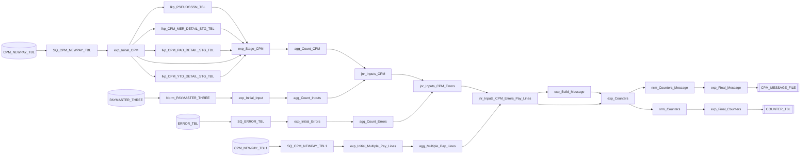

### `m_CPM_Load_CPM_PMR_Staging_Tables`

**Source(s):** PAYMASTER_FILE

**Target(s):** CPM_PM1_STG_TBL, CPM_PMH_STG_TBL, CPM_PM2_STG_TBL, CPM_PM3_STG_TBL

**Transformation Chain:**

1. PAYMASTER_FILE (Source Definition)
2. Norm_PAYMASTER_FILE (Normalizer)
3. exp_Determine_Record_Type (Expression)
4. rtr_Paymaster_Records (Router)
5. exp_Final_Paymaster_1 (Expression)
6. exp_Final_Paymaster_2 (Expression)
7. exp_Final_Paymaster_3 (Expression)
8. exp_Initial (Expression)
9. lkp_Current_Pay_Period (Lookup Procedure)
10. lkp_Pay_Period_Record_Date (Lookup Procedure)
11. exp_Stage (Expression)
12. exp_Final_Paymaster_Header (Expression)
13. CPM_PM1_STG_TBL (Target Definition)
14. CPM_PM2_STG_TBL (Target Definition)
15. CPM_PM3_STG_TBL (Target Definition)
16. CPM_PMH_STG_TBL (Target Definition)

<details>
<summary>Connector Details</summary>

| From Instance | To Instance |
|--------------|-------------|
| exp_Final_Paymaster_1 | CPM_PM1_STG_TBL |
| exp_Final_Paymaster_Header | CPM_PMH_STG_TBL |
| exp_Final_Paymaster_2 | CPM_PM2_STG_TBL |
| exp_Final_Paymaster_3 | CPM_PM3_STG_TBL |
| rtr_Paymaster_Records | exp_Final_Paymaster_3 |
| rtr_Paymaster_Records | exp_Final_Paymaster_2 |
| rtr_Paymaster_Records | exp_Final_Paymaster_1 |
| lkp_Pay_Period_Record_Date | exp_Stage |
| exp_Initial | lkp_Pay_Period_Record_Date |
| exp_Initial | exp_Stage |
| exp_Initial | lkp_Current_Pay_Period |
| rtr_Paymaster_Records | exp_Initial |
| lkp_Current_Pay_Period | exp_Stage |
| exp_Stage | exp_Final_Paymaster_Header |
| PAYMASTER_FILE | Norm_PAYMASTER_FILE |
| Norm_PAYMASTER_FILE | exp_Determine_Record_Type |
| exp_Determine_Record_Type | rtr_Paymaster_Records |

</details>

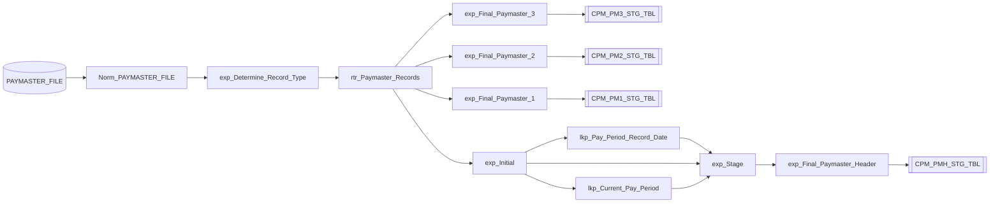

### `m_CPM_Load_CPM_PAD_Staging_Tables`

**Source(s):** PAD_FILE

**Target(s):** CPM_PAD_DETAIL_STG_TBL, CPM_PAD_HEADER_STG_TBL

**Transformation Chain:**

1. PAD_FILE (Source Definition)
2. Norm_PAD_FILE (Normalizer)
3. exp_Determine_Record_Type (Expression)
4. rtr_PAD_Records (Router)
5. exp_Convert (Expression)
6. exp_Final_PAD_Detail (Expression)
7. lkp_Current_Pay_Period (Lookup Procedure)
8. lkp_Pay_Period_Record_Date (Lookup Procedure)
9. exp_Verify_Header_Date (Expression)
10. exp_Final_PAD_Header (Expression)
11. CPM_PAD_DETAIL_STG_TBL (Target Definition)
12. CPM_PAD_HEADER_STG_TBL (Target Definition)

<details>
<summary>Connector Details</summary>

| From Instance | To Instance |
|--------------|-------------|
| exp_Final_PAD_Detail | CPM_PAD_DETAIL_STG_TBL |
| exp_Final_PAD_Header | CPM_PAD_HEADER_STG_TBL |
| rtr_PAD_Records | exp_Final_PAD_Detail |
| exp_Convert | lkp_Current_Pay_Period |
| lkp_Current_Pay_Period | exp_Verify_Header_Date |
| exp_Convert | lkp_Pay_Period_Record_Date |
| lkp_Pay_Period_Record_Date | exp_Verify_Header_Date |
| exp_Verify_Header_Date | exp_Final_PAD_Header |
| rtr_PAD_Records | exp_Convert |
| exp_Convert | exp_Verify_Header_Date |
| PAD_FILE | Norm_PAD_FILE |
| Norm_PAD_FILE | exp_Determine_Record_Type |
| exp_Determine_Record_Type | rtr_PAD_Records |

</details>

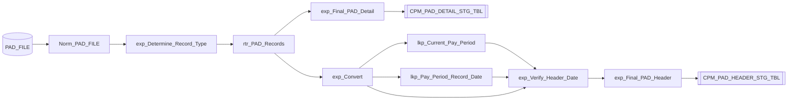

### `m_CPM_Load_PMR_To_CPM_NEWPAY_TBL`

**Source(s):** CPM_NEWPAY_STG_TYPE_1_2_TBL, CPM_NEWPAY_STG_TYPE_3_TBL

**Target(s):** CPM_NEWPAY_TBL

**Transformation Chain:**

1. CPM_NEWPAY_STG_TYPE_1_2_TBL (Source Definition)
2. CPM_NEWPAY_STG_TYPE_3_TBL (Source Definition)
3. SQ_CPM_NEWPAY_STG_TYPE_1_2_TBL (Source Qualifier)
4. exp_Initial (Expression)
5. exp_Convert (Expression)
6. exp_Final (Expression)
7. CPM_NEWPAY_TBL (Target Definition)

<details>
<summary>Connector Details</summary>

| From Instance | To Instance |
|--------------|-------------|
| exp_Final | CPM_NEWPAY_TBL |
| exp_Initial | exp_Final |
| SQ_CPM_NEWPAY_STG_TYPE_1_2_TBL | exp_Initial |
| exp_Initial | exp_Convert |
| exp_Convert | exp_Final |
| CPM_NEWPAY_STG_TYPE_1_2_TBL | SQ_CPM_NEWPAY_STG_TYPE_1_2_TBL |
| CPM_NEWPAY_STG_TYPE_3_TBL | SQ_CPM_NEWPAY_STG_TYPE_1_2_TBL |

</details>

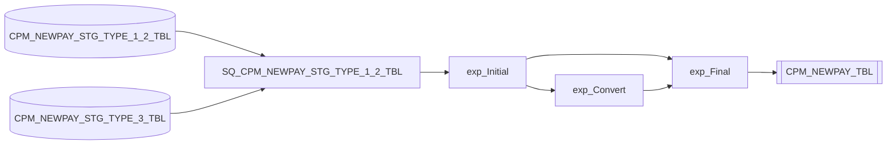

### `m_Generic_Mapping`

**Source(s):** HI_GENERIC_SRC_TBL

**Target(s):** GENERIC_TARGET_FILE

**Transformation Chain:**

1. HI_GENERIC_SRC_TBL (Source Definition)
2. SQ_HI_GENERIC_SRC_TBL (Source Qualifier)
3. GENERIC_TARGET_FILE (Target Definition)

<details>
<summary>Connector Details</summary>

| From Instance | To Instance |
|--------------|-------------|
| SQ_HI_GENERIC_SRC_TBL | GENERIC_TARGET_FILE |
| HI_GENERIC_SRC_TBL | SQ_HI_GENERIC_SRC_TBL |

</details>

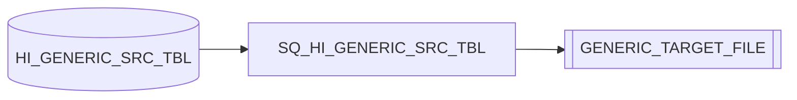

### `m_CPM_Load_FDR_CPM_NEWPAY_TBL`

**Source(s):** CPM_NEWPAY_STG_TYPE_1_2_TBL, CPM_NEWPAY_STG_TYPE_3_FDR_TBL

**Target(s):** CPM_NEWPAY_TBL

**Transformation Chain:**

1. CPM_NEWPAY_STG_TYPE_1_2_TBL (Source Definition)
2. CPM_NEWPAY_STG_TYPE_3_FDR_TBL (Source Definition)
3. SQ_CPM_NEWPAY_STG_TYPE_1_2_TBL (Source Qualifier)
4. exp_Initial (Expression)
5. lkp_REG_REEMPLED (Lookup Procedure)
6. exp_Convert (Expression)
7. exp_Final (Expression)
8. CPM_NEWPAY_TBL (Target Definition)

<details>
<summary>Connector Details</summary>

| From Instance | To Instance |
|--------------|-------------|
| exp_Final | CPM_NEWPAY_TBL |
| exp_Initial | exp_Convert |
| exp_Initial | lkp_REG_REEMPLED |
| exp_Initial | exp_Final |
| SQ_CPM_NEWPAY_STG_TYPE_1_2_TBL | exp_Initial |
| exp_Convert | exp_Final |
| CPM_NEWPAY_STG_TYPE_1_2_TBL | SQ_CPM_NEWPAY_STG_TYPE_1_2_TBL |
| CPM_NEWPAY_STG_TYPE_3_FDR_TBL | SQ_CPM_NEWPAY_STG_TYPE_1_2_TBL |
| lkp_REG_REEMPLED | exp_Convert |

</details>

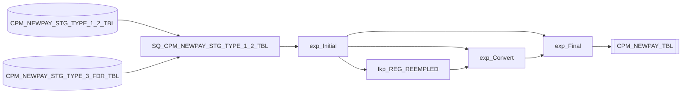

### `m_CPM_Load_CPM_NEWPAY_STG_TYPE_3_FDR_TBL`

**Source(s):** CPM_PM3_STG_TBL

**Target(s):** CPM_NEWPAY_STG_TYPE_3_FDR_TBL

**Transformation Chain:**

1. CPM_PM3_STG_TBL (Source Definition)
2. SQ_CPM_PM3_STG_TBL (Source Qualifier)
3. exp_Initial (Expression)
4. lkp_CPM_NEWPAY_STG_TYPE_1_2_TBL (Lookup Procedure)
5. agg_PYF_EYE_ID_PP_NUM (Aggregator)
6. exp_Double_T38_SUN_DIF_HRS_CPP (Expression)
7. exp_GEN_SEQ_NUMBER (Expression)
8. lkp_CPM_NEWPAY_STG_ALT_TBL (Lookup Procedure)
9. mplt_Convert_Num_To_Prec71 (Mapplet)
10. mplt_Convert_Num_To_Prec710 (Mapplet)
11. mplt_Convert_Num_To_Prec711 (Mapplet)
12. mplt_Convert_Num_To_Prec72 (Mapplet)
13. mplt_Convert_Num_To_Prec73 (Mapplet)
14. mplt_Convert_Num_To_Prec74 (Mapplet)
15. mplt_Convert_Num_To_Prec75 (Mapplet)
16. mplt_Convert_Num_To_Prec76 (Mapplet)
17. mplt_Convert_Num_To_Prec77 (Mapplet)
18. mplt_Convert_Num_To_Prec78 (Mapplet)
19. mplt_Convert_Num_To_Prec79 (Mapplet)
20. exp_Format_Fields (Expression)
21. exp_Set_REEMP_ANN_CDE (Expression)
22. mplt_Convert_Num_To_Prec7 (Mapplet)
23. exp_Final (Expression)
24. CPM_NEWPAY_STG_TYPE_3_FDR_TBL (Target Definition)

<details>
<summary>Connector Details</summary>

| From Instance | To Instance |
|--------------|-------------|
| exp_Final | CPM_NEWPAY_STG_TYPE_3_FDR_TBL |
| SQ_CPM_PM3_STG_TBL | exp_Initial |
| exp_Initial | agg_PYF_EYE_ID_PP_NUM |
| exp_Initial | lkp_CPM_NEWPAY_STG_TYPE_1_2_TBL |
| agg_PYF_EYE_ID_PP_NUM | exp_Format_Fields |
| lkp_CPM_NEWPAY_STG_TYPE_1_2_TBL | agg_PYF_EYE_ID_PP_NUM |
| agg_PYF_EYE_ID_PP_NUM | exp_Final |
| agg_PYF_EYE_ID_PP_NUM | lkp_CPM_NEWPAY_STG_ALT_TBL |
| agg_PYF_EYE_ID_PP_NUM | exp_GEN_SEQ_NUMBER |
| agg_PYF_EYE_ID_PP_NUM | mplt_Convert_Num_To_Prec7 |
| agg_PYF_EYE_ID_PP_NUM | mplt_Convert_Num_To_Prec71 |
| agg_PYF_EYE_ID_PP_NUM | mplt_Convert_Num_To_Prec72 |
| agg_PYF_EYE_ID_PP_NUM | mplt_Convert_Num_To_Prec73 |
| agg_PYF_EYE_ID_PP_NUM | mplt_Convert_Num_To_Prec74 |
| agg_PYF_EYE_ID_PP_NUM | mplt_Convert_Num_To_Prec75 |
| agg_PYF_EYE_ID_PP_NUM | mplt_Convert_Num_To_Prec76 |
| agg_PYF_EYE_ID_PP_NUM | mplt_Convert_Num_To_Prec77 |
| agg_PYF_EYE_ID_PP_NUM | mplt_Convert_Num_To_Prec78 |
| agg_PYF_EYE_ID_PP_NUM | mplt_Convert_Num_To_Prec79 |
| agg_PYF_EYE_ID_PP_NUM | mplt_Convert_Num_To_Prec711 |
| agg_PYF_EYE_ID_PP_NUM | mplt_Convert_Num_To_Prec710 |
| agg_PYF_EYE_ID_PP_NUM | exp_Double_T38_SUN_DIF_HRS_CPP |
| agg_PYF_EYE_ID_PP_NUM | exp_Set_REEMP_ANN_CDE |
| mplt_Convert_Num_To_Prec71 | exp_Final |
| mplt_Convert_Num_To_Prec72 | exp_Final |
| exp_Set_REEMP_ANN_CDE | exp_Final |
| mplt_Convert_Num_To_Prec73 | exp_Final |
| mplt_Convert_Num_To_Prec74 | exp_Final |
| mplt_Convert_Num_To_Prec75 | exp_Final |
| mplt_Convert_Num_To_Prec76 | exp_Final |
| mplt_Convert_Num_To_Prec77 | exp_Final |
| mplt_Convert_Num_To_Prec78 | exp_Final |
| mplt_Convert_Num_To_Prec79 | exp_Final |
| mplt_Convert_Num_To_Prec710 | exp_Final |
| exp_Format_Fields | exp_Final |
| mplt_Convert_Num_To_Prec711 | exp_Final |
| exp_GEN_SEQ_NUMBER | exp_Final |
| mplt_Convert_Num_To_Prec7 | exp_Final |
| CPM_PM3_STG_TBL | SQ_CPM_PM3_STG_TBL |
| exp_Double_T38_SUN_DIF_HRS_CPP | exp_Format_Fields |
| lkp_CPM_NEWPAY_STG_ALT_TBL | exp_Format_Fields |
| exp_Format_Fields | mplt_Convert_Num_To_Prec7 |
| exp_Format_Fields | exp_Set_REEMP_ANN_CDE |

</details>

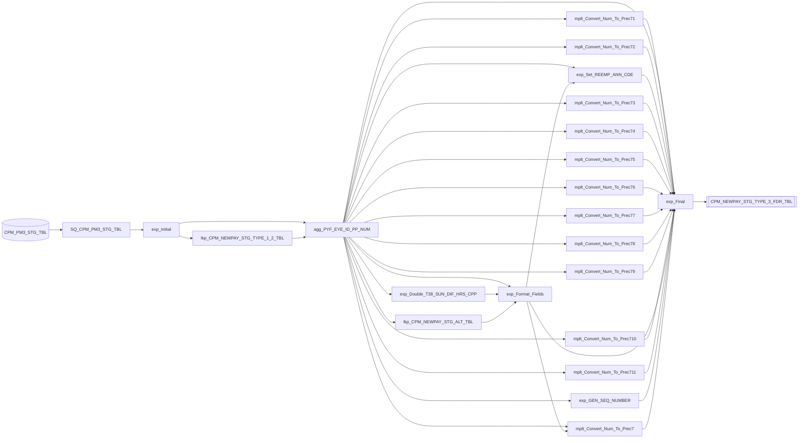

### `m_CPM_Load_CPM_NEWPAY_STG_TYPE_3_TBL`

**Source(s):** CPM_NEWPAY_STG_TYPE_3_FDR_TBL

**Target(s):** CPM_NEWPAY_STG_TYPE_3_TBL

**Transformation Chain:**

1. CPM_NEWPAY_STG_TYPE_3_FDR_TBL (Source Definition)
2. SQ_CPM_NEWPAY_STG_TYPE_3_FDR_TBL (Source Qualifier)
3. exp_Initial (Expression)
4. lkp_CPM_NEWPAY_STG_TYPE_1_2_TBL (Lookup Procedure)
5. agg_PYF_EYE_ID_PP_NUM (Aggregator)
6. lkp_CPM_NEWPAY_STG_ALT_TBL (Lookup Procedure)
7. lkp_CPM_NEWPAY_STG_DETAIL_TBL (Lookup Procedure)
8. exp_Format_Fields (Expression)
9. exp_Final (Expression)
10. CPM_NEWPAY_STG_TYPE_3_TBL (Target Definition)

<details>
<summary>Connector Details</summary>

| From Instance | To Instance |
|--------------|-------------|
| exp_Final | CPM_NEWPAY_STG_TYPE_3_TBL |
| exp_Initial | agg_PYF_EYE_ID_PP_NUM |
| exp_Initial | lkp_CPM_NEWPAY_STG_TYPE_1_2_TBL |
| SQ_CPM_NEWPAY_STG_TYPE_3_FDR_TBL | exp_Initial |
| agg_PYF_EYE_ID_PP_NUM | lkp_CPM_NEWPAY_STG_ALT_TBL |
| agg_PYF_EYE_ID_PP_NUM | lkp_CPM_NEWPAY_STG_DETAIL_TBL |
| agg_PYF_EYE_ID_PP_NUM | exp_Final |
| agg_PYF_EYE_ID_PP_NUM | exp_Format_Fields |
| lkp_CPM_NEWPAY_STG_TYPE_1_2_TBL | agg_PYF_EYE_ID_PP_NUM |
| exp_Format_Fields | exp_Final |
| lkp_CPM_NEWPAY_STG_ALT_TBL | exp_Format_Fields |
| lkp_CPM_NEWPAY_STG_DETAIL_TBL | exp_Format_Fields |
| CPM_NEWPAY_STG_TYPE_3_FDR_TBL | SQ_CPM_NEWPAY_STG_TYPE_3_FDR_TBL |

</details>

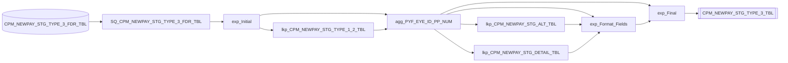

---

## CPM_AFPS

- **Repository**: `Test_Repo_Srvc`
- **Folder**: `CPM`

### `m_CPM_AFPS_0100_Data_Seperate`

**Source(s):** CPM_NEWPAY_TBL, PAY_PERIOD

**Target(s):** HI_AFPS_FEEDER_TBL

**Transformation Chain:**

1. CPM_NEWPAY_TBL (Source Definition)
2. PAY_PERIOD (Source Definition)
3. SQ_CPM_NEWPAY_TBL (Source Qualifier)
4. exp_Format_AFPS_Feeder (Expression)
5. exp_Convert_Calc_Fields (Expression)
6. exp_Format_Text_Fields (Expression)
7. srt_Sort_By_Payment_Type (Sorter)
8. HI_AFPS_FEEDER_TBL (Target Definition)

<details>
<summary>Connector Details</summary>

| From Instance | To Instance |
|--------------|-------------|
| srt_Sort_By_Payment_Type | HI_AFPS_FEEDER_TBL |
| CPM_NEWPAY_TBL | SQ_CPM_NEWPAY_TBL |
| PAY_PERIOD | SQ_CPM_NEWPAY_TBL |
| SQ_CPM_NEWPAY_TBL | exp_Format_AFPS_Feeder |
| exp_Format_AFPS_Feeder | srt_Sort_By_Payment_Type |
| exp_Format_AFPS_Feeder | exp_Convert_Calc_Fields |
| exp_Format_AFPS_Feeder | exp_Format_Text_Fields |
| exp_Convert_Calc_Fields | srt_Sort_By_Payment_Type |
| exp_Format_Text_Fields | srt_Sort_By_Payment_Type |

</details>

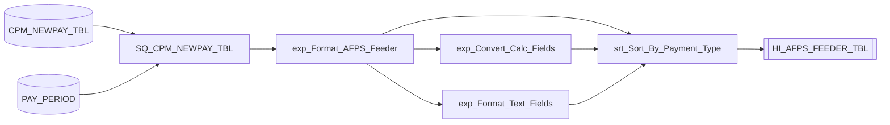

### `m_CPM_AFPS_0300_Gross_Exp_Report`

**Source(s):** HI_AFPS_FEEDER_TBL

**Target(s):** HI_GROSS_EXP_TBL

**Transformation Chain:**

1. HI_AFPS_FEEDER_TBL (Source Definition)
2. SQ_HI_AFPS_FEEDER_TBL (Source Qualifier)
3. exp_Compute_Main (Expression)
4. HI_GROSS_EXP_TBL (Target Definition)

<details>
<summary>Connector Details</summary>

| From Instance | To Instance |
|--------------|-------------|
| exp_Compute_Main | HI_GROSS_EXP_TBL |
| SQ_HI_AFPS_FEEDER_TBL | exp_Compute_Main |
| HI_AFPS_FEEDER_TBL | SQ_HI_AFPS_FEEDER_TBL |

</details>

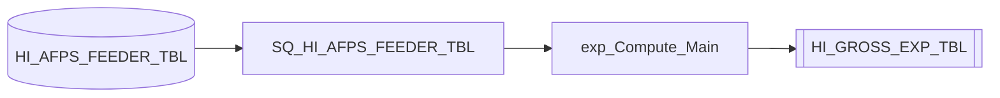

### `m_CPM_AFPS_0720_Crossfoot_Message_Gross_Expend`

**Source(s):** HI_AFPS_FEEDER_TBL

**Target(s):** CPM_AFPS_MESSAGE_COUNTS_TOT_FILE

**Transformation Chain:**

1. HI_AFPS_FEEDER_TBL (Source Definition)
2. SQ_HI_AFPS_FEEDER_TBL (Source Qualifier)
3. exp_Initial_Feeder (Expression)
4. agg_Gross_Expenditures (Aggregator)
5. exp_Counters (Expression)
6. exp_Final_Message (Expression)
7. CPM_AFPS_MESSAGE_COUNTS_TOT_FILE (Target Definition)

<details>
<summary>Connector Details</summary>

| From Instance | To Instance |
|--------------|-------------|
| exp_Final_Message | CPM_AFPS_MESSAGE_COUNTS_TOT_FILE |
| exp_Counters | exp_Final_Message |
| HI_AFPS_FEEDER_TBL | SQ_HI_AFPS_FEEDER_TBL |
| SQ_HI_AFPS_FEEDER_TBL | exp_Initial_Feeder |
| exp_Initial_Feeder | agg_Gross_Expenditures |
| agg_Gross_Expenditures | exp_Counters |

</details>

```mermaid
flowchart LR
    n0[("HI_AFPS_FEEDER_TBL")]
    n1["SQ_HI_AFPS_FEEDER_TBL"]
    n2["exp_Initial_Feeder"]
    n3["agg_Gross_Expenditures"]
    n4["exp_Counters"]
    n5["exp_Final_Message"]
    n6[["CPM_AFPS_MESSAGE_COUNTS_TOT_FILE"]]
    n5 --> n6
    n4 --> n5
    n0 --> n1
    n1 --> n2
    n2 --> n3
    n3 --> n4
```

### `m_CPM_AFPS_0700_Crossfoot_Message_Summary_Counts`

**Source(s):** HI_AFPS_FEEDER_TBL, ERROR_TBL

**Target(s):** CPM_AFPS_MESSAGE_COUNTS_FILE

**Transformation Chain:**

1. ERROR_TBL (Source Definition)
2. HI_AFPS_FEEDER_TBL (Source Definition)
3. SQ_ERROR_TBL (Source Qualifier)
4. SQ_HI_AFPS_FEEDER_TBL (Source Qualifier)
5. exp_Initial_Crossfoot_Errors (Expression)
6. exp_Initial_Feeder (Expression)
7. agg_Crossfoot_Errors (Aggregator)
8. agg_Gross_Expenditures (Aggregator)
9. jnr_Feeder_Crossfoot (Joiner)
10. exp_Counters (Expression)
11. nrm_Counters (Normalizer)
12. exp_Final_Message (Expression)
13. CPM_AFPS_MESSAGE_COUNTS_FILE (Target Definition)

<details>
<summary>Connector Details</summary>

| From Instance | To Instance |
|--------------|-------------|
| exp_Final_Message | CPM_AFPS_MESSAGE_COUNTS_FILE |
| ERROR_TBL | SQ_ERROR_TBL |
| SQ_ERROR_TBL | exp_Initial_Crossfoot_Errors |
| nrm_Counters | exp_Final_Message |
| exp_Initial_Crossfoot_Errors | agg_Crossfoot_Errors |
| HI_AFPS_FEEDER_TBL | SQ_HI_AFPS_FEEDER_TBL |
| SQ_HI_AFPS_FEEDER_TBL | exp_Initial_Feeder |
| exp_Initial_Feeder | agg_Gross_Expenditures |
| agg_Gross_Expenditures | jnr_Feeder_Crossfoot |
| agg_Crossfoot_Errors | jnr_Feeder_Crossfoot |
| jnr_Feeder_Crossfoot | exp_Counters |
| exp_Counters | nrm_Counters |

</details>

```mermaid
flowchart LR
    n0[("ERROR_TBL")]
    n1[("HI_AFPS_FEEDER_TBL")]
    n2["SQ_ERROR_TBL"]
    n3["SQ_HI_AFPS_FEEDER_TBL"]
    n4["exp_Initial_Crossfoot_Errors"]
    n5["exp_Initial_Feeder"]
    n6["agg_Crossfoot_Errors"]
    n7["agg_Gross_Expenditures"]
    n8["jnr_Feeder_Crossfoot"]
    n9["exp_Counters"]
    n10["nrm_Counters"]
    n11["exp_Final_Message"]
    n12[["CPM_AFPS_MESSAGE_COUNTS_FILE"]]
    n11 --> n12
    n0 --> n2
    n2 --> n4
    n10 --> n11
    n4 --> n6
    n1 --> n3
    n3 --> n5
    n5 --> n7
    n7 --> n8
    n6 --> n8
    n8 --> n9
    n9 --> n10
```

### `m_CPM_AFPS_0800_Build_Message_Counters`

**Source(s):** CPM_NEWPAY_TBL, HI_AFPS_FEEDER_TBL

**Target(s):** AFPS_COUNTER_TBL, CPM_AFPS_MESSAGE_COUNTS_FILE

**Transformation Chain:**

1. CPM_NEWPAY_TBL (Source Definition)
2. HI_AFPS_FEEDER_TBL (Source Definition)
3. SQ_CPM_NEWPAY_TBL (Source Qualifier)
4. SQ_HI_AFPS_FEEDER_TBL (Source Qualifier)
5. exp_Initial_CPM (Expression)
6. exp_Initial_Feeder (Expression)
7. agg_Count_CPM (Aggregator)
8. agg_Feeder (Aggregator)
9. jnr_Inputs_CPM (Joiner)
10. exp_Counters (Expression)
11. nrm_Counters (Normalizer)
12. nrm_Counters_Message (Normalizer)
13. exp_Final_Counters (Expression)
14. exp_Final_Message (Expression)
15. AFPS_COUNTER_TBL (Target Definition)
16. CPM_AFPS_MESSAGE_COUNTS_FILE (Target Definition)

<details>
<summary>Connector Details</summary>

| From Instance | To Instance |
|--------------|-------------|
| exp_Final_Counters | AFPS_COUNTER_TBL |
| exp_Final_Message | CPM_AFPS_MESSAGE_COUNTS_FILE |
| SQ_HI_AFPS_FEEDER_TBL | exp_Initial_Feeder |
| exp_Initial_Feeder | agg_Feeder |
| agg_Feeder | jnr_Inputs_CPM |
| exp_Counters | nrm_Counters_Message |
| nrm_Counters_Message | exp_Final_Message |
| CPM_NEWPAY_TBL | SQ_CPM_NEWPAY_TBL |
| SQ_CPM_NEWPAY_TBL | exp_Initial_CPM |
| exp_Initial_CPM | agg_Count_CPM |
| agg_Count_CPM | jnr_Inputs_CPM |
| jnr_Inputs_CPM | exp_Counters |
| exp_Counters | nrm_Counters |
| nrm_Counters | exp_Final_Counters |
| HI_AFPS_FEEDER_TBL | SQ_HI_AFPS_FEEDER_TBL |

</details>

```mermaid
flowchart LR
    n0[("CPM_NEWPAY_TBL")]
    n1[("HI_AFPS_FEEDER_TBL")]
    n2["SQ_CPM_NEWPAY_TBL"]
    n3["SQ_HI_AFPS_FEEDER_TBL"]
    n4["exp_Initial_CPM"]
    n5["exp_Initial_Feeder"]
    n6["agg_Count_CPM"]
    n7["agg_Feeder"]
    n8["jnr_Inputs_CPM"]
    n9["exp_Counters"]
    n10["nrm_Counters"]
    n11["nrm_Counters_Message"]
    n12["exp_Final_Counters"]
    n13["exp_Final_Message"]
    n14[["AFPS_COUNTER_TBL"]]
    n15[["CPM_AFPS_MESSAGE_COUNTS_FILE"]]
    n12 --> n14
    n13 --> n15
    n3 --> n5
    n5 --> n7
    n7 --> n8
    n9 --> n11
    n11 --> n13
    n0 --> n2
    n2 --> n4
    n4 --> n6
    n6 --> n8
    n8 --> n9
    n9 --> n10
    n10 --> n12
    n1 --> n3
```

### `m_CPM_AFPS_0900_Build_Message`

**Source(s):** PAY_PERIOD1

**Target(s):** CPM_AFPS_MESSAGE_FILE

**Transformation Chain:**

1. PAY_PERIOD1 (Source Definition)
2. SQ_PAY_PERIOD (Source Qualifier)
3. exp_Initial (Expression)
4. exp_Final (Expression)
5. CPM_AFPS_MESSAGE_FILE (Target Definition)

<details>
<summary>Connector Details</summary>

| From Instance | To Instance |
|--------------|-------------|
| exp_Final | CPM_AFPS_MESSAGE_FILE |
| PAY_PERIOD1 | SQ_PAY_PERIOD |
| SQ_PAY_PERIOD | exp_Initial |
| exp_Initial | exp_Final |

</details>

```mermaid
flowchart LR
    n0[("PAY_PERIOD1")]
    n1["SQ_PAY_PERIOD"]
    n2["exp_Initial"]
    n3["exp_Final"]
    n4[["CPM_AFPS_MESSAGE_FILE"]]
    n3 --> n4
    n0 --> n1
    n1 --> n2
    n2 --> n3
```

### `m_CPM_AFPS_0760_Concatenate_Crossfoot_Files`

**Source(s):** HI_GENERIC_SRC_TBL

**Target(s):** GENERIC_TARGET_FILE

**Transformation Chain:**

1. HI_GENERIC_SRC_TBL (Source Definition)
2. SQ_HI_GENERIC_SRC_TBL (Source Qualifier)
3. GENERIC_TARGET_FILE (Target Definition)

<details>
<summary>Connector Details</summary>

| From Instance | To Instance |
|--------------|-------------|
| SQ_HI_GENERIC_SRC_TBL | GENERIC_TARGET_FILE |
| HI_GENERIC_SRC_TBL | SQ_HI_GENERIC_SRC_TBL |

</details>

```mermaid
flowchart LR
    n0[("HI_GENERIC_SRC_TBL")]
    n1["SQ_HI_GENERIC_SRC_TBL"]
    n2[["GENERIC_TARGET_FILE"]]
    n1 --> n2
    n0 --> n1
```

### `m_CPM_AFPS_1000_Send_Report`

**Source(s):** HI_GENERIC_SRC_TBL

**Target(s):** GENERIC_TARGET_FILE

**Transformation Chain:**

1. HI_GENERIC_SRC_TBL (Source Definition)
2. SQ_HI_GENERIC_SRC_TBL (Source Qualifier)
3. GENERIC_TARGET_FILE (Target Definition)

<details>
<summary>Connector Details</summary>

| From Instance | To Instance |
|--------------|-------------|
| SQ_HI_GENERIC_SRC_TBL | GENERIC_TARGET_FILE |
| HI_GENERIC_SRC_TBL | SQ_HI_GENERIC_SRC_TBL |

</details>

```mermaid
flowchart LR
    n0[("HI_GENERIC_SRC_TBL")]
    n1["SQ_HI_GENERIC_SRC_TBL"]
    n2[["GENERIC_TARGET_FILE"]]
    n1 --> n2
    n0 --> n1
```

### `m_CPM_AFPS_0500_Crossfoot_Message_Header`

**Source(s):** PAY_PERIOD

**Target(s):** CPM_AFPS_MESSAGE_FILE

**Transformation Chain:**

1. PAY_PERIOD (Source Definition)
2. SQ_PAY_PERIOD (Source Qualifier)
3. exp_Initial (Expression)
4. exp_Build_Message (Expression)
5. exp_Final_Message (Expression)
6. CPM_AFPS_MESSAGE_FILE (Target Definition)

<details>
<summary>Connector Details</summary>

| From Instance | To Instance |
|--------------|-------------|
| exp_Final_Message | CPM_AFPS_MESSAGE_FILE |
| exp_Build_Message | exp_Final_Message |
| exp_Initial | exp_Build_Message |
| PAY_PERIOD | SQ_PAY_PERIOD |
| SQ_PAY_PERIOD | exp_Initial |

</details>

```mermaid
flowchart LR
    n0[("PAY_PERIOD")]
    n1["SQ_PAY_PERIOD"]
    n2["exp_Initial"]
    n3["exp_Build_Message"]
    n4["exp_Final_Message"]
    n5[["CPM_AFPS_MESSAGE_FILE"]]
    n4 --> n5
    n3 --> n4
    n2 --> n3
    n0 --> n1
    n1 --> n2
```

### `m_CPM_AFPS_0820_Build_Message_Totals`

**Source(s):** HI_AFPS_FEEDER_TBL, CPM_NEWPAY_TBL

**Target(s):** CPM_AFPS_MESSAGE_COUNTS_TOT_FILE, AFPS_COUNTER_TBL

**Transformation Chain:**

1. CPM_NEWPAY_TBL (Source Definition)
2. HI_AFPS_FEEDER_TBL (Source Definition)
3. SQ_CPM_NEWPAY_TBL (Source Qualifier)
4. SQ_HI_AFPS_FEEDER_TBL (Source Qualifier)
5. exp_Initial_CPM (Expression)
6. exp_Initial_Feeder (Expression)
7. agg_Count_CPM (Aggregator)
8. agg_Feeder (Aggregator)
9. jnr_Inputs_CPM (Joiner)
10. exp_Counters (Expression)
11. nrm_Counters (Normalizer)
12. exp_Final_Counters (Expression)
13. exp_Final_Message (Expression)
14. AFPS_COUNTER_TBL (Target Definition)
15. CPM_AFPS_MESSAGE_COUNTS_TOT_FILE (Target Definition)

<details>
<summary>Connector Details</summary>

| From Instance | To Instance |
|--------------|-------------|
| exp_Final_Message | CPM_AFPS_MESSAGE_COUNTS_TOT_FILE |
| exp_Final_Counters | AFPS_COUNTER_TBL |
| HI_AFPS_FEEDER_TBL | SQ_HI_AFPS_FEEDER_TBL |
| SQ_HI_AFPS_FEEDER_TBL | exp_Initial_Feeder |
| exp_Initial_Feeder | agg_Feeder |
| agg_Feeder | jnr_Inputs_CPM |
| nrm_Counters | exp_Final_Message |
| CPM_NEWPAY_TBL | SQ_CPM_NEWPAY_TBL |
| SQ_CPM_NEWPAY_TBL | exp_Initial_CPM |
| exp_Initial_CPM | agg_Count_CPM |
| jnr_Inputs_CPM | exp_Counters |
| agg_Count_CPM | jnr_Inputs_CPM |
| exp_Counters | nrm_Counters |
| nrm_Counters | exp_Final_Counters |

</details>

```mermaid
flowchart LR
    n0[("CPM_NEWPAY_TBL")]
    n1[("HI_AFPS_FEEDER_TBL")]
    n2["SQ_CPM_NEWPAY_TBL"]
    n3["SQ_HI_AFPS_FEEDER_TBL"]
    n4["exp_Initial_CPM"]
    n5["exp_Initial_Feeder"]
    n6["agg_Count_CPM"]
    n7["agg_Feeder"]
    n8["jnr_Inputs_CPM"]
    n9["exp_Counters"]
    n10["nrm_Counters"]
    n11["exp_Final_Counters"]
    n12["exp_Final_Message"]
    n13[["AFPS_COUNTER_TBL"]]
    n14[["CPM_AFPS_MESSAGE_COUNTS_TOT_FILE"]]
    n12 --> n14
    n11 --> n13
    n1 --> n3
    n3 --> n5
    n5 --> n7
    n7 --> n8
    n10 --> n12
    n0 --> n2
    n2 --> n4
    n4 --> n6
    n8 --> n9
    n6 --> n8
    n9 --> n10
    n10 --> n11
```

### `m_CPM_AFPS_0860_Concatenate_Counts_Files`

**Source(s):** HI_GENERIC_SRC_TBL

**Target(s):** GENERIC_TARGET_FILE

**Transformation Chain:**

1. HI_GENERIC_SRC_TBL (Source Definition)
2. SQ_HI_GENERIC_SRC_TBL (Source Qualifier)
3. GENERIC_TARGET_FILE (Target Definition)

<details>
<summary>Connector Details</summary>

| From Instance | To Instance |
|--------------|-------------|
| SQ_HI_GENERIC_SRC_TBL | GENERIC_TARGET_FILE |
| HI_GENERIC_SRC_TBL | SQ_HI_GENERIC_SRC_TBL |

</details>

```mermaid
flowchart LR
    n0[("HI_GENERIC_SRC_TBL")]
    n1["SQ_HI_GENERIC_SRC_TBL"]
    n2[["GENERIC_TARGET_FILE"]]
    n1 --> n2
    n0 --> n1
```

### `m_CPM_AFPS_0025_Set_Pay_Calendar`

**Source(s):** PAY_PERIOD1

**Target(s):** CPM_AFPS_PAY_PERIOD_FILE

**Transformation Chain:**

1. PAY_PERIOD1 (Source Definition)
2. SQ_PAY_PERIOD (Source Qualifier)
3. exp_Initial (Expression)
4. lkp_Current_Pay_Period (Lookup Procedure)
5. lkp_Existing_Pay_Period (Lookup Procedure)
6. exp_Set_Parameters (Expression)
7. lkp_CPM_NEWPAY_TBL (Lookup Procedure)
8. exp_Validate_Parameters (Expression)
9. exp_Final (Expression)
10. CPM_AFPS_PAY_PERIOD_FILE (Target Definition)

<details>
<summary>Connector Details</summary>

| From Instance | To Instance |
|--------------|-------------|
| exp_Final | CPM_AFPS_PAY_PERIOD_FILE |
| exp_Validate_Parameters | exp_Final |
| exp_Initial | lkp_Existing_Pay_Period |
| lkp_Existing_Pay_Period | exp_Set_Parameters |
| exp_Initial | exp_Set_Parameters |
| lkp_Current_Pay_Period | exp_Set_Parameters |
| exp_Set_Parameters | exp_Validate_Parameters |
| exp_Set_Parameters | lkp_CPM_NEWPAY_TBL |
| exp_Initial | lkp_Current_Pay_Period |
| PAY_PERIOD1 | SQ_PAY_PERIOD |
| SQ_PAY_PERIOD | exp_Initial |
| lkp_CPM_NEWPAY_TBL | exp_Validate_Parameters |

</details>

```mermaid
flowchart LR
    n0[("PAY_PERIOD1")]
    n1["SQ_PAY_PERIOD"]
    n2["exp_Initial"]
    n3["lkp_Current_Pay_Period"]
    n4["lkp_Existing_Pay_Period"]
    n5["exp_Set_Parameters"]
    n6["lkp_CPM_NEWPAY_TBL"]
    n7["exp_Validate_Parameters"]
    n8["exp_Final"]
    n9[["CPM_AFPS_PAY_PERIOD_FILE"]]
    n8 --> n9
    n7 --> n8
    n2 --> n4
    n4 --> n5
    n2 --> n5
    n3 --> n5
    n5 --> n7
    n5 --> n6
    n2 --> n3
    n0 --> n1
    n1 --> n2
    n6 --> n7
```

### `m_CPM_AFPS_0600_Crossfoot_Message_Details`

**Source(s):** ERROR_TBL

**Target(s):** CPM_AFPS_CROSSFOOT_FILE

**Transformation Chain:**

1. ERROR_TBL (Source Definition)
2. SQ_ERROR_TBL (Source Qualifier)
3. exp_Initial (Expression)
4. exp_Convert (Expression)
5. exp_Final_Message (Expression)
6. CPM_AFPS_CROSSFOOT_FILE (Target Definition)

<details>
<summary>Connector Details</summary>

| From Instance | To Instance |
|--------------|-------------|
| exp_Final_Message | CPM_AFPS_CROSSFOOT_FILE |
| exp_Convert | exp_Final_Message |
| SQ_ERROR_TBL | exp_Initial |
| exp_Initial | exp_Convert |
| ERROR_TBL | SQ_ERROR_TBL |

</details>

```mermaid
flowchart LR
    n0[("ERROR_TBL")]
    n1["SQ_ERROR_TBL"]
    n2["exp_Initial"]
    n3["exp_Convert"]
    n4["exp_Final_Message"]
    n5[["CPM_AFPS_CROSSFOOT_FILE"]]
    n4 --> n5
    n3 --> n4
    n1 --> n2
    n2 --> n3
    n0 --> n1
```

### `m_CPM_AFPS_0050_Update_CPM_CYCLE_TBL`

**Source(s):** CPM_CYCLE_TBL1

**Target(s):** CPM_CYCLE_TBL

**Transformation Chain:**

1. CPM_CYCLE_TBL1 (Source Definition)
2. SQ_CPM_CYCLE_TBL (Source Qualifier)
3. exp_Format_Lookup_Current_PAY_PERIOD (Expression)
4. lkp_PAY_PERIOD (Lookup Procedure)
5. exp_Increment_Cycle_ID (Expression)
6. upd_DFAS_HEADER_TABLE (Update Strategy)
7. CPM_CYCLE_TBL (Target Definition)

<details>
<summary>Connector Details</summary>

| From Instance | To Instance |
|--------------|-------------|
| upd_DFAS_HEADER_TABLE | CPM_CYCLE_TBL |
| exp_Increment_Cycle_ID | upd_DFAS_HEADER_TABLE |
| CPM_CYCLE_TBL1 | SQ_CPM_CYCLE_TBL |
| SQ_CPM_CYCLE_TBL | exp_Format_Lookup_Current_PAY_PERIOD |
| lkp_PAY_PERIOD | exp_Increment_Cycle_ID |
| exp_Format_Lookup_Current_PAY_PERIOD | exp_Increment_Cycle_ID |
| exp_Format_Lookup_Current_PAY_PERIOD | lkp_PAY_PERIOD |

</details>

```mermaid
flowchart LR
    n0[("CPM_CYCLE_TBL1")]
    n1["SQ_CPM_CYCLE_TBL"]
    n2["exp_Format_Lookup_Current_PAY_PERIOD"]
    n3["lkp_PAY_PERIOD"]
    n4["exp_Increment_Cycle_ID"]
    n5["upd_DFAS_HEADER_TABLE"]
    n6[["CPM_CYCLE_TBL"]]
    n5 --> n6
    n4 --> n5
    n0 --> n1
    n1 --> n2
    n3 --> n4
    n2 --> n4
    n2 --> n3
```

### `m_CPM_AFPS_0010_Set_CPM_Calendar`

**Source(s):** PAY_PERIOD1

**Target(s):** CPM_AFPS_PAY_PERIOD_CAL_FILE

**Transformation Chain:**

1. PAY_PERIOD1 (Source Definition)
2. SQ_PAY_PERIOD (Source Qualifier)
3. exp_Initial (Expression)
4. lkp_Current_Pay_Period (Lookup Procedure)
5. lkp_Existing_Pay_Period (Lookup Procedure)
6. exp_Set_Parameters (Expression)
7. exp_PP_YEAR_NUM (Expression)
8. exp_Validate_Parameters (Expression)
9. exp_Final (Expression)
10. CPM_AFPS_PAY_PERIOD_CAL_FILE (Target Definition)

<details>
<summary>Connector Details</summary>

| From Instance | To Instance |
|--------------|-------------|
| exp_Final | CPM_AFPS_PAY_PERIOD_CAL_FILE |
| exp_Validate_Parameters | exp_Final |
| exp_Initial | lkp_Existing_Pay_Period |
| lkp_Existing_Pay_Period | exp_Set_Parameters |
| exp_Initial | exp_Set_Parameters |
| lkp_Current_Pay_Period | exp_Set_Parameters |
| exp_Set_Parameters | exp_Validate_Parameters |
| exp_Set_Parameters | exp_PP_YEAR_NUM |
| exp_Initial | lkp_Current_Pay_Period |
| PAY_PERIOD1 | SQ_PAY_PERIOD |
| SQ_PAY_PERIOD | exp_Initial |
| exp_PP_YEAR_NUM | exp_Validate_Parameters |

</details>

```mermaid
flowchart LR
    n0[("PAY_PERIOD1")]
    n1["SQ_PAY_PERIOD"]
    n2["exp_Initial"]
    n3["lkp_Current_Pay_Period"]
    n4["lkp_Existing_Pay_Period"]
    n5["exp_Set_Parameters"]
    n6["exp_PP_YEAR_NUM"]
    n7["exp_Validate_Parameters"]
    n8["exp_Final"]
    n9[["CPM_AFPS_PAY_PERIOD_CAL_FILE"]]
    n8 --> n9
    n7 --> n8
    n2 --> n4
    n4 --> n5
    n2 --> n5
    n3 --> n5
    n5 --> n7
    n5 --> n6
    n2 --> n3
    n0 --> n1
    n1 --> n2
    n6 --> n7
```

### `m_CPM_AFPS_0200_Debridge_To_FEEDER_FLAT`

**Source(s):** HI_AFPS_FEEDER_TBL

**Target(s):** feeder_FEEDER_RECORD

**Transformation Chain:**

1. HI_AFPS_FEEDER_TBL (Source Definition)
2. SQ_HI_AFPS_FEEDER_TBL (Source Qualifier)
3. feeder_FEEDER_RECORD (Target Definition)

<details>
<summary>Connector Details</summary>

| From Instance | To Instance |
|--------------|-------------|
| SQ_HI_AFPS_FEEDER_TBL | feeder_FEEDER_RECORD |
| HI_AFPS_FEEDER_TBL | SQ_HI_AFPS_FEEDER_TBL |

</details>

```mermaid
flowchart LR
    n0[("HI_AFPS_FEEDER_TBL")]
    n1["SQ_HI_AFPS_FEEDER_TBL"]
    n2[["feeder_FEEDER_RECORD"]]
    n1 --> n2
    n0 --> n1
```

### `m_CPM_AFPS_0400_Crossfoot_Errors`

**Source(s):** HI_GROSS_EXP_TBL, CPM_PM3_STG_TBL, HI_GROSS_EXP_TBL1

**Target(s):** ERROR_TBL

**Transformation Chain:**

1. CPM_PM3_STG_TBL (Source Definition)
2. HI_GROSS_EXP_TBL (Source Definition)
3. HI_GROSS_EXP_TBL1 (Source Definition)
4. SQ_HI_GROSS_EXP_TBL (Source Qualifier)
5. SQ_HI_GROSS_EXP_TBL1 (Source Qualifier)
6. exp_Join_Tables (Expression)
7. lkp_CPM3 (Lookup Procedure)
8. jnr_Check_For_Records_Not_In_CPM3 (Joiner)
9. exp_Format_Message (Expression)
10. ERROR_TBL (Target Definition)

<details>
<summary>Connector Details</summary>

| From Instance | To Instance |
|--------------|-------------|
| exp_Format_Message | ERROR_TBL |
| HI_GROSS_EXP_TBL | SQ_HI_GROSS_EXP_TBL |
| CPM_PM3_STG_TBL | SQ_HI_GROSS_EXP_TBL |
| SQ_HI_GROSS_EXP_TBL | exp_Join_Tables |
| jnr_Check_For_Records_Not_In_CPM3 | exp_Format_Message |
| exp_Join_Tables | lkp_CPM3 |
| lkp_CPM3 | jnr_Check_For_Records_Not_In_CPM3 |
| HI_GROSS_EXP_TBL1 | SQ_HI_GROSS_EXP_TBL1 |
| SQ_HI_GROSS_EXP_TBL1 | jnr_Check_For_Records_Not_In_CPM3 |

</details>

```mermaid
flowchart LR
    n0[("CPM_PM3_STG_TBL")]
    n1[("HI_GROSS_EXP_TBL")]
    n2[("HI_GROSS_EXP_TBL1")]
    n3["SQ_HI_GROSS_EXP_TBL"]
    n4["SQ_HI_GROSS_EXP_TBL1"]
    n5["exp_Join_Tables"]
    n6["lkp_CPM3"]
    n7["jnr_Check_For_Records_Not_In_CPM3"]
    n8["exp_Format_Message"]
    n9[["ERROR_TBL"]]
    n8 --> n9
    n1 --> n3
    n0 --> n3
    n3 --> n5
    n7 --> n8
    n5 --> n6
    n6 --> n7
    n2 --> n4
    n4 --> n7
```

---

## CPM_CDC

- **Repository**: `Test_Repo_Srvc`
- **Folder**: `CPM`

### `m_CPM_CDC_Load_CPM_CDC_Header_File`

**Source(s):** PAY_PERIOD

**Target(s):** cdchdr_WS_CDC_HDR

**Transformation Chain:**

1. PAY_PERIOD (Source Definition)
2. SQ_PAY_PERIOD (Source Qualifier)
3. exp_Initial (Expression)
4. exp_Final (Expression)
5. cdchdr_WS_CDC_HDR (Target Definition)

<details>
<summary>Connector Details</summary>

| From Instance | To Instance |
|--------------|-------------|
| exp_Final | cdchdr_WS_CDC_HDR |
| exp_Initial | exp_Final |
| SQ_PAY_PERIOD | exp_Initial |
| PAY_PERIOD | SQ_PAY_PERIOD |

</details>

```mermaid
flowchart LR
    n0[("PAY_PERIOD")]
    n1["SQ_PAY_PERIOD"]
    n2["exp_Initial"]
    n3["exp_Final"]
    n4[["cdchdr_WS_CDC_HDR"]]
    n3 --> n4
    n2 --> n3
    n1 --> n2
    n0 --> n1
```

### `m_CPM_CDC_Concatenate_Files`

**Source(s):** HI_GENERIC_SRC_TBL

**Target(s):** GENERIC_TARGET_FILE

**Transformation Chain:**

1. HI_GENERIC_SRC_TBL (Source Definition)
2. SQ_HI_GENERIC_SRC_TBL (Source Qualifier)
3. GENERIC_TARGET_FILE (Target Definition)

<details>
<summary>Connector Details</summary>

| From Instance | To Instance |
|--------------|-------------|
| SQ_HI_GENERIC_SRC_TBL | GENERIC_TARGET_FILE |
| HI_GENERIC_SRC_TBL | SQ_HI_GENERIC_SRC_TBL |

</details>

```mermaid
flowchart LR
    n0[("HI_GENERIC_SRC_TBL")]
    n1["SQ_HI_GENERIC_SRC_TBL"]
    n2[["GENERIC_TARGET_FILE"]]
    n1 --> n2
    n0 --> n1
```

### `m_CPM_CDC_Set_Pay_Calendar`

**Source(s):** PAY_PERIOD1

**Target(s):** CPM_CDC_PAY_PERIOD_FILE

**Transformation Chain:**

1. PAY_PERIOD1 (Source Definition)
2. SQ_PAY_PERIOD (Source Qualifier)
3. exp_Initial (Expression)
4. lkp_Current_Pay_Period (Lookup Procedure)
5. lkp_Existing_Pay_Period (Lookup Procedure)
6. exp_Set_Parameters (Expression)
7. lkp_CPM_NEWPAY_TBL (Lookup Procedure)
8. exp_Validate_Parameters (Expression)
9. exp_Final (Expression)
10. CPM_CDC_PAY_PERIOD_FILE (Target Definition)

<details>
<summary>Connector Details</summary>

| From Instance | To Instance |
|--------------|-------------|
| exp_Final | CPM_CDC_PAY_PERIOD_FILE |
| exp_Validate_Parameters | exp_Final |
| exp_Initial | lkp_Existing_Pay_Period |
| lkp_Existing_Pay_Period | exp_Set_Parameters |
| exp_Set_Parameters | exp_Validate_Parameters |
| exp_Set_Parameters | lkp_CPM_NEWPAY_TBL |
| exp_Initial | exp_Set_Parameters |
| lkp_Current_Pay_Period | exp_Set_Parameters |
| exp_Initial | lkp_Current_Pay_Period |
| PAY_PERIOD1 | SQ_PAY_PERIOD |
| SQ_PAY_PERIOD | exp_Initial |
| lkp_CPM_NEWPAY_TBL | exp_Validate_Parameters |

</details>

```mermaid
flowchart LR
    n0[("PAY_PERIOD1")]
    n1["SQ_PAY_PERIOD"]
    n2["exp_Initial"]
    n3["lkp_Current_Pay_Period"]
    n4["lkp_Existing_Pay_Period"]
    n5["exp_Set_Parameters"]
    n6["lkp_CPM_NEWPAY_TBL"]
    n7["exp_Validate_Parameters"]
    n8["exp_Final"]
    n9[["CPM_CDC_PAY_PERIOD_FILE"]]
    n8 --> n9
    n7 --> n8
    n2 --> n4
    n4 --> n5
    n5 --> n7
    n5 --> n6
    n2 --> n5
    n3 --> n5
    n2 --> n3
    n0 --> n1
    n1 --> n2
    n6 --> n7
```

### `m_CPM_CDC_Load_CPM_CDC_Data_File`

**Source(s):** CPM_NEWPAY_TBL

**Target(s):** cdcskel_WS_PAY_OUT_REC

**Transformation Chain:**

1. CPM_NEWPAY_TBL (Source Definition)
2. SQ_CPM_NEWPAY_TBL (Source Qualifier)
3. exp_Init (Expression)
4. exp_Convert (Expression)
5. exp_Set_Defaults (Expression)
6. exp_Final (Expression)
7. cdcskel_WS_PAY_OUT_REC (Target Definition)

<details>
<summary>Connector Details</summary>

| From Instance | To Instance |
|--------------|-------------|
| exp_Final | cdcskel_WS_PAY_OUT_REC |
| CPM_NEWPAY_TBL | SQ_CPM_NEWPAY_TBL |
| SQ_CPM_NEWPAY_TBL | exp_Init |
| exp_Set_Defaults | exp_Final |
| exp_Convert | exp_Set_Defaults |
| exp_Init | exp_Convert |
| exp_Convert | exp_Final |

</details>

```mermaid
flowchart LR
    n0[("CPM_NEWPAY_TBL")]
    n1["SQ_CPM_NEWPAY_TBL"]
    n2["exp_Init"]
    n3["exp_Convert"]
    n4["exp_Set_Defaults"]
    n5["exp_Final"]
    n6[["cdcskel_WS_PAY_OUT_REC"]]
    n5 --> n6
    n0 --> n1
    n1 --> n2
    n4 --> n5
    n3 --> n4
    n2 --> n3
    n3 --> n5
```

### `m_CPM_CDC_Set_CPM_Calendar`

**Source(s):** PAY_PERIOD1

**Target(s):** CPM_CDC_CPM_PAY_PERIOD_FILE

**Transformation Chain:**

1. PAY_PERIOD1 (Source Definition)
2. SQ_PAY_PERIOD (Source Qualifier)
3. exp_Initial (Expression)
4. lkp_Current_Pay_Period (Lookup Procedure)
5. lkp_Existing_Pay_Period (Lookup Procedure)
6. exp_Set_Parameters (Expression)
7. exp_Validate_Parameters (Expression)
8. exp_Final (Expression)
9. CPM_CDC_CPM_PAY_PERIOD_FILE (Target Definition)

<details>
<summary>Connector Details</summary>

| From Instance | To Instance |
|--------------|-------------|
| exp_Final | CPM_CDC_CPM_PAY_PERIOD_FILE |
| exp_Initial | lkp_Existing_Pay_Period |
| lkp_Existing_Pay_Period | exp_Set_Parameters |
| exp_Initial | exp_Set_Parameters |
| lkp_Current_Pay_Period | exp_Set_Parameters |
| exp_Set_Parameters | exp_Validate_Parameters |
| exp_Initial | lkp_Current_Pay_Period |
| PAY_PERIOD1 | SQ_PAY_PERIOD |
| SQ_PAY_PERIOD | exp_Initial |
| exp_Validate_Parameters | exp_Final |

</details>

```mermaid
flowchart LR
    n0[("PAY_PERIOD1")]
    n1["SQ_PAY_PERIOD"]
    n2["exp_Initial"]
    n3["lkp_Current_Pay_Period"]
    n4["lkp_Existing_Pay_Period"]
    n5["exp_Set_Parameters"]
    n6["exp_Validate_Parameters"]
    n7["exp_Final"]
    n8[["CPM_CDC_CPM_PAY_PERIOD_FILE"]]
    n7 --> n8
    n2 --> n4
    n4 --> n5
    n2 --> n5
    n3 --> n5
    n5 --> n6
    n2 --> n3
    n0 --> n1
    n1 --> n2
    n6 --> n7
```

### `m_CPM_CDC_Build_Message`

**Source(s):** CPM_NEWPAY_TBL

**Target(s):** CPM_CDC_MESSAGE_FILE

**Transformation Chain:**

1. CPM_NEWPAY_TBL (Source Definition)
2. SQ_CPM_NEWPAY_TBL (Source Qualifier)
3. exp_Initial (Expression)
4. agg_Count_CPM_CDC (Aggregator)
5. lkp_Pay_Period_Total (Lookup Procedure)
6. exp_Build_Message (Expression)
7. exp_Final (Expression)
8. CPM_CDC_MESSAGE_FILE (Target Definition)

<details>
<summary>Connector Details</summary>

| From Instance | To Instance |
|--------------|-------------|
| exp_Final | CPM_CDC_MESSAGE_FILE |
| CPM_NEWPAY_TBL | SQ_CPM_NEWPAY_TBL |
| SQ_CPM_NEWPAY_TBL | exp_Initial |
| agg_Count_CPM_CDC | exp_Build_Message |
| lkp_Pay_Period_Total | exp_Build_Message |
| exp_Build_Message | exp_Final |
| exp_Initial | agg_Count_CPM_CDC |
| agg_Count_CPM_CDC | lkp_Pay_Period_Total |

</details>

```mermaid
flowchart LR
    n0[("CPM_NEWPAY_TBL")]
    n1["SQ_CPM_NEWPAY_TBL"]
    n2["exp_Initial"]
    n3["agg_Count_CPM_CDC"]
    n4["lkp_Pay_Period_Total"]
    n5["exp_Build_Message"]
    n6["exp_Final"]
    n7[["CPM_CDC_MESSAGE_FILE"]]
    n6 --> n7
    n0 --> n1
    n1 --> n2
    n3 --> n5
    n4 --> n5
    n5 --> n6
    n2 --> n3
    n3 --> n4
```

---

## CPM_NIH

- **Repository**: `Test_Repo_Srvc`
- **Folder**: `CPM`

### `m_CPM_NIH_Build_Message`

**Source(s):** CPM_NEWPAY_TBL

**Target(s):** CPM_NIH_MESSAGE_FILE

**Transformation Chain:**

1. CPM_NEWPAY_TBL (Source Definition)
2. SQ_CPM_NEWPAY_TBL (Source Qualifier)
3. exp_Initial (Expression)
4. agg_Count_CPM_NIH (Aggregator)
5. lkp_Pay_Period_Total (Lookup Procedure)
6. exp_Build_Message (Expression)
7. exp_Final (Expression)
8. CPM_NIH_MESSAGE_FILE (Target Definition)

<details>
<summary>Connector Details</summary>

| From Instance | To Instance |
|--------------|-------------|
| exp_Final | CPM_NIH_MESSAGE_FILE |
| lkp_Pay_Period_Total | exp_Build_Message |
| agg_Count_CPM_NIH | lkp_Pay_Period_Total |
| CPM_NEWPAY_TBL | SQ_CPM_NEWPAY_TBL |
| SQ_CPM_NEWPAY_TBL | exp_Initial |
| agg_Count_CPM_NIH | exp_Build_Message |
| exp_Build_Message | exp_Final |
| exp_Initial | agg_Count_CPM_NIH |

</details>

```mermaid
flowchart LR
    n0[("CPM_NEWPAY_TBL")]
    n1["SQ_CPM_NEWPAY_TBL"]
    n2["exp_Initial"]
    n3["agg_Count_CPM_NIH"]
    n4["lkp_Pay_Period_Total"]
    n5["exp_Build_Message"]
    n6["exp_Final"]
    n7[["CPM_NIH_MESSAGE_FILE"]]
    n6 --> n7
    n4 --> n5
    n3 --> n4
    n0 --> n1
    n1 --> n2
    n3 --> n5
    n5 --> n6
    n2 --> n3
```

### `m_CPM_NIH_Load_CPM_NIH_Header_File`

**Source(s):** PAY_PERIOD

**Target(s):** nihhdr_WS_NIH_HDR

**Transformation Chain:**

1. PAY_PERIOD (Source Definition)
2. SQ_PAY_PERIOD (Source Qualifier)
3. exp_Initial (Expression)
4. exp_Final (Expression)
5. nihhdr_WS_NIH_HDR (Target Definition)

<details>
<summary>Connector Details</summary>

| From Instance | To Instance |
|--------------|-------------|
| exp_Final | nihhdr_WS_NIH_HDR |
| PAY_PERIOD | SQ_PAY_PERIOD |
| SQ_PAY_PERIOD | exp_Initial |
| exp_Initial | exp_Final |

</details>

```mermaid
flowchart LR
    n0[("PAY_PERIOD")]
    n1["SQ_PAY_PERIOD"]
    n2["exp_Initial"]
    n3["exp_Final"]
    n4[["nihhdr_WS_NIH_HDR"]]
    n3 --> n4
    n0 --> n1
    n1 --> n2
    n2 --> n3
```

### `m_CPM_NIH_Load_CPM_NIH_Data_File`

**Source(s):** CPM_NEWPAY_TBL

**Target(s):** nihtest_NIH_PAYROLL_MASTER

**Transformation Chain:**

1. CPM_NEWPAY_TBL (Source Definition)
2. SQ_CPM_NEWPAY_TBL (Source Qualifier)
3. exp_Init (Expression)
4. exp_Convert (Expression)
5. exp_Set_Defaults (Expression)
6. exp_Final (Expression)
7. nihtest_NIH_PAYROLL_MASTER (Target Definition)

<details>
<summary>Connector Details</summary>

| From Instance | To Instance |
|--------------|-------------|
| exp_Final | nihtest_NIH_PAYROLL_MASTER |
| CPM_NEWPAY_TBL | SQ_CPM_NEWPAY_TBL |
| SQ_CPM_NEWPAY_TBL | exp_Init |
| exp_Set_Defaults | exp_Final |
| exp_Init | exp_Set_Defaults |
| exp_Init | exp_Final |
| exp_Init | exp_Convert |
| exp_Convert | exp_Final |

</details>

```mermaid
flowchart LR
    n0[("CPM_NEWPAY_TBL")]
    n1["SQ_CPM_NEWPAY_TBL"]
    n2["exp_Init"]
    n3["exp_Convert"]
    n4["exp_Set_Defaults"]
    n5["exp_Final"]
    n6[["nihtest_NIH_PAYROLL_MASTER"]]
    n5 --> n6
    n0 --> n1
    n1 --> n2
    n4 --> n5
    n2 --> n4
    n2 --> n5
    n2 --> n3
    n3 --> n5
```

### `m_CPM_NIH_Set_CPM_Calendar`

**Source(s):** PAY_PERIOD1

**Target(s):** CPM_NIH_CPM_PAY_PERIOD_FILE

**Transformation Chain:**

1. PAY_PERIOD1 (Source Definition)
2. SQ_PAY_PERIOD (Source Qualifier)
3. exp_Initial (Expression)
4. lkp_Current_Pay_Period (Lookup Procedure)
5. lkp_Existing_Pay_Period (Lookup Procedure)
6. exp_Set_Parameters (Expression)
7. exp_Validate_Parameters (Expression)
8. exp_Final (Expression)
9. CPM_NIH_CPM_PAY_PERIOD_FILE (Target Definition)

<details>
<summary>Connector Details</summary>

| From Instance | To Instance |
|--------------|-------------|
| exp_Final | CPM_NIH_CPM_PAY_PERIOD_FILE |
| exp_Validate_Parameters | exp_Final |
| exp_Initial | lkp_Existing_Pay_Period |
| lkp_Existing_Pay_Period | exp_Set_Parameters |
| exp_Initial | exp_Set_Parameters |
| lkp_Current_Pay_Period | exp_Set_Parameters |
| exp_Set_Parameters | exp_Validate_Parameters |
| exp_Initial | lkp_Current_Pay_Period |
| PAY_PERIOD1 | SQ_PAY_PERIOD |
| SQ_PAY_PERIOD | exp_Initial |

</details>

```mermaid
flowchart LR
    n0[("PAY_PERIOD1")]
    n1["SQ_PAY_PERIOD"]
    n2["exp_Initial"]
    n3["lkp_Current_Pay_Period"]
    n4["lkp_Existing_Pay_Period"]
    n5["exp_Set_Parameters"]
    n6["exp_Validate_Parameters"]
    n7["exp_Final"]
    n8[["CPM_NIH_CPM_PAY_PERIOD_FILE"]]
    n7 --> n8
    n6 --> n7
    n2 --> n4
    n4 --> n5
    n2 --> n5
    n3 --> n5
    n5 --> n6
    n2 --> n3
    n0 --> n1
    n1 --> n2
```

### `m_CPM_NIH_Concatenate_Files`

**Source(s):** HI_GENERIC_SRC_TBL

**Target(s):** GENERIC_TARGET_FILE

**Transformation Chain:**

1. HI_GENERIC_SRC_TBL (Source Definition)
2. SQ_HI_GENERIC_SRC_TBL (Source Qualifier)
3. GENERIC_TARGET_FILE (Target Definition)

<details>
<summary>Connector Details</summary>

| From Instance | To Instance |
|--------------|-------------|
| SQ_HI_GENERIC_SRC_TBL | GENERIC_TARGET_FILE |
| HI_GENERIC_SRC_TBL | SQ_HI_GENERIC_SRC_TBL |

</details>

```mermaid
flowchart LR
    n0[("HI_GENERIC_SRC_TBL")]
    n1["SQ_HI_GENERIC_SRC_TBL"]
    n2[["GENERIC_TARGET_FILE"]]
    n1 --> n2
    n0 --> n1
```

### `m_CPM_NIH_Set_Pay_Calendar`

**Source(s):** PAY_PERIOD1

**Target(s):** CPM_NIH_PAY_PERIOD_FILE

**Transformation Chain:**

1. PAY_PERIOD1 (Source Definition)
2. SQ_PAY_PERIOD (Source Qualifier)
3. exp_Initial (Expression)
4. lkp_Current_Pay_Period (Lookup Procedure)
5. lkp_Existing_Pay_Period (Lookup Procedure)
6. exp_Set_Parameters (Expression)
7. lkp_CPM_NEWPAY_TBL (Lookup Procedure)
8. exp_Validate_Parameters (Expression)
9. exp_Final (Expression)
10. CPM_NIH_PAY_PERIOD_FILE (Target Definition)

<details>
<summary>Connector Details</summary>

| From Instance | To Instance |
|--------------|-------------|
| exp_Final | CPM_NIH_PAY_PERIOD_FILE |
| exp_Validate_Parameters | exp_Final |
| exp_Initial | lkp_Existing_Pay_Period |
| lkp_Existing_Pay_Period | exp_Set_Parameters |
| exp_Initial | exp_Set_Parameters |
| lkp_Current_Pay_Period | exp_Set_Parameters |
| exp_Set_Parameters | exp_Validate_Parameters |
| exp_Set_Parameters | lkp_CPM_NEWPAY_TBL |
| exp_Initial | lkp_Current_Pay_Period |
| PAY_PERIOD1 | SQ_PAY_PERIOD |
| SQ_PAY_PERIOD | exp_Initial |
| lkp_CPM_NEWPAY_TBL | exp_Validate_Parameters |

</details>

```mermaid
flowchart LR
    n0[("PAY_PERIOD1")]
    n1["SQ_PAY_PERIOD"]
    n2["exp_Initial"]
    n3["lkp_Current_Pay_Period"]
    n4["lkp_Existing_Pay_Period"]
    n5["exp_Set_Parameters"]
    n6["lkp_CPM_NEWPAY_TBL"]
    n7["exp_Validate_Parameters"]
    n8["exp_Final"]
    n9[["CPM_NIH_PAY_PERIOD_FILE"]]
    n8 --> n9
    n7 --> n8
    n2 --> n4
    n4 --> n5
    n2 --> n5
    n3 --> n5
    n5 --> n7
    n5 --> n6
    n2 --> n3
    n0 --> n1
    n1 --> n2
    n6 --> n7
```

---

## CPM_OIG

- **Repository**: `Test_Repo_Srvc`
- **Folder**: `CPM`

### `m_CPM_OIG_Build_Message`

**Source(s):** CPM_NEWPAY_TBL

**Target(s):** CPM_OIG_MESSAGE_FILE

**Transformation Chain:**

1. CPM_NEWPAY_TBL (Source Definition)
2. SQ_CPM_NEWPAY_TBL (Source Qualifier)
3. exp_Initial (Expression)
4. agg_Count_CPM_OIG (Aggregator)
5. exp_Build_Message (Expression)
6. exp_Final (Expression)
7. CPM_OIG_MESSAGE_FILE (Target Definition)

<details>
<summary>Connector Details</summary>

| From Instance | To Instance |
|--------------|-------------|
| exp_Final | CPM_OIG_MESSAGE_FILE |
| CPM_NEWPAY_TBL | SQ_CPM_NEWPAY_TBL |
| SQ_CPM_NEWPAY_TBL | exp_Initial |
| agg_Count_CPM_OIG | exp_Build_Message |
| exp_Build_Message | exp_Final |
| exp_Initial | agg_Count_CPM_OIG |

</details>

```mermaid
flowchart LR
    n0[("CPM_NEWPAY_TBL")]
    n1["SQ_CPM_NEWPAY_TBL"]
    n2["exp_Initial"]
    n3["agg_Count_CPM_OIG"]
    n4["exp_Build_Message"]
    n5["exp_Final"]
    n6[["CPM_OIG_MESSAGE_FILE"]]
    n5 --> n6
    n0 --> n1
    n1 --> n2
    n3 --> n4
    n4 --> n5
    n2 --> n3
```

### `m_CPM_OIG_Set_Pay_Calendar`

**Source(s):** PAY_PERIOD1

**Target(s):** CPM_OIG_PAY_PERIOD_FILE

**Transformation Chain:**

1. PAY_PERIOD1 (Source Definition)
2. SQ_PAY_PERIOD (Source Qualifier)
3. exp_Initial (Expression)
4. lkp_Current_Pay_Period (Lookup Procedure)
5. lkp_Existing_Pay_Period (Lookup Procedure)
6. exp_Set_Parameters (Expression)
7. lkp_CPM_NEWPAY_TBL (Lookup Procedure)
8. exp_Validate_Parameters (Expression)
9. exp_Final (Expression)
10. CPM_OIG_PAY_PERIOD_FILE (Target Definition)

<details>
<summary>Connector Details</summary>

| From Instance | To Instance |
|--------------|-------------|
| exp_Final | CPM_OIG_PAY_PERIOD_FILE |
| exp_Set_Parameters | exp_Validate_Parameters |
| lkp_CPM_NEWPAY_TBL | exp_Validate_Parameters |
| exp_Validate_Parameters | exp_Final |
| exp_Set_Parameters | lkp_CPM_NEWPAY_TBL |
| exp_Initial | lkp_Existing_Pay_Period |
| lkp_Existing_Pay_Period | exp_Set_Parameters |
| exp_Initial | exp_Set_Parameters |
| lkp_Current_Pay_Period | exp_Set_Parameters |
| exp_Initial | lkp_Current_Pay_Period |
| PAY_PERIOD1 | SQ_PAY_PERIOD |
| SQ_PAY_PERIOD | exp_Initial |

</details>

```mermaid
flowchart LR
    n0[("PAY_PERIOD1")]
    n1["SQ_PAY_PERIOD"]
    n2["exp_Initial"]
    n3["lkp_Current_Pay_Period"]
    n4["lkp_Existing_Pay_Period"]
    n5["exp_Set_Parameters"]
    n6["lkp_CPM_NEWPAY_TBL"]
    n7["exp_Validate_Parameters"]
    n8["exp_Final"]
    n9[["CPM_OIG_PAY_PERIOD_FILE"]]
    n8 --> n9
    n5 --> n7
    n6 --> n7
    n7 --> n8
    n5 --> n6
    n2 --> n4
    n4 --> n5
    n2 --> n5
    n3 --> n5
    n2 --> n3
    n0 --> n1
    n1 --> n2
```

### `m_CPM_OIG_Set_CPM_Calendar`

**Source(s):** PAY_PERIOD1

**Target(s):** CPM_OIG_CPM_PAY_PERIOD_FILE

**Transformation Chain:**

1. PAY_PERIOD1 (Source Definition)
2. SQ_PAY_PERIOD (Source Qualifier)
3. exp_Initial (Expression)
4. lkp_Current_Pay_Period (Lookup Procedure)
5. lkp_Existing_Pay_Period (Lookup Procedure)
6. exp_Set_Parameters (Expression)
7. exp_Validate_Parameters (Expression)
8. exp_Final (Expression)
9. CPM_OIG_CPM_PAY_PERIOD_FILE (Target Definition)

<details>
<summary>Connector Details</summary>

| From Instance | To Instance |
|--------------|-------------|
| exp_Final | CPM_OIG_CPM_PAY_PERIOD_FILE |
| exp_Set_Parameters | exp_Validate_Parameters |
| exp_Validate_Parameters | exp_Final |
| exp_Initial | lkp_Existing_Pay_Period |
| lkp_Existing_Pay_Period | exp_Set_Parameters |
| exp_Initial | exp_Set_Parameters |
| lkp_Current_Pay_Period | exp_Set_Parameters |
| exp_Initial | lkp_Current_Pay_Period |
| PAY_PERIOD1 | SQ_PAY_PERIOD |
| SQ_PAY_PERIOD | exp_Initial |

</details>

```mermaid
flowchart LR
    n0[("PAY_PERIOD1")]
    n1["SQ_PAY_PERIOD"]
    n2["exp_Initial"]
    n3["lkp_Current_Pay_Period"]
    n4["lkp_Existing_Pay_Period"]
    n5["exp_Set_Parameters"]
    n6["exp_Validate_Parameters"]
    n7["exp_Final"]
    n8[["CPM_OIG_CPM_PAY_PERIOD_FILE"]]
    n7 --> n8
    n5 --> n6
    n6 --> n7
    n2 --> n4
    n4 --> n5
    n2 --> n5
    n3 --> n5
    n2 --> n3
    n0 --> n1
    n1 --> n2
```

### `m_CPM_OIG_Load_CPM_OIG_File`

**Source(s):** CPM_NEWPAY_TBL

**Target(s):** oigsgndec_SKPAYROLL_MASTER

**Transformation Chain:**

1. CPM_NEWPAY_TBL (Source Definition)
2. SQ_CPM_NEWPAY_TBL (Source Qualifier)
3. exp_Init (Expression)
4. exp_Convert (Expression)
5. exp_Final (Expression)
6. oigsgndec_SKPAYROLL_MASTER (Target Definition)

<details>
<summary>Connector Details</summary>

| From Instance | To Instance |
|--------------|-------------|
| exp_Final | oigsgndec_SKPAYROLL_MASTER |
| CPM_NEWPAY_TBL | SQ_CPM_NEWPAY_TBL |
| SQ_CPM_NEWPAY_TBL | exp_Init |
| exp_Init | exp_Final |
| exp_Init | exp_Convert |
| exp_Convert | exp_Final |

</details>

```mermaid
flowchart LR
    n0[("CPM_NEWPAY_TBL")]
    n1["SQ_CPM_NEWPAY_TBL"]
    n2["exp_Init"]
    n3["exp_Convert"]
    n4["exp_Final"]
    n5[["oigsgndec_SKPAYROLL_MASTER"]]
    n4 --> n5
    n0 --> n1
    n1 --> n2
    n2 --> n4
    n2 --> n3
    n3 --> n4
```

---

## EHRP2BIIS_UPDATE

- **Repository**: `Prd_Repo_Srvc`
- **Folder**: `EHRP2BIIS`

### `m_EHRP2BIIS_UPDATE`

**Source(s):** PS_GVT_JOB, NWK_NEW_EHRP_ACTIONS_TBL

**Target(s):** NWK_ACTION_SECONDARY_TBL, NWK_ACTION_PRIMARY_TBL, EHRP_RECS_TRACKING_TBL

**Transformation Chain:**

1. NWK_NEW_EHRP_ACTIONS_TBL (Source Definition)
2. PS_GVT_JOB (Source Definition)
3. SQ_PS_GVT_JOB (Source Qualifier)
4. exp_GET_EFFDT_YEAR (Expression)
5. lkp_PS_GVT_AWD_DATA (Lookup Procedure)
6. lkp_PS_GVT_CITIZENSHIP (Lookup Procedure)
7. lkp_PS_GVT_EE_DATA_TRK (Lookup Procedure)
8. lkp_PS_GVT_EMPLOYMENT (Lookup Procedure)
9. lkp_PS_GVT_PERS_DATA (Lookup Procedure)
10. lkp_PS_GVT_PERS_NID (Lookup Procedure)
11. lkp_PS_HE_FILL_POS (Lookup Procedure)
12. lkp_PS_JPM_JP_ITEMS (Lookup Procedure)
13. lkp_OLD_SEQUENCE_NUMBER (Lookup Procedure)
14. exp_PERS_DATA (Expression)
15. exp_MAIN2BIIS (Expression)
16. EHRP_RECS_TRACKING_TBL (Target Definition)
17. NWK_ACTION_PRIMARY_TBL (Target Definition)
18. NWK_ACTION_SECONDARY_TBL (Target Definition)

<details>
<summary>Connector Details</summary>

| From Instance | To Instance |
|--------------|-------------|
| exp_MAIN2BIIS | NWK_ACTION_SECONDARY_TBL |
| exp_PERS_DATA | NWK_ACTION_SECONDARY_TBL |
| exp_PERS_DATA | NWK_ACTION_PRIMARY_TBL |
| lkp_PS_GVT_EMPLOYMENT | NWK_ACTION_PRIMARY_TBL |
| exp_MAIN2BIIS | NWK_ACTION_PRIMARY_TBL |
| lkp_PS_HE_FILL_POS | NWK_ACTION_PRIMARY_TBL |
| lkp_PS_GVT_PERS_NID | NWK_ACTION_PRIMARY_TBL |
| lkp_PS_JPM_JP_ITEMS | NWK_ACTION_PRIMARY_TBL |
| exp_MAIN2BIIS | EHRP_RECS_TRACKING_TBL |
| SQ_PS_GVT_JOB | EHRP_RECS_TRACKING_TBL |
| SQ_PS_GVT_JOB | exp_GET_EFFDT_YEAR |
| exp_GET_EFFDT_YEAR | lkp_OLD_SEQUENCE_NUMBER |
| lkp_OLD_SEQUENCE_NUMBER | exp_MAIN2BIIS |
| PS_GVT_JOB | SQ_PS_GVT_JOB |
| NWK_NEW_EHRP_ACTIONS_TBL | SQ_PS_GVT_JOB |
| SQ_PS_GVT_JOB | lkp_PS_GVT_EMPLOYMENT |
| SQ_PS_GVT_JOB | lkp_PS_GVT_PERS_NID |
| SQ_PS_GVT_JOB | exp_MAIN2BIIS |
| SQ_PS_GVT_JOB | lkp_PS_GVT_AWD_DATA |
| SQ_PS_GVT_JOB | lkp_PS_GVT_EE_DATA_TRK |
| SQ_PS_GVT_JOB | lkp_PS_HE_FILL_POS |
| SQ_PS_GVT_JOB | lkp_PS_GVT_CITIZENSHIP |
| SQ_PS_GVT_JOB | lkp_PS_GVT_PERS_DATA |
| SQ_PS_GVT_JOB | lkp_PS_JPM_JP_ITEMS |
| lkp_PS_GVT_EMPLOYMENT | exp_MAIN2BIIS |
| lkp_PS_GVT_AWD_DATA | exp_MAIN2BIIS |
| lkp_PS_GVT_CITIZENSHIP | exp_MAIN2BIIS |
| lkp_PS_GVT_EE_DATA_TRK | exp_MAIN2BIIS |
| exp_PERS_DATA | exp_MAIN2BIIS |
| lkp_PS_JPM_JP_ITEMS | exp_MAIN2BIIS |
| lkp_PS_GVT_PERS_DATA | exp_PERS_DATA |

</details>

```mermaid
flowchart LR
    n0[("NWK_NEW_EHRP_ACTIONS_TBL")]
    n1[("PS_GVT_JOB")]
    n2["SQ_PS_GVT_JOB"]
    n3["exp_GET_EFFDT_YEAR"]
    n4["lkp_PS_GVT_AWD_DATA"]
    n5["lkp_PS_GVT_CITIZENSHIP"]
    n6["lkp_PS_GVT_EE_DATA_TRK"]
    n7["lkp_PS_GVT_EMPLOYMENT"]
    n8["lkp_PS_GVT_PERS_DATA"]
    n9["lkp_PS_GVT_PERS_NID"]
    n10["lkp_PS_HE_FILL_POS"]
    n11["lkp_PS_JPM_JP_ITEMS"]
    n12["lkp_OLD_SEQUENCE_NUMBER"]
    n13["exp_PERS_DATA"]
    n14["exp_MAIN2BIIS"]
    n15[["EHRP_RECS_TRACKING_TBL"]]
    n16[["NWK_ACTION_PRIMARY_TBL"]]
    n17[["NWK_ACTION_SECONDARY_TBL"]]
    n14 --> n17
    n13 --> n17
    n13 --> n16
    n7 --> n16
    n14 --> n16
    n10 --> n16
    n9 --> n16
    n11 --> n16
    n14 --> n15
    n2 --> n15
    n2 --> n3
    n3 --> n12
    n12 --> n14
    n1 --> n2
    n0 --> n2
    n2 --> n7
    n2 --> n9
    n2 --> n14
    n2 --> n4
    n2 --> n6
    n2 --> n10
    n2 --> n5
    n2 --> n8
    n2 --> n11
    n7 --> n14
    n4 --> n14
    n5 --> n14
    n6 --> n14
    n13 --> n14
    n11 --> n14
    n8 --> n13
```

---

## FDA_Leave

- **Repository**: `Test_Repo_Srvc`
- **Folder**: `CPM`

### `m_0150_PM_FDA_Error_Counter`

**Source(s):** HI_PM_FDA_TATRAN_TBL11

**Target(s):** ERROR_TBL_CPM, ERROR_TBL_MER, ERROR_TBL_YTD, ERROR_TBL_PAD

**Transformation Chain:**

1. HI_PM_FDA_TATRAN_TBL11 (Source Definition)
2. SQ_HI_PM_FDA_TATRAN_TBL11 (Source Qualifier)
3. exp_Format_Get_Current_PP11 (Expression)
4. lkp_CPM_MER_DETAIL_STG_TBL (Lookup Procedure)
5. lkp_CPM_NEWPAY_TBL (Lookup Procedure)
6. lkp_CPM_PAD_DETAIL_STG_TBL (Lookup Procedure)
7. lkp_CPM_YTD_DETAIL_STG_TBL (Lookup Procedure)
8. fil_Errors_MER (Filter)
9. fil_Errors_CPM (Filter)
10. fil_Errors_PAD (Filter)
11. fil_Errors_YTD (Filter)
12. exp_Format_MER (Expression)
13. exp_Format_CPM (Expression)
14. exp_Format_PAD (Expression)
15. exp_Format_YTD (Expression)
16. ERROR_TBL_MER (Target Definition)
17. ERROR_TBL_CPM (Target Definition)
18. ERROR_TBL_PAD (Target Definition)
19. ERROR_TBL_YTD (Target Definition)

<details>
<summary>Connector Details</summary>

| From Instance | To Instance |
|--------------|-------------|
| exp_Format_CPM | ERROR_TBL_CPM |
| exp_Format_MER | ERROR_TBL_MER |
| exp_Format_YTD | ERROR_TBL_YTD |
| exp_Format_PAD | ERROR_TBL_PAD |
| fil_Errors_YTD | exp_Format_YTD |
| lkp_CPM_YTD_DETAIL_STG_TBL | fil_Errors_YTD |
| exp_Format_Get_Current_PP11 | lkp_CPM_YTD_DETAIL_STG_TBL |
| HI_PM_FDA_TATRAN_TBL11 | SQ_HI_PM_FDA_TATRAN_TBL11 |
| SQ_HI_PM_FDA_TATRAN_TBL11 | exp_Format_Get_Current_PP11 |
| exp_Format_Get_Current_PP11 | lkp_CPM_NEWPAY_TBL |
| exp_Format_Get_Current_PP11 | lkp_CPM_PAD_DETAIL_STG_TBL |
| exp_Format_Get_Current_PP11 | lkp_CPM_MER_DETAIL_STG_TBL |
| fil_Errors_PAD | exp_Format_PAD |
| lkp_CPM_PAD_DETAIL_STG_TBL | fil_Errors_PAD |
| lkp_CPM_MER_DETAIL_STG_TBL | fil_Errors_MER |
| fil_Errors_MER | exp_Format_MER |
| lkp_CPM_NEWPAY_TBL | fil_Errors_CPM |
| fil_Errors_CPM | exp_Format_CPM |

</details>

```mermaid
flowchart LR
    n0[("HI_PM_FDA_TATRAN_TBL11")]
    n1["SQ_HI_PM_FDA_TATRAN_TBL11"]
    n2["exp_Format_Get_Current_PP11"]
    n3["lkp_CPM_MER_DETAIL_STG_TBL"]
    n4["lkp_CPM_NEWPAY_TBL"]
    n5["lkp_CPM_PAD_DETAIL_STG_TBL"]
    n6["lkp_CPM_YTD_DETAIL_STG_TBL"]
    n7["fil_Errors_MER"]
    n8["fil_Errors_CPM"]
    n9["fil_Errors_PAD"]
    n10["fil_Errors_YTD"]
    n11["exp_Format_MER"]
    n12["exp_Format_CPM"]
    n13["exp_Format_PAD"]
    n14["exp_Format_YTD"]
    n15[["ERROR_TBL_MER"]]
    n16[["ERROR_TBL_CPM"]]
    n17[["ERROR_TBL_PAD"]]
    n18[["ERROR_TBL_YTD"]]
    n12 --> n16
    n11 --> n15
    n14 --> n18
    n13 --> n17
    n10 --> n14
    n6 --> n10
    n2 --> n6
    n0 --> n1
    n1 --> n2
    n2 --> n4
    n2 --> n5
    n2 --> n3
    n9 --> n13
    n5 --> n9
    n3 --> n7
    n7 --> n11
    n4 --> n8
    n8 --> n12
```

### `m_0300_PM_FDA_Create_Output_File`

**Source(s):** HI_PM_FDA_TATRAN_TBL

**Target(s):** HI_PM_FDA_TATRAN_FLAT

**Transformation Chain:**

1. HI_PM_FDA_TATRAN_TBL (Source Definition)
2. SQ_HI_PM_FDA_TATRAN_TBL (Source Qualifier)
3. exp_Convert_Minutes_REPLACESTR (Expression)
4. HI_PM_FDA_TATRAN_FLAT (Target Definition)

<details>
<summary>Connector Details</summary>

| From Instance | To Instance |
|--------------|-------------|
| exp_Convert_Minutes_REPLACESTR | HI_PM_FDA_TATRAN_FLAT |
| HI_PM_FDA_TATRAN_TBL | SQ_HI_PM_FDA_TATRAN_TBL |
| SQ_HI_PM_FDA_TATRAN_TBL | exp_Convert_Minutes_REPLACESTR |

</details>

```mermaid
flowchart LR
    n0[("HI_PM_FDA_TATRAN_TBL")]
    n1["SQ_HI_PM_FDA_TATRAN_TBL"]
    n2["exp_Convert_Minutes_REPLACESTR"]
    n3[["HI_PM_FDA_TATRAN_FLAT"]]
    n2 --> n3
    n0 --> n1
    n1 --> n2
```

### `m_0020_PM_FDA_Set_CPM_Calendar`

**Source(s):** PAY_PERIOD1

**Target(s):** CPM_FDA_CPM_PAY_PERIOD_FILE

**Transformation Chain:**

1. PAY_PERIOD1 (Source Definition)
2. SQ_PAY_PERIOD (Source Qualifier)
3. exp_Initial (Expression)
4. lkp_Current_Pay_Period (Lookup Procedure)
5. lkp_Existing_Pay_Period (Lookup Procedure)
6. exp_Set_Parameters (Expression)
7. exp_Validate_Parameters (Expression)
8. exp_Final (Expression)
9. CPM_FDA_CPM_PAY_PERIOD_FILE (Target Definition)

<details>
<summary>Connector Details</summary>

| From Instance | To Instance |
|--------------|-------------|
| exp_Final | CPM_FDA_CPM_PAY_PERIOD_FILE |
| exp_Validate_Parameters | exp_Final |
| exp_Initial | lkp_Existing_Pay_Period |
| lkp_Existing_Pay_Period | exp_Set_Parameters |
| exp_Initial | exp_Set_Parameters |
| lkp_Current_Pay_Period | exp_Set_Parameters |
| exp_Set_Parameters | exp_Validate_Parameters |
| exp_Initial | lkp_Current_Pay_Period |
| PAY_PERIOD1 | SQ_PAY_PERIOD |
| SQ_PAY_PERIOD | exp_Initial |

</details>

```mermaid
flowchart LR
    n0[("PAY_PERIOD1")]
    n1["SQ_PAY_PERIOD"]
    n2["exp_Initial"]
    n3["lkp_Current_Pay_Period"]
    n4["lkp_Existing_Pay_Period"]
    n5["exp_Set_Parameters"]
    n6["exp_Validate_Parameters"]
    n7["exp_Final"]
    n8[["CPM_FDA_CPM_PAY_PERIOD_FILE"]]
    n7 --> n8
    n6 --> n7
    n2 --> n4
    n4 --> n5
    n2 --> n5
    n3 --> n5
    n5 --> n6
    n2 --> n3
    n0 --> n1
    n1 --> n2
```

### `m_1100_PM_FDA_Send_Email`

**Source(s):** HI_GENERIC_SRC_TBL

**Target(s):** GENERIC_TARGET_FILE

**Transformation Chain:**

1. HI_GENERIC_SRC_TBL (Source Definition)
2. SQ_HI_GENERIC_SRC_TBL (Source Qualifier)
3. GENERIC_TARGET_FILE (Target Definition)

<details>
<summary>Connector Details</summary>

| From Instance | To Instance |
|--------------|-------------|
| SQ_HI_GENERIC_SRC_TBL | GENERIC_TARGET_FILE |
| HI_GENERIC_SRC_TBL | SQ_HI_GENERIC_SRC_TBL |

</details>

```mermaid
flowchart LR
    n0[("HI_GENERIC_SRC_TBL")]
    n1["SQ_HI_GENERIC_SRC_TBL"]
    n2[["GENERIC_TARGET_FILE"]]
    n1 --> n2
    n0 --> n1
```

### `m_0200_PM_FDA_Create_Insert_200_Rows`

**Source(s):** HI_PM_FDA_TATRAN_TBL

**Target(s):** HI_PM_FDA_TATRAN_TBL1

**Transformation Chain:**

1. HI_PM_FDA_TATRAN_TBL (Source Definition)
2. SQ_HI_PM_FDA_TATRAN_TBL (Source Qualifier)
3. exp_Set_PP (Expression)
4. lkp_CPM_MER_DETAIL_STG_TBL (Lookup Procedure)
5. lkp_CPM_NEWPAY_TBL (Lookup Procedure)
6. lkp_CPM_PAD_DETAIL_STG_TBL (Lookup Procedure)
7. lkp_CPM_YTD_DETAIL_STG_TBL (Lookup Procedure)
8. fil_Filter_Out_NULL (Filter)
9. exp_Format_200_Records (Expression)
10. lkp_PSEUDOSSN (Lookup Procedure)
11. nrm_Normalize_200_Records (Normalizer)
12. HI_PM_FDA_TATRAN_TBL1 (Target Definition)

<details>
<summary>Connector Details</summary>

| From Instance | To Instance |
|--------------|-------------|
| nrm_Normalize_200_Records | HI_PM_FDA_TATRAN_TBL1 |
| HI_PM_FDA_TATRAN_TBL | SQ_HI_PM_FDA_TATRAN_TBL |
| SQ_HI_PM_FDA_TATRAN_TBL | exp_Set_PP |
| SQ_HI_PM_FDA_TATRAN_TBL | fil_Filter_Out_NULL |
| fil_Filter_Out_NULL | exp_Format_200_Records |
| exp_Format_200_Records | nrm_Normalize_200_Records |
| exp_Format_200_Records | lkp_PSEUDOSSN |
| lkp_PSEUDOSSN | nrm_Normalize_200_Records |
| lkp_CPM_MER_DETAIL_STG_TBL | fil_Filter_Out_NULL |
| exp_Set_PP | lkp_CPM_MER_DETAIL_STG_TBL |
| exp_Set_PP | lkp_CPM_PAD_DETAIL_STG_TBL |
| exp_Set_PP | lkp_CPM_YTD_DETAIL_STG_TBL |
| exp_Set_PP | lkp_CPM_NEWPAY_TBL |
| lkp_CPM_PAD_DETAIL_STG_TBL | fil_Filter_Out_NULL |
| lkp_CPM_YTD_DETAIL_STG_TBL | fil_Filter_Out_NULL |
| lkp_CPM_NEWPAY_TBL | fil_Filter_Out_NULL |

</details>

```mermaid
flowchart LR
    n0[("HI_PM_FDA_TATRAN_TBL")]
    n1["SQ_HI_PM_FDA_TATRAN_TBL"]
    n2["exp_Set_PP"]
    n3["lkp_CPM_MER_DETAIL_STG_TBL"]
    n4["lkp_CPM_NEWPAY_TBL"]
    n5["lkp_CPM_PAD_DETAIL_STG_TBL"]
    n6["lkp_CPM_YTD_DETAIL_STG_TBL"]
    n7["fil_Filter_Out_NULL"]
    n8["exp_Format_200_Records"]
    n9["lkp_PSEUDOSSN"]
    n10["nrm_Normalize_200_Records"]
    n11[["HI_PM_FDA_TATRAN_TBL1"]]
    n10 --> n11
    n0 --> n1
    n1 --> n2
    n1 --> n7
    n7 --> n8
    n8 --> n10
    n8 --> n9
    n9 --> n10
    n3 --> n7
    n2 --> n3
    n2 --> n5
    n2 --> n6
    n2 --> n4
    n5 --> n7
    n6 --> n7
    n4 --> n7
```

### `m_0500_PM_FDA_IO_Counter`

**Source(s):** HI_PM_FDA_TATRAN_TBL, ERROR_TBL, PAY_PERIOD

**Target(s):** COUNTER_TBL, FDA_EXTRACT_MESSAGE_FILE

**Transformation Chain:**

1. ERROR_TBL (Source Definition)
2. HI_PM_FDA_TATRAN_TBL (Source Definition)
3. SQ_ERROR_TBL (Source Qualifier)
4. SQ_HI_PM_FDA_TATRAN_TBL (Source Qualifier)
5. exp_Initial_Error (Expression)
6. fil_Leave_Records (Filter)
7. agg_Error_Records (Aggregator)
8. agg_All_Leave_Recs (Aggregator)
9. exp_Error_Count (Expression)
10. exp_Leave_Rec_Count (Expression)
11. lkp_Count_HI_PM_FDA_TATRAN_TBL_ALL (Lookup Procedure)
12. lkp_Count_HI_PM_FDA_TATRAN_TBL_READ (Lookup Procedure)
13. lkp_Curr_Pay_Period (Lookup Procedure)
14. exp_Counters1 (Expression)
15. jnr_All_Counts (Joiner)
16. exp_Counters (Expression)
17. exp_Build_Message (Expression)
18. nrm_Counters (Normalizer)
19. nrm_Counters_Message (Normalizer)
20. exp_Final_Rec_Insert (Expression)
21. exp_Final_Message (Expression)
22. COUNTER_TBL (Target Definition)
23. FDA_EXTRACT_MESSAGE_FILE (Target Definition)

<details>
<summary>Connector Details</summary>

| From Instance | To Instance |
|--------------|-------------|
| exp_Final_Rec_Insert | COUNTER_TBL |
| exp_Final_Message | FDA_EXTRACT_MESSAGE_FILE |
| exp_Build_Message | nrm_Counters_Message |
| nrm_Counters_Message | exp_Final_Message |
| exp_Counters1 | jnr_All_Counts |
| exp_Leave_Rec_Count | exp_Counters1 |
| lkp_Count_HI_PM_FDA_TATRAN_TBL_ALL | exp_Counters1 |
| lkp_Count_HI_PM_FDA_TATRAN_TBL_READ | exp_Counters1 |
| lkp_Curr_Pay_Period | exp_Counters1 |
| HI_PM_FDA_TATRAN_TBL | SQ_HI_PM_FDA_TATRAN_TBL |
| SQ_HI_PM_FDA_TATRAN_TBL | fil_Leave_Records |
| fil_Leave_Records | agg_All_Leave_Recs |
| agg_All_Leave_Recs | exp_Leave_Rec_Count |
| exp_Leave_Rec_Count | lkp_Curr_Pay_Period |
| exp_Leave_Rec_Count | lkp_Count_HI_PM_FDA_TATRAN_TBL_READ |
| exp_Leave_Rec_Count | lkp_Count_HI_PM_FDA_TATRAN_TBL_ALL |
| jnr_All_Counts | exp_Counters |
| exp_Counters | nrm_Counters |
| exp_Counters | exp_Build_Message |
| nrm_Counters | exp_Final_Rec_Insert |
| exp_Initial_Error | agg_Error_Records |
| agg_Error_Records | exp_Error_Count |
| exp_Error_Count | jnr_All_Counts |
| ERROR_TBL | SQ_ERROR_TBL |
| SQ_ERROR_TBL | exp_Initial_Error |

</details>

```mermaid
flowchart LR
    n0[("ERROR_TBL")]
    n1[("HI_PM_FDA_TATRAN_TBL")]
    n2["SQ_ERROR_TBL"]
    n3["SQ_HI_PM_FDA_TATRAN_TBL"]
    n4["exp_Initial_Error"]
    n5["fil_Leave_Records"]
    n6["agg_Error_Records"]
    n7["agg_All_Leave_Recs"]
    n8["exp_Error_Count"]
    n9["exp_Leave_Rec_Count"]
    n10["lkp_Count_HI_PM_FDA_TATRAN_TBL_ALL"]
    n11["lkp_Count_HI_PM_FDA_TATRAN_TBL_READ"]
    n12["lkp_Curr_Pay_Period"]
    n13["exp_Counters1"]
    n14["jnr_All_Counts"]
    n15["exp_Counters"]
    n16["exp_Build_Message"]
    n17["nrm_Counters"]
    n18["nrm_Counters_Message"]
    n19["exp_Final_Rec_Insert"]
    n20["exp_Final_Message"]
    n21[["COUNTER_TBL"]]
    n22[["FDA_EXTRACT_MESSAGE_FILE"]]
    n19 --> n21
    n20 --> n22
    n16 --> n18
    n18 --> n20
    n13 --> n14
    n9 --> n13
    n10 --> n13
    n11 --> n13
    n12 --> n13
    n1 --> n3
    n3 --> n5
    n5 --> n7
    n7 --> n9
    n9 --> n12
    n9 --> n11
    n9 --> n10
    n14 --> n15
    n15 --> n17
    n15 --> n16
    n17 --> n19
    n4 --> n6
    n6 --> n8
    n8 --> n14
    n0 --> n2
    n2 --> n4
```

### `m_0050_PM_FDA_Update_CPM_CYCLE_TBL_FDA`

**Source(s):** CPM_CYCLE_TBL1

**Target(s):** CPM_CYCLE_TBL

**Transformation Chain:**

1. CPM_CYCLE_TBL1 (Source Definition)
2. SQ_CPM_CYCLE_TBL (Source Qualifier)
3. exp_Format_Lookup_Current_PAY_PERIOD (Expression)
4. lkp_PAY_PERIOD (Lookup Procedure)
5. exp_Increment_Cycle_ID (Expression)
6. upd_DFAS_HEADER_TABLE (Update Strategy)
7. CPM_CYCLE_TBL (Target Definition)

<details>
<summary>Connector Details</summary>

| From Instance | To Instance |
|--------------|-------------|
| upd_DFAS_HEADER_TABLE | CPM_CYCLE_TBL |
| lkp_PAY_PERIOD | exp_Increment_Cycle_ID |
| exp_Format_Lookup_Current_PAY_PERIOD | exp_Increment_Cycle_ID |
| exp_Increment_Cycle_ID | upd_DFAS_HEADER_TABLE |
| SQ_CPM_CYCLE_TBL | exp_Format_Lookup_Current_PAY_PERIOD |
| exp_Format_Lookup_Current_PAY_PERIOD | lkp_PAY_PERIOD |
| CPM_CYCLE_TBL1 | SQ_CPM_CYCLE_TBL |

</details>

```mermaid
flowchart LR
    n0[("CPM_CYCLE_TBL1")]
    n1["SQ_CPM_CYCLE_TBL"]
    n2["exp_Format_Lookup_Current_PAY_PERIOD"]
    n3["lkp_PAY_PERIOD"]
    n4["exp_Increment_Cycle_ID"]
    n5["upd_DFAS_HEADER_TABLE"]
    n6[["CPM_CYCLE_TBL"]]
    n5 --> n6
    n3 --> n4
    n2 --> n4
    n4 --> n5
    n1 --> n2
    n2 --> n3
    n0 --> n1
```

### `m_0010_PM_FDA_Verify_File`

**Source(s):** HI_PM_FDA_TATRAN_FLAT_FILE_NAME

**Target(s):** CPM_FDA_PAY_PERIOD_FILE

**Transformation Chain:**

1. HI_PM_FDA_TATRAN_FLAT_FILE_NAME (Source Definition)
2. SQ_HI_PM_FDA_TATRAN_FLAT_FILE_NAME (Source Qualifier)
3. exp_Initial (Expression)
4. srt_Distinct_File_Names (Sorter)
5. agg_Count_Number_of_Files (Aggregator)
6. EXPTRANS (Expression)
7. lkp_Current_Pay_Period (Lookup Procedure)
8. exp_Set_Parameters (Expression)
9. exp_Validate_Parameters (Expression)
10. exp_Final (Expression)
11. CPM_FDA_PAY_PERIOD_FILE (Target Definition)

<details>
<summary>Connector Details</summary>

| From Instance | To Instance |
|--------------|-------------|
| exp_Final | CPM_FDA_PAY_PERIOD_FILE |
| exp_Validate_Parameters | exp_Final |
| lkp_Current_Pay_Period | exp_Set_Parameters |
| EXPTRANS | exp_Set_Parameters |
| exp_Set_Parameters | exp_Validate_Parameters |
| EXPTRANS | lkp_Current_Pay_Period |
| SQ_HI_PM_FDA_TATRAN_FLAT_FILE_NAME | exp_Initial |
| exp_Initial | srt_Distinct_File_Names |
| HI_PM_FDA_TATRAN_FLAT_FILE_NAME | SQ_HI_PM_FDA_TATRAN_FLAT_FILE_NAME |
| srt_Distinct_File_Names | agg_Count_Number_of_Files |
| agg_Count_Number_of_Files | EXPTRANS |

</details>

```mermaid
flowchart LR
    n0[("HI_PM_FDA_TATRAN_FLAT_FILE_NAME")]
    n1["SQ_HI_PM_FDA_TATRAN_FLAT_FILE_NAME"]
    n2["exp_Initial"]
    n3["srt_Distinct_File_Names"]
    n4["agg_Count_Number_of_Files"]
    n5["EXPTRANS"]
    n6["lkp_Current_Pay_Period"]
    n7["exp_Set_Parameters"]
    n8["exp_Validate_Parameters"]
    n9["exp_Final"]
    n10[["CPM_FDA_PAY_PERIOD_FILE"]]
    n9 --> n10
    n8 --> n9
    n6 --> n7
    n5 --> n7
    n7 --> n8
    n5 --> n6
    n1 --> n2
    n2 --> n3
    n0 --> n1
    n3 --> n4
    n4 --> n5
```

### `m_0100_PM_FDA_Load_TATRAN_To_DB`

**Source(s):** HI_PM_FDA_TATRAN_FLAT

**Target(s):** HI_PM_FDA_TATRAN_TBL

**Transformation Chain:**

1. HI_PM_FDA_TATRAN_FLAT (Source Definition)
2. SQ_HI_PM_FDA_TATRAN_FLAT (Source Qualifier)
3. fil_Filter_Out_01_99 (Filter)
4. exp_Add_FDA_SEQ (Expression)
5. srt_Sort_By_BATCH_SEQ (Sorter)
6. HI_PM_FDA_TATRAN_TBL (Target Definition)

<details>
<summary>Connector Details</summary>

| From Instance | To Instance |
|--------------|-------------|
| srt_Sort_By_BATCH_SEQ | HI_PM_FDA_TATRAN_TBL |
| fil_Filter_Out_01_99 | exp_Add_FDA_SEQ |
| exp_Add_FDA_SEQ | srt_Sort_By_BATCH_SEQ |
| HI_PM_FDA_TATRAN_FLAT | SQ_HI_PM_FDA_TATRAN_FLAT |
| SQ_HI_PM_FDA_TATRAN_FLAT | fil_Filter_Out_01_99 |

</details>

```mermaid
flowchart LR
    n0[("HI_PM_FDA_TATRAN_FLAT")]
    n1["SQ_HI_PM_FDA_TATRAN_FLAT"]
    n2["fil_Filter_Out_01_99"]
    n3["exp_Add_FDA_SEQ"]
    n4["srt_Sort_By_BATCH_SEQ"]
    n5[["HI_PM_FDA_TATRAN_TBL"]]
    n4 --> n5
    n2 --> n3
    n3 --> n4
    n0 --> n1
    n1 --> n2
```

### `m_0025_PM_FDA_Set_Pay_Calendar`

**Source(s):** PAY_PERIOD1

**Target(s):** CPM_FDA_PAY_PERIOD_FILE

**Transformation Chain:**

1. PAY_PERIOD1 (Source Definition)
2. SQ_PAY_PERIOD (Source Qualifier)
3. exp_Initial (Expression)
4. lkp_Current_Pay_Period (Lookup Procedure)
5. lkp_Existing_Pay_Period (Lookup Procedure)
6. exp_Set_Parameters (Expression)
7. exp_Stage_Parameters (Expression)
8. lkp_CPM_NEWPAY_TBL (Lookup Procedure)
9. exp_Validate_Parameters (Expression)
10. exp_Final (Expression)
11. CPM_FDA_PAY_PERIOD_FILE (Target Definition)

<details>
<summary>Connector Details</summary>

| From Instance | To Instance |
|--------------|-------------|
| exp_Final | CPM_FDA_PAY_PERIOD_FILE |
| PAY_PERIOD1 | SQ_PAY_PERIOD |
| SQ_PAY_PERIOD | exp_Initial |
| exp_Initial | lkp_Existing_Pay_Period |
| exp_Initial | exp_Set_Parameters |
| exp_Initial | lkp_Current_Pay_Period |
| exp_Set_Parameters | exp_Validate_Parameters |
| lkp_CPM_NEWPAY_TBL | exp_Validate_Parameters |
| exp_Validate_Parameters | exp_Final |
| exp_Stage_Parameters | lkp_CPM_NEWPAY_TBL |
| exp_Set_Parameters | exp_Stage_Parameters |
| lkp_Existing_Pay_Period | exp_Set_Parameters |
| lkp_Current_Pay_Period | exp_Set_Parameters |

</details>

```mermaid
flowchart LR
    n0[("PAY_PERIOD1")]
    n1["SQ_PAY_PERIOD"]
    n2["exp_Initial"]
    n3["lkp_Current_Pay_Period"]
    n4["lkp_Existing_Pay_Period"]
    n5["exp_Set_Parameters"]
    n6["exp_Stage_Parameters"]
    n7["lkp_CPM_NEWPAY_TBL"]
    n8["exp_Validate_Parameters"]
    n9["exp_Final"]
    n10[["CPM_FDA_PAY_PERIOD_FILE"]]
    n9 --> n10
    n0 --> n1
    n1 --> n2
    n2 --> n4
    n2 --> n5
    n2 --> n3
    n5 --> n8
    n7 --> n8
    n8 --> n9
    n6 --> n7
    n5 --> n6
    n4 --> n5
    n3 --> n5
```

---

## LES

- **Repository**: `Prd_Repo_Srvc`
- **Folder**: `LES`

### `m_LESRPT_Load_LESL`

**Source(s):** LES_EMP_DETAIL_LEAVE_TBL

**Target(s):** LESL

**Transformation Chain:**

1. LES_EMP_DETAIL_LEAVE_TBL (Source Definition)
2. SQ_LES_EMP_DETAIL_LEAVE_TBL (Source Qualifier)
3. exp_Initial (Expression)
4. exp_Final (Expression)
5. LESL (Target Definition)

<details>
<summary>Connector Details</summary>

| From Instance | To Instance |
|--------------|-------------|
| exp_Final | LESL |
| LES_EMP_DETAIL_LEAVE_TBL | SQ_LES_EMP_DETAIL_LEAVE_TBL |
| SQ_LES_EMP_DETAIL_LEAVE_TBL | exp_Initial |
| exp_Initial | exp_Final |

</details>

```mermaid
flowchart LR
    n0[("LES_EMP_DETAIL_LEAVE_TBL")]
    n1["SQ_LES_EMP_DETAIL_LEAVE_TBL"]
    n2["exp_Initial"]
    n3["exp_Final"]
    n4[["LESL"]]
    n3 --> n4
    n0 --> n1
    n1 --> n2
    n2 --> n3
```

### `m_LESRPT_Load_LEST`

**Source(s):** LES_EMP_DETAIL_RECTYPE_T_TBL

**Target(s):** LEST

**Transformation Chain:**

1. LES_EMP_DETAIL_RECTYPE_T_TBL (Source Definition)
2. SEQTRANS (Sequence)
3. SQ_LES_EMP_DETAIL_RECTYPE_T_TBL (Source Qualifier)
4. exp_Initial (Expression)
5. exp_Final (Expression)
6. LEST (Target Definition)

<details>
<summary>Connector Details</summary>

| From Instance | To Instance |
|--------------|-------------|
| exp_Final | LEST |
| SEQTRANS | exp_Final |
| exp_Initial | exp_Final |
| SQ_LES_EMP_DETAIL_RECTYPE_T_TBL | exp_Initial |
| LES_EMP_DETAIL_RECTYPE_T_TBL | SQ_LES_EMP_DETAIL_RECTYPE_T_TBL |

</details>

```mermaid
flowchart LR
    n0[("LES_EMP_DETAIL_RECTYPE_T_TBL")]
    n1["SEQTRANS"]
    n2["SQ_LES_EMP_DETAIL_RECTYPE_T_TBL"]
    n3["exp_Initial"]
    n4["exp_Final"]
    n5[["LEST"]]
    n4 --> n5
    n1 --> n4
    n3 --> n4
    n2 --> n3
    n0 --> n2
```

### `m_LESRPT_Load_LESM`

**Source(s):** LES_EMP_DETAIL_RECTYPE_M_TBL

**Target(s):** LESM

**Transformation Chain:**

1. LES_EMP_DETAIL_RECTYPE_M_TBL (Source Definition)
2. SQ_LES_EMP_DETAIL_RECTYPE_M_TBL (Source Qualifier)
3. exp_Initial (Expression)
4. exp_Final (Expression)
5. LESM (Target Definition)

<details>
<summary>Connector Details</summary>

| From Instance | To Instance |
|--------------|-------------|
| exp_Final | LESM |
| LES_EMP_DETAIL_RECTYPE_M_TBL | SQ_LES_EMP_DETAIL_RECTYPE_M_TBL |
| SQ_LES_EMP_DETAIL_RECTYPE_M_TBL | exp_Initial |
| exp_Initial | exp_Final |

</details>

```mermaid
flowchart LR
    n0[("LES_EMP_DETAIL_RECTYPE_M_TBL")]
    n1["SQ_LES_EMP_DETAIL_RECTYPE_M_TBL"]
    n2["exp_Initial"]
    n3["exp_Final"]
    n4[["LESM"]]
    n3 --> n4
    n0 --> n1
    n1 --> n2
    n2 --> n3
```

### `m_LESRPT_Load_LESD`

**Source(s):** LES_EMP_DETAIL_RECTYPE_D_TBL

**Target(s):** LESD

**Transformation Chain:**

1. LES_EMP_DETAIL_RECTYPE_D_TBL (Source Definition)
2. SEQTRANS (Sequence)
3. SQ_LES_EMP_DETAIL_RECTYPE_D_TBL (Source Qualifier)
4. exp_Initial (Expression)
5. exp_Final (Expression)
6. LESD (Target Definition)

<details>
<summary>Connector Details</summary>

| From Instance | To Instance |
|--------------|-------------|
| exp_Final | LESD |
| LES_EMP_DETAIL_RECTYPE_D_TBL | SQ_LES_EMP_DETAIL_RECTYPE_D_TBL |
| SQ_LES_EMP_DETAIL_RECTYPE_D_TBL | exp_Initial |
| exp_Initial | exp_Final |
| SEQTRANS | exp_Final |

</details>

```mermaid
flowchart LR
    n0[("LES_EMP_DETAIL_RECTYPE_D_TBL")]
    n1["SEQTRANS"]
    n2["SQ_LES_EMP_DETAIL_RECTYPE_D_TBL"]
    n3["exp_Initial"]
    n4["exp_Final"]
    n5[["LESD"]]
    n4 --> n5
    n0 --> n2
    n2 --> n3
    n3 --> n4
    n1 --> n4
```

### `m_LESRPT_Load_LESS`

**Source(s):** LES_PRIMARY_DATA_TBL

**Target(s):** LESS

**Transformation Chain:**

1. LES_PRIMARY_DATA_TBL (Source Definition)
2. SQ_LES_PRIMARY_DATA_TBL (Source Qualifier)
3. exp_Initial (Expression)
4. exp_Final (Expression)
5. LESS (Target Definition)

<details>
<summary>Connector Details</summary>

| From Instance | To Instance |
|--------------|-------------|
| exp_Final | LESS |
| LES_PRIMARY_DATA_TBL | SQ_LES_PRIMARY_DATA_TBL |
| SQ_LES_PRIMARY_DATA_TBL | exp_Initial |
| exp_Initial | exp_Final |

</details>

```mermaid
flowchart LR
    n0[("LES_PRIMARY_DATA_TBL")]
    n1["SQ_LES_PRIMARY_DATA_TBL"]
    n2["exp_Initial"]
    n3["exp_Final"]
    n4[["LESS"]]
    n3 --> n4
    n0 --> n1
    n1 --> n2
    n2 --> n3
```

### `m_LESRPT_Load_LESU`

**Source(s):** LES_EMP_DETAIL_RECTYPE_U_TBL

**Target(s):** LESU

**Transformation Chain:**

1. LES_EMP_DETAIL_RECTYPE_U_TBL (Source Definition)
2. SEQTRANS (Sequence)
3. SQ_LES_EMP_DETAIL_RECTYPE_U_TBL (Source Qualifier)
4. exp_Initial (Expression)
5. exp_Final (Expression)
6. LESU (Target Definition)

<details>
<summary>Connector Details</summary>

| From Instance | To Instance |
|--------------|-------------|
| exp_Final | LESU |
| LES_EMP_DETAIL_RECTYPE_U_TBL | SQ_LES_EMP_DETAIL_RECTYPE_U_TBL |
| SQ_LES_EMP_DETAIL_RECTYPE_U_TBL | exp_Initial |
| exp_Initial | exp_Final |
| SEQTRANS | exp_Final |

</details>

```mermaid
flowchart LR
    n0[("LES_EMP_DETAIL_RECTYPE_U_TBL")]
    n1["SEQTRANS"]
    n2["SQ_LES_EMP_DETAIL_RECTYPE_U_TBL"]
    n3["exp_Initial"]
    n4["exp_Final"]
    n5[["LESU"]]
    n4 --> n5
    n0 --> n2
    n2 --> n3
    n3 --> n4
    n1 --> n4
```

### `m_LESRPT_Load_LESC`

**Source(s):** LES_EMP_DETAIL_RECTYPE_C_TBL

**Target(s):** LESC

**Transformation Chain:**

1. LES_EMP_DETAIL_RECTYPE_C_TBL (Source Definition)
2. SEQTRANS (Sequence)
3. SQ_LES_EMP_DETAIL_RECTYPE_C_TBL (Source Qualifier)
4. exp_Initial (Expression)
5. exp_Final (Expression)
6. LESC (Target Definition)

<details>
<summary>Connector Details</summary>

| From Instance | To Instance |
|--------------|-------------|
| exp_Final | LESC |
| LES_EMP_DETAIL_RECTYPE_C_TBL | SQ_LES_EMP_DETAIL_RECTYPE_C_TBL |
| SQ_LES_EMP_DETAIL_RECTYPE_C_TBL | exp_Initial |
| exp_Initial | exp_Final |
| SEQTRANS | exp_Final |

</details>

```mermaid
flowchart LR
    n0[("LES_EMP_DETAIL_RECTYPE_C_TBL")]
    n1["SEQTRANS"]
    n2["SQ_LES_EMP_DETAIL_RECTYPE_C_TBL"]
    n3["exp_Initial"]
    n4["exp_Final"]
    n5[["LESC"]]
    n4 --> n5
    n0 --> n2
    n2 --> n3
    n3 --> n4
    n1 --> n4
```

### `m_LESRPT_Load_LESR`

**Source(s):** LES_EMP_DETAIL_RECTYPE_R_TBL

**Target(s):** LESR

**Transformation Chain:**

1. LES_EMP_DETAIL_RECTYPE_R_TBL (Source Definition)
2. SEQTRANS (Sequence)
3. SQ_LES_EMP_DETAIL_RECTYPE_R_TBL (Source Qualifier)
4. exp_Initial (Expression)
5. exp_Final (Expression)
6. LESR (Target Definition)

<details>
<summary>Connector Details</summary>

| From Instance | To Instance |
|--------------|-------------|
| exp_Final | LESR |
| SEQTRANS | exp_Final |
| LES_EMP_DETAIL_RECTYPE_R_TBL | SQ_LES_EMP_DETAIL_RECTYPE_R_TBL |
| SQ_LES_EMP_DETAIL_RECTYPE_R_TBL | exp_Initial |
| exp_Initial | exp_Final |

</details>

```mermaid
flowchart LR
    n0[("LES_EMP_DETAIL_RECTYPE_R_TBL")]
    n1["SEQTRANS"]
    n2["SQ_LES_EMP_DETAIL_RECTYPE_R_TBL"]
    n3["exp_Initial"]
    n4["exp_Final"]
    n5[["LESR"]]
    n4 --> n5
    n1 --> n4
    n0 --> n2
    n2 --> n3
    n3 --> n4
```

### `m_LES_Verify_Header`

**Source(s):** EMP_REC_TYPE_0

**Target(s):** LES_HEADER_FILE

**Transformation Chain:**

1. EMP_REC_TYPE_0 (Source Definition)
2. Norm_EMP_REC_TYPE_0 (Normalizer)
3. fil_LES_HEADER (Filter)
4. exp_Convert (Expression)
5. lkp_Current_Pay_Period (Lookup Procedure)
6. lkp_Pay_Period_Record_Date (Lookup Procedure)
7. exp_Verify_Header_Date (Expression)
8. exp_Stage (Expression)
9. exp_Final (Expression)
10. LES_HEADER_FILE (Target Definition)

<details>
<summary>Connector Details</summary>

| From Instance | To Instance |
|--------------|-------------|
| exp_Final | LES_HEADER_FILE |
| exp_Convert | lkp_Pay_Period_Record_Date |
| lkp_Pay_Period_Record_Date | exp_Verify_Header_Date |
| Norm_EMP_REC_TYPE_0 | fil_LES_HEADER |
| fil_LES_HEADER | exp_Convert |
| exp_Convert | exp_Verify_Header_Date |
| exp_Convert | lkp_Current_Pay_Period |
| EMP_REC_TYPE_0 | Norm_EMP_REC_TYPE_0 |
| exp_Stage | exp_Final |
| exp_Verify_Header_Date | exp_Stage |
| lkp_Current_Pay_Period | exp_Verify_Header_Date |

</details>

```mermaid
flowchart LR
    n0[("EMP_REC_TYPE_0")]
    n1["Norm_EMP_REC_TYPE_0"]
    n2["fil_LES_HEADER"]
    n3["exp_Convert"]
    n4["lkp_Current_Pay_Period"]
    n5["lkp_Pay_Period_Record_Date"]
    n6["exp_Verify_Header_Date"]
    n7["exp_Stage"]
    n8["exp_Final"]
    n9[["LES_HEADER_FILE"]]
    n8 --> n9
    n3 --> n5
    n5 --> n6
    n1 --> n2
    n2 --> n3
    n3 --> n6
    n3 --> n4
    n0 --> n1
    n7 --> n8
    n6 --> n7
    n4 --> n6
```

### `m_LES_Verify_Record_Count`

**Source(s):** EMP_REC_TYPE_E

**Target(s):** LES_TOTALS_FILE

**Transformation Chain:**

1. EMP_REC_TYPE_E (Source Definition)
2. Norm_EMP_REC_TYPE_E (Normalizer)
3. fil_LES_Records (Filter)
4. exp_Convert (Expression)
5. exp_Verify_Header_Date (Expression)
6. fil_Trailer_Records (Filter)
7. exp_Stage (Expression)
8. exp_Final (Expression)
9. LES_TOTALS_FILE (Target Definition)

<details>
<summary>Connector Details</summary>

| From Instance | To Instance |
|--------------|-------------|
| exp_Final | LES_TOTALS_FILE |
| Norm_EMP_REC_TYPE_E | fil_LES_Records |
| fil_LES_Records | exp_Convert |
| exp_Convert | exp_Verify_Header_Date |
| exp_Stage | exp_Final |
| fil_Trailer_Records | exp_Stage |
| exp_Verify_Header_Date | fil_Trailer_Records |
| EMP_REC_TYPE_E | Norm_EMP_REC_TYPE_E |

</details>

```mermaid
flowchart LR
    n0[("EMP_REC_TYPE_E")]
    n1["Norm_EMP_REC_TYPE_E"]
    n2["fil_LES_Records"]
    n3["exp_Convert"]
    n4["exp_Verify_Header_Date"]
    n5["fil_Trailer_Records"]
    n6["exp_Stage"]
    n7["exp_Final"]
    n8[["LES_TOTALS_FILE"]]
    n7 --> n8
    n1 --> n2
    n2 --> n3
    n3 --> n4
    n6 --> n7
    n5 --> n6
    n4 --> n5
    n0 --> n1
```

### `m_LES_Load_LES_EMP_DETAIL_LEAVE_TBL`

**Source(s):** LES_EMP_DETAIL_RECTYPE_L_TBL

**Target(s):** LES_EMP_DETAIL_LEAVE_TBL

**Transformation Chain:**

1. LES_EMP_DETAIL_RECTYPE_L_TBL (Source Definition)
2. SQ_LES_EMP_DETAIL_RECTYPE_L_TBL (Source Qualifier)
3. exp_Initial (Expression)
4. exp_Final (Expression)
5. LES_EMP_DETAIL_LEAVE_TBL (Target Definition)

<details>
<summary>Connector Details</summary>

| From Instance | To Instance |
|--------------|-------------|
| exp_Final | LES_EMP_DETAIL_LEAVE_TBL |
| LES_EMP_DETAIL_RECTYPE_L_TBL | SQ_LES_EMP_DETAIL_RECTYPE_L_TBL |
| SQ_LES_EMP_DETAIL_RECTYPE_L_TBL | exp_Initial |
| exp_Initial | exp_Final |

</details>

```mermaid
flowchart LR
    n0[("LES_EMP_DETAIL_RECTYPE_L_TBL")]
    n1["SQ_LES_EMP_DETAIL_RECTYPE_L_TBL"]
    n2["exp_Initial"]
    n3["exp_Final"]
    n4[["LES_EMP_DETAIL_LEAVE_TBL"]]
    n3 --> n4
    n0 --> n1
    n1 --> n2
    n2 --> n3
```

### `m_LES_Load_LES_EMP_DETAIL_RETRO_EARN_TBL`

**Source(s):** LES_EMP_DETAIL_RECTYPE_R_TBL

**Target(s):** LES_EMP_DETAIL_RETRO_EARN_TBL

**Transformation Chain:**

1. LES_EMP_DETAIL_RECTYPE_R_TBL (Source Definition)
2. SQ_LES_EMP_DETAIL_RECTYPE_R_TBL (Source Qualifier)
3. exp_Initial (Expression)
4. nrm_EMP_RETRO_EARN (Normalizer)
5. fil_Remove_Blank_Retroactive_Earnings (Filter)
6. exp_Convert (Expression)
7. exp_Final (Expression)
8. LES_EMP_DETAIL_RETRO_EARN_TBL (Target Definition)

<details>
<summary>Connector Details</summary>

| From Instance | To Instance |
|--------------|-------------|
| exp_Final | LES_EMP_DETAIL_RETRO_EARN_TBL |
| nrm_EMP_RETRO_EARN | fil_Remove_Blank_Retroactive_Earnings |
| fil_Remove_Blank_Retroactive_Earnings | exp_Convert |
| SQ_LES_EMP_DETAIL_RECTYPE_R_TBL | exp_Initial |
| exp_Initial | nrm_EMP_RETRO_EARN |
| exp_Convert | exp_Final |
| LES_EMP_DETAIL_RECTYPE_R_TBL | SQ_LES_EMP_DETAIL_RECTYPE_R_TBL |

</details>

```mermaid
flowchart LR
    n0[("LES_EMP_DETAIL_RECTYPE_R_TBL")]
    n1["SQ_LES_EMP_DETAIL_RECTYPE_R_TBL"]
    n2["exp_Initial"]
    n3["nrm_EMP_RETRO_EARN"]
    n4["fil_Remove_Blank_Retroactive_Earnings"]
    n5["exp_Convert"]
    n6["exp_Final"]
    n7[["LES_EMP_DETAIL_RETRO_EARN_TBL"]]
    n6 --> n7
    n3 --> n4
    n4 --> n5
    n1 --> n2
    n2 --> n3
    n5 --> n6
    n0 --> n1
```

### `m_LES_NIH_FILE`

**Source(s):** LES_EMPLOYEE_DETAIL

**Target(s):** LES_NIH_EMPLOYEE_DETAIL, LES_NIH_EMPLOYEE_SUMMARY_TBL

**Transformation Chain:**

1. LES_EMPLOYEE_DETAIL (Source Definition)
2. SQ_LES_EMPLOYEE_DETAIL (Source Qualifier)
3. fil_Header_Trailer (Filter)
4. exp_Initial (Expression)
5. lkp_PSEUDOSSN_TBL (Lookup Procedure)
6. exp_Flag_NIH_Record (Expression)
7. fil_NIH_EMPLOYEE_DETAIL (Filter)
8. fil_NIH_Records (Filter)
9. exp_Set_Curr_Flag (Expression)
10. lkp_Current_Pay_Period (Lookup Procedure)
11. exp_Final (Expression)
12. LES_NIH_EMPLOYEE_DETAIL (Target Definition)
13. LES_NIH_EMPLOYEE_SUMMARY_TBL (Target Definition)

<details>
<summary>Connector Details</summary>

| From Instance | To Instance |
|--------------|-------------|
| fil_NIH_Records | LES_NIH_EMPLOYEE_DETAIL |
| exp_Final | LES_NIH_EMPLOYEE_SUMMARY_TBL |
| exp_Set_Curr_Flag | lkp_Current_Pay_Period |
| lkp_Current_Pay_Period | exp_Final |
| exp_Flag_NIH_Record | fil_NIH_Records |
| LES_EMPLOYEE_DETAIL | SQ_LES_EMPLOYEE_DETAIL |
| exp_Initial | lkp_PSEUDOSSN_TBL |
| lkp_PSEUDOSSN_TBL | exp_Flag_NIH_Record |
| fil_Header_Trailer | exp_Initial |
| exp_Initial | exp_Flag_NIH_Record |
| SQ_LES_EMPLOYEE_DETAIL | fil_Header_Trailer |
| exp_Flag_NIH_Record | fil_NIH_EMPLOYEE_DETAIL |
| fil_NIH_EMPLOYEE_DETAIL | exp_Set_Curr_Flag |
| exp_Set_Curr_Flag | exp_Final |

</details>

```mermaid
flowchart LR
    n0[("LES_EMPLOYEE_DETAIL")]
    n1["SQ_LES_EMPLOYEE_DETAIL"]
    n2["fil_Header_Trailer"]
    n3["exp_Initial"]
    n4["lkp_PSEUDOSSN_TBL"]
    n5["exp_Flag_NIH_Record"]
    n6["fil_NIH_EMPLOYEE_DETAIL"]
    n7["fil_NIH_Records"]
    n8["exp_Set_Curr_Flag"]
    n9["lkp_Current_Pay_Period"]
    n10["exp_Final"]
    n11[["LES_NIH_EMPLOYEE_DETAIL"]]
    n12[["LES_NIH_EMPLOYEE_SUMMARY_TBL"]]
    n7 --> n11
    n10 --> n12
    n8 --> n9
    n9 --> n10
    n5 --> n7
    n0 --> n1
    n3 --> n4
    n4 --> n5
    n2 --> n3
    n3 --> n5
    n1 --> n2
    n5 --> n6
    n6 --> n8
    n8 --> n10
```

### `m_LES_Load_LES_EMP_DETAIL_CURR_EARN_TBL`

**Source(s):** LES_EMP_DETAIL_RECTYPE_C_TBL

**Target(s):** LES_EMP_DETAIL_CURR_EARN_TBL

**Transformation Chain:**

1. LES_EMP_DETAIL_RECTYPE_C_TBL (Source Definition)
2. SQ_LES_EMP_DETAIL_RECTYPE_C_TBL (Source Qualifier)
3. exp_Initial (Expression)
4. nrm_EMP_CURR_EARN (Normalizer)
5. fil_Remove_Blank_Current_Earnings (Filter)
6. exp_Convert (Expression)
7. exp_Final (Expression)
8. LES_EMP_DETAIL_CURR_EARN_TBL (Target Definition)

<details>
<summary>Connector Details</summary>

| From Instance | To Instance |
|--------------|-------------|
| exp_Final | LES_EMP_DETAIL_CURR_EARN_TBL |
| exp_Convert | exp_Final |
| LES_EMP_DETAIL_RECTYPE_C_TBL | SQ_LES_EMP_DETAIL_RECTYPE_C_TBL |
| SQ_LES_EMP_DETAIL_RECTYPE_C_TBL | exp_Initial |
| exp_Initial | nrm_EMP_CURR_EARN |
| nrm_EMP_CURR_EARN | fil_Remove_Blank_Current_Earnings |
| fil_Remove_Blank_Current_Earnings | exp_Convert |

</details>

```mermaid
flowchart LR
    n0[("LES_EMP_DETAIL_RECTYPE_C_TBL")]
    n1["SQ_LES_EMP_DETAIL_RECTYPE_C_TBL"]
    n2["exp_Initial"]
    n3["nrm_EMP_CURR_EARN"]
    n4["fil_Remove_Blank_Current_Earnings"]
    n5["exp_Convert"]
    n6["exp_Final"]
    n7[["LES_EMP_DETAIL_CURR_EARN_TBL"]]
    n6 --> n7
    n5 --> n6
    n0 --> n1
    n1 --> n2
    n2 --> n3
    n3 --> n4
    n4 --> n5
```

### `m_LES_Build_Message_Counters`

**Source(s):** LES_NIH_EMPLOYEE_SUMMARY_TBL, ERROR_TBL, EMP_REC_TYPE_E, LES_PRIMARY_DATA_TBL

**Target(s):** LES_MESSAGE_FILE, COUNTER_TBL

**Transformation Chain:**

1. EMP_REC_TYPE_E (Source Definition)
2. ERROR_TBL (Source Definition)
3. LES_NIH_EMPLOYEE_SUMMARY_TBL (Source Definition)
4. LES_PRIMARY_DATA_TBL (Source Definition)
5. Norm_EMP_REC_TYPE_E (Normalizer)
6. SQ_ERROR_TBL (Source Qualifier)
7. SQ_LES_NIH_EMPLOYEE_SUMMARY_TBL (Source Qualifier)
8. SQ_LES_PRIMARY_DATA_TBL (Source Qualifier)
9. fil_EMPLOYEE_DETAIL (Filter)
10. exp_Init_Errors (Expression)
11. exp_Init_NIH (Expression)
12. exp_Init_Loaded_Records (Expression)
13. exp_Init_Inputs (Expression)
14. agg_Count_Error_Records (Aggregator)
15. agg_Count_NIH_Records (Aggregator)
16. agg_Count_Loaded_Records (Aggregator)
17. agg_Count_Input_Records (Aggregator)
18. exp_Error_Count (Expression)
19. exp_NIH_Counters (Expression)
20. exp_Loaded_Counters (Expression)
21. exp_Input_Counters (Expression)
22. jnr_Inputs_Loaded (Joiner)
23. jnr_Inputs_Loaded_NIH (Joiner)
24. jnr_Input_Loaded_NIH_Errors (Joiner)
25. exp_Counters (Expression)
26. lkp_Current_Pay_Period (Lookup Procedure)
27. exp_Build_Message (Expression)
28. exp_Pay_Period (Expression)
29. exp_Final_Message (Expression)
30. nrm_Counters (Normalizer)
31. exp_Stage_Counters (Expression)
32. exp_Final_Counters (Expression)
33. LES_MESSAGE_FILE (Target Definition)
34. COUNTER_TBL (Target Definition)

<details>
<summary>Connector Details</summary>

| From Instance | To Instance |
|--------------|-------------|
| exp_Final_Message | LES_MESSAGE_FILE |
| exp_Final_Counters | COUNTER_TBL |
| jnr_Inputs_Loaded_NIH | jnr_Input_Loaded_NIH_Errors |
| exp_Error_Count | jnr_Input_Loaded_NIH_Errors |
| jnr_Input_Loaded_NIH_Errors | exp_Counters |
| exp_Counters | exp_Pay_Period |
| exp_Counters | lkp_Current_Pay_Period |
| exp_Counters | exp_Build_Message |
| exp_Stage_Counters | exp_Final_Counters |
| nrm_Counters | exp_Stage_Counters |
| lkp_Current_Pay_Period | exp_Pay_Period |
| exp_Pay_Period | nrm_Counters |
| LES_NIH_EMPLOYEE_SUMMARY_TBL | SQ_LES_NIH_EMPLOYEE_SUMMARY_TBL |
| SQ_LES_NIH_EMPLOYEE_SUMMARY_TBL | exp_Init_NIH |
| lkp_Current_Pay_Period | exp_Build_Message |
| ERROR_TBL | SQ_ERROR_TBL |
| SQ_ERROR_TBL | exp_Init_Errors |
| EMP_REC_TYPE_E | Norm_EMP_REC_TYPE_E |
| Norm_EMP_REC_TYPE_E | fil_EMPLOYEE_DETAIL |
| fil_EMPLOYEE_DETAIL | exp_Init_Inputs |
| exp_Build_Message | exp_Final_Message |
| exp_Init_Inputs | agg_Count_Input_Records |
| agg_Count_Input_Records | exp_Input_Counters |
| LES_PRIMARY_DATA_TBL | SQ_LES_PRIMARY_DATA_TBL |
| SQ_LES_PRIMARY_DATA_TBL | exp_Init_Loaded_Records |
| exp_Init_Loaded_Records | agg_Count_Loaded_Records |
| agg_Count_Loaded_Records | exp_Loaded_Counters |
| exp_Init_Errors | agg_Count_Error_Records |
| agg_Count_Error_Records | exp_Error_Count |
| exp_Input_Counters | jnr_Inputs_Loaded |
| exp_Loaded_Counters | jnr_Inputs_Loaded |
| exp_Init_NIH | agg_Count_NIH_Records |
| agg_Count_NIH_Records | exp_NIH_Counters |
| exp_NIH_Counters | jnr_Inputs_Loaded_NIH |
| jnr_Inputs_Loaded | jnr_Inputs_Loaded_NIH |

</details>

```mermaid
flowchart LR
    n0[("EMP_REC_TYPE_E")]
    n1[("ERROR_TBL")]
    n2[("LES_NIH_EMPLOYEE_SUMMARY_TBL")]
    n3[("LES_PRIMARY_DATA_TBL")]
    n4["Norm_EMP_REC_TYPE_E"]
    n5["SQ_ERROR_TBL"]
    n6["SQ_LES_NIH_EMPLOYEE_SUMMARY_TBL"]
    n7["SQ_LES_PRIMARY_DATA_TBL"]
    n8["fil_EMPLOYEE_DETAIL"]
    n9["exp_Init_Errors"]
    n10["exp_Init_NIH"]
    n11["exp_Init_Loaded_Records"]
    n12["exp_Init_Inputs"]
    n13["agg_Count_Error_Records"]
    n14["agg_Count_NIH_Records"]
    n15["agg_Count_Loaded_Records"]
    n16["agg_Count_Input_Records"]
    n17["exp_Error_Count"]
    n18["exp_NIH_Counters"]
    n19["exp_Loaded_Counters"]
    n20["exp_Input_Counters"]
    n21["jnr_Inputs_Loaded"]
    n22["jnr_Inputs_Loaded_NIH"]
    n23["jnr_Input_Loaded_NIH_Errors"]
    n24["exp_Counters"]
    n25["lkp_Current_Pay_Period"]
    n26["exp_Build_Message"]
    n27["exp_Pay_Period"]
    n28["exp_Final_Message"]
    n29["nrm_Counters"]
    n30["exp_Stage_Counters"]
    n31["exp_Final_Counters"]
    n32[["LES_MESSAGE_FILE"]]
    n33[["COUNTER_TBL"]]
    n28 --> n32
    n31 --> n33
    n22 --> n23
    n17 --> n23
    n23 --> n24
    n24 --> n27
    n24 --> n25
    n24 --> n26
    n30 --> n31
    n29 --> n30
    n25 --> n27
    n27 --> n29
    n2 --> n6
    n6 --> n10
    n25 --> n26
    n1 --> n5
    n5 --> n9
    n0 --> n4
    n4 --> n8
    n8 --> n12
    n26 --> n28
    n12 --> n16
    n16 --> n20
    n3 --> n7
    n7 --> n11
    n11 --> n15
    n15 --> n19
    n9 --> n13
    n13 --> n17
    n20 --> n21
    n19 --> n21
    n10 --> n14
    n14 --> n18
    n18 --> n22
    n21 --> n22
```

### `m_LES_Load_LES_EMP_DETAIL_RECTYPE_D_TBL`

**Source(s):** EMP_REC_TYPE_D, LES_EMP_DETAIL_TBL

**Target(s):** LES_EMP_DETAIL_RECTYPE_D_TBL

**Transformation Chain:**

1. EMP_REC_TYPE_D (Source Definition)
2. LES_EMP_DETAIL_TBL (Source Definition)
3. Norm_EMP_REC_TYPE_D (Normalizer)
4. SQ_LES_EMP_DETAIL_TBL (Source Qualifier)
5. fil_EMP_REC_TYPE_D_EMP_DETAIL (Filter)
6. exp_Convert (Expression)
7. fil_EMP_REC_TYPE_D (Filter)
8. jnr_LES_NUMBER (Joiner)
9. exp_Final (Expression)
10. LES_EMP_DETAIL_RECTYPE_D_TBL (Target Definition)

<details>
<summary>Connector Details</summary>

| From Instance | To Instance |
|--------------|-------------|
| exp_Final | LES_EMP_DETAIL_RECTYPE_D_TBL |
| EMP_REC_TYPE_D | Norm_EMP_REC_TYPE_D |
| Norm_EMP_REC_TYPE_D | fil_EMP_REC_TYPE_D_EMP_DETAIL |
| fil_EMP_REC_TYPE_D_EMP_DETAIL | exp_Convert |
| exp_Convert | fil_EMP_REC_TYPE_D |
| fil_EMP_REC_TYPE_D | jnr_LES_NUMBER |
| LES_EMP_DETAIL_TBL | SQ_LES_EMP_DETAIL_TBL |
| SQ_LES_EMP_DETAIL_TBL | jnr_LES_NUMBER |
| jnr_LES_NUMBER | exp_Final |

</details>

```mermaid
flowchart LR
    n0[("EMP_REC_TYPE_D")]
    n1[("LES_EMP_DETAIL_TBL")]
    n2["Norm_EMP_REC_TYPE_D"]
    n3["SQ_LES_EMP_DETAIL_TBL"]
    n4["fil_EMP_REC_TYPE_D_EMP_DETAIL"]
    n5["exp_Convert"]
    n6["fil_EMP_REC_TYPE_D"]
    n7["jnr_LES_NUMBER"]
    n8["exp_Final"]
    n9[["LES_EMP_DETAIL_RECTYPE_D_TBL"]]
    n8 --> n9
    n0 --> n2
    n2 --> n4
    n4 --> n5
    n5 --> n6
    n6 --> n7
    n1 --> n3
    n3 --> n7
    n7 --> n8
```

### `m_LES_Current_Pay_Period`

**Source(s):** PAY_PERIOD

**Target(s):** LES_PAY_PERIOD_DATE_FILE

**Transformation Chain:**

1. PAY_PERIOD (Source Definition)
2. SQ_PAY_PERIOD (Source Qualifier)
3. exp_Build_Pay_Period (Expression)
4. exp_Final (Expression)
5. LES_PAY_PERIOD_DATE_FILE (Target Definition)

<details>
<summary>Connector Details</summary>

| From Instance | To Instance |
|--------------|-------------|
| exp_Final | LES_PAY_PERIOD_DATE_FILE |
| PAY_PERIOD | SQ_PAY_PERIOD |
| SQ_PAY_PERIOD | exp_Build_Pay_Period |
| exp_Build_Pay_Period | exp_Final |

</details>

```mermaid
flowchart LR
    n0[("PAY_PERIOD")]
    n1["SQ_PAY_PERIOD"]
    n2["exp_Build_Pay_Period"]
    n3["exp_Final"]
    n4[["LES_PAY_PERIOD_DATE_FILE"]]
    n3 --> n4
    n0 --> n1
    n1 --> n2
    n2 --> n3
```

### `m_LES_Load_LES_EMP_DETAIL_RECTYPE_2_TBL`

**Source(s):** LES_EMP_DETAIL_TBL, EMP_REC_TYPE_2

**Target(s):** LES_EMP_DETAIL_RECTYPE_2_TBL

**Transformation Chain:**

1. EMP_REC_TYPE_2 (Source Definition)
2. LES_EMP_DETAIL_TBL (Source Definition)
3. Norm_EMP_REC_TYPE_2 (Normalizer)
4. SQ_LES_EMP_DETAIL_TBL (Source Qualifier)
5. fil_EMP_REC_TYPE_2_EMP_DETAIL (Filter)
6. exp_Convert (Expression)
7. fil_EMP_REC_TYPE_2 (Filter)
8. jnr_LES_NUMBER (Joiner)
9. exp_Final (Expression)
10. LES_EMP_DETAIL_RECTYPE_2_TBL (Target Definition)

<details>
<summary>Connector Details</summary>

| From Instance | To Instance |
|--------------|-------------|
| exp_Final | LES_EMP_DETAIL_RECTYPE_2_TBL |
| Norm_EMP_REC_TYPE_2 | fil_EMP_REC_TYPE_2_EMP_DETAIL |
| fil_EMP_REC_TYPE_2_EMP_DETAIL | exp_Convert |
| exp_Convert | fil_EMP_REC_TYPE_2 |
| fil_EMP_REC_TYPE_2 | jnr_LES_NUMBER |
| LES_EMP_DETAIL_TBL | SQ_LES_EMP_DETAIL_TBL |
| SQ_LES_EMP_DETAIL_TBL | jnr_LES_NUMBER |
| jnr_LES_NUMBER | exp_Final |
| EMP_REC_TYPE_2 | Norm_EMP_REC_TYPE_2 |

</details>

```mermaid
flowchart LR
    n0[("EMP_REC_TYPE_2")]
    n1[("LES_EMP_DETAIL_TBL")]
    n2["Norm_EMP_REC_TYPE_2"]
    n3["SQ_LES_EMP_DETAIL_TBL"]
    n4["fil_EMP_REC_TYPE_2_EMP_DETAIL"]
    n5["exp_Convert"]
    n6["fil_EMP_REC_TYPE_2"]
    n7["jnr_LES_NUMBER"]
    n8["exp_Final"]
    n9[["LES_EMP_DETAIL_RECTYPE_2_TBL"]]
    n8 --> n9
    n2 --> n4
    n4 --> n5
    n5 --> n6
    n6 --> n7
    n1 --> n3
    n3 --> n7
    n7 --> n8
    n0 --> n2
```

### `m_LES_Load_LES_EMP_DETAIL_RECTYPE_T_TBL`

**Source(s):** EMP_REC_TYPE_T, LES_EMP_DETAIL_TBL

**Target(s):** LES_EMP_DETAIL_RECTYPE_T_TBL

**Transformation Chain:**

1. EMP_REC_TYPE_T (Source Definition)
2. LES_EMP_DETAIL_TBL (Source Definition)
3. Norm_EMP_REC_TYPE_T (Normalizer)
4. SQ_LES_EMP_DETAIL_TBL (Source Qualifier)
5. fil_EMP_REC_TYPE_T_EMP_DETAIL (Filter)
6. exp_Convert (Expression)
7. fil_EMP_REC_TYPE_T (Filter)
8. jnr_LES_NUMBER (Joiner)
9. exp_Final (Expression)
10. LES_EMP_DETAIL_RECTYPE_T_TBL (Target Definition)

<details>
<summary>Connector Details</summary>

| From Instance | To Instance |
|--------------|-------------|
| exp_Final | LES_EMP_DETAIL_RECTYPE_T_TBL |
| Norm_EMP_REC_TYPE_T | fil_EMP_REC_TYPE_T_EMP_DETAIL |
| fil_EMP_REC_TYPE_T_EMP_DETAIL | exp_Convert |
| exp_Convert | fil_EMP_REC_TYPE_T |
| fil_EMP_REC_TYPE_T | jnr_LES_NUMBER |
| SQ_LES_EMP_DETAIL_TBL | jnr_LES_NUMBER |
| jnr_LES_NUMBER | exp_Final |
| EMP_REC_TYPE_T | Norm_EMP_REC_TYPE_T |
| LES_EMP_DETAIL_TBL | SQ_LES_EMP_DETAIL_TBL |

</details>

```mermaid
flowchart LR
    n0[("EMP_REC_TYPE_T")]
    n1[("LES_EMP_DETAIL_TBL")]
    n2["Norm_EMP_REC_TYPE_T"]
    n3["SQ_LES_EMP_DETAIL_TBL"]
    n4["fil_EMP_REC_TYPE_T_EMP_DETAIL"]
    n5["exp_Convert"]
    n6["fil_EMP_REC_TYPE_T"]
    n7["jnr_LES_NUMBER"]
    n8["exp_Final"]
    n9[["LES_EMP_DETAIL_RECTYPE_T_TBL"]]
    n8 --> n9
    n2 --> n4
    n4 --> n5
    n5 --> n6
    n6 --> n7
    n3 --> n7
    n7 --> n8
    n0 --> n2
    n1 --> n3
```

### `m_LES_Load_LES_PRIMARY_DATA_TBL`

**Source(s):** LES_EMP_DETAIL_RECTYPE_4_TBL, LES_EMP_DETAIL_RECTYPE_5_TBL, LES_EMP_DETAIL_RECTYPE_6_TBL, LES_EMP_DETAIL_TBL, LES_HEADER_TBL, LES_EMP_DETAIL_RECTYPE_1_TBL, LES_EMP_DETAIL_RECTYPE_2_TBL, LES_EMP_DETAIL_RECTYPE_3_TBL

**Target(s):** LES_PRIMARY_DATA_TBL

**Transformation Chain:**

1. LES_EMP_DETAIL_RECTYPE_1_TBL (Source Definition)
2. LES_EMP_DETAIL_RECTYPE_2_TBL (Source Definition)
3. LES_EMP_DETAIL_RECTYPE_3_TBL (Source Definition)
4. LES_EMP_DETAIL_RECTYPE_4_TBL (Source Definition)
5. LES_EMP_DETAIL_RECTYPE_5_TBL (Source Definition)
6. LES_EMP_DETAIL_RECTYPE_6_TBL (Source Definition)
7. LES_EMP_DETAIL_TBL (Source Definition)
8. LES_HEADER_TBL (Source Definition)
9. SQ_LES_EMP_DETAIL_TBL (Source Qualifier)
10. exp_Initial (Expression)
11. lkp_PSEUDOSSN (Lookup Procedure)
12. exp_Stage (Expression)
13. exp_Final (Expression)
14. LES_PRIMARY_DATA_TBL (Target Definition)

<details>
<summary>Connector Details</summary>

| From Instance | To Instance |
|--------------|-------------|
| exp_Final | LES_PRIMARY_DATA_TBL |
| LES_EMP_DETAIL_RECTYPE_4_TBL | SQ_LES_EMP_DETAIL_TBL |
| LES_EMP_DETAIL_RECTYPE_5_TBL | SQ_LES_EMP_DETAIL_TBL |
| LES_EMP_DETAIL_RECTYPE_6_TBL | SQ_LES_EMP_DETAIL_TBL |
| exp_Stage | exp_Final |
| exp_Initial | exp_Stage |
| lkp_PSEUDOSSN | exp_Stage |
| exp_Initial | lkp_PSEUDOSSN |
| LES_EMP_DETAIL_TBL | SQ_LES_EMP_DETAIL_TBL |
| LES_HEADER_TBL | SQ_LES_EMP_DETAIL_TBL |
| LES_EMP_DETAIL_RECTYPE_1_TBL | SQ_LES_EMP_DETAIL_TBL |
| LES_EMP_DETAIL_RECTYPE_2_TBL | SQ_LES_EMP_DETAIL_TBL |
| LES_EMP_DETAIL_RECTYPE_3_TBL | SQ_LES_EMP_DETAIL_TBL |
| SQ_LES_EMP_DETAIL_TBL | exp_Initial |

</details>

```mermaid
flowchart LR
    n0[("LES_EMP_DETAIL_RECTYPE_1_TBL")]
    n1[("LES_EMP_DETAIL_RECTYPE_2_TBL")]
    n2[("LES_EMP_DETAIL_RECTYPE_3_TBL")]
    n3[("LES_EMP_DETAIL_RECTYPE_4_TBL")]
    n4[("LES_EMP_DETAIL_RECTYPE_5_TBL")]
    n5[("LES_EMP_DETAIL_RECTYPE_6_TBL")]
    n6[("LES_EMP_DETAIL_TBL")]
    n7[("LES_HEADER_TBL")]
    n8["SQ_LES_EMP_DETAIL_TBL"]
    n9["exp_Initial"]
    n10["lkp_PSEUDOSSN"]
    n11["exp_Stage"]
    n12["exp_Final"]
    n13[["LES_PRIMARY_DATA_TBL"]]
    n12 --> n13
    n3 --> n8
    n4 --> n8
    n5 --> n8
    n11 --> n12
    n9 --> n11
    n10 --> n11
    n9 --> n10
    n6 --> n8
    n7 --> n8
    n0 --> n8
    n1 --> n8
    n2 --> n8
    n8 --> n9
```

### `m_LES_Load_LES_EMP_DETAIL_RECTYPE_3_TBL`

**Source(s):** EMP_REC_TYPE_3, LES_EMP_DETAIL_TBL

**Target(s):** LES_EMP_DETAIL_RECTYPE_3_TBL

**Transformation Chain:**

1. EMP_REC_TYPE_3 (Source Definition)
2. LES_EMP_DETAIL_TBL (Source Definition)
3. Norm_EMP_REC_TYPE_3 (Normalizer)
4. SQ_LES_EMP_DETAIL_TBL (Source Qualifier)
5. fil_EMP_REC_TYPE_3_EMP_DETAIL (Filter)
6. exp_Convert (Expression)
7. fil_EMP_REC_TYPE_3 (Filter)
8. jnr_LES_NUMBER (Joiner)
9. exp_Final (Expression)
10. LES_EMP_DETAIL_RECTYPE_3_TBL (Target Definition)

<details>
<summary>Connector Details</summary>

| From Instance | To Instance |
|--------------|-------------|
| exp_Final | LES_EMP_DETAIL_RECTYPE_3_TBL |
| EMP_REC_TYPE_3 | Norm_EMP_REC_TYPE_3 |
| Norm_EMP_REC_TYPE_3 | fil_EMP_REC_TYPE_3_EMP_DETAIL |
| LES_EMP_DETAIL_TBL | SQ_LES_EMP_DETAIL_TBL |
| SQ_LES_EMP_DETAIL_TBL | jnr_LES_NUMBER |
| fil_EMP_REC_TYPE_3_EMP_DETAIL | exp_Convert |
| exp_Convert | fil_EMP_REC_TYPE_3 |
| fil_EMP_REC_TYPE_3 | jnr_LES_NUMBER |
| jnr_LES_NUMBER | exp_Final |

</details>

```mermaid
flowchart LR
    n0[("EMP_REC_TYPE_3")]
    n1[("LES_EMP_DETAIL_TBL")]
    n2["Norm_EMP_REC_TYPE_3"]
    n3["SQ_LES_EMP_DETAIL_TBL"]
    n4["fil_EMP_REC_TYPE_3_EMP_DETAIL"]
    n5["exp_Convert"]
    n6["fil_EMP_REC_TYPE_3"]
    n7["jnr_LES_NUMBER"]
    n8["exp_Final"]
    n9[["LES_EMP_DETAIL_RECTYPE_3_TBL"]]
    n8 --> n9
    n0 --> n2
    n2 --> n4
    n1 --> n3
    n3 --> n7
    n4 --> n5
    n5 --> n6
    n6 --> n7
    n7 --> n8
```

### `m_LES_Load_LES_HEADER_TBL`

**Source(s):** EMP_REC_TYPE_0

**Target(s):** LES_HEADER_TBL

**Transformation Chain:**

1. EMP_REC_TYPE_0 (Source Definition)
2. Norm_EMP_REC_TYPE_0 (Normalizer)
3. fil_LES_HEADER (Filter)
4. exp_Convert (Expression)
5. fil_First_Header_Record (Filter)
6. lkp_Pay_Period_Record_Date (Lookup Procedure)
7. exp_Stage (Expression)
8. exp_Final (Expression)
9. LES_HEADER_TBL (Target Definition)

<details>
<summary>Connector Details</summary>

| From Instance | To Instance |
|--------------|-------------|
| exp_Final | LES_HEADER_TBL |
| fil_First_Header_Record | lkp_Pay_Period_Record_Date |
| lkp_Pay_Period_Record_Date | exp_Stage |
| Norm_EMP_REC_TYPE_0 | fil_LES_HEADER |
| fil_LES_HEADER | exp_Convert |
| exp_Convert | fil_First_Header_Record |
| EMP_REC_TYPE_0 | Norm_EMP_REC_TYPE_0 |
| exp_Stage | exp_Final |
| fil_First_Header_Record | exp_Stage |

</details>

```mermaid
flowchart LR
    n0[("EMP_REC_TYPE_0")]
    n1["Norm_EMP_REC_TYPE_0"]
    n2["fil_LES_HEADER"]
    n3["exp_Convert"]
    n4["fil_First_Header_Record"]
    n5["lkp_Pay_Period_Record_Date"]
    n6["exp_Stage"]
    n7["exp_Final"]
    n8[["LES_HEADER_TBL"]]
    n7 --> n8
    n4 --> n5
    n5 --> n6
    n1 --> n2
    n2 --> n3
    n3 --> n4
    n0 --> n1
    n6 --> n7
    n4 --> n6
```

### `m_LES_Load_LES_EMP_DETAIL_RECTYPE_5_TBL`

**Source(s):** EMP_REC_TYPE_5, LES_EMP_DETAIL_TBL

**Target(s):** LES_EMP_DETAIL_RECTYPE_5_TBL

**Transformation Chain:**

1. EMP_REC_TYPE_5 (Source Definition)
2. LES_EMP_DETAIL_TBL (Source Definition)
3. Norm_EMP_REC_TYPE_5 (Normalizer)
4. SQ_LES_EMP_DETAIL_TBL (Source Qualifier)
5. fil_EMP_REC_TYPE_5_EMP_DETAIL (Filter)
6. exp_Convert (Expression)
7. fil_EMP_REC_TYPE_5 (Filter)
8. jnr_LES_NUMBER (Joiner)
9. exp_Final (Expression)
10. LES_EMP_DETAIL_RECTYPE_5_TBL (Target Definition)

<details>
<summary>Connector Details</summary>

| From Instance | To Instance |
|--------------|-------------|
| exp_Final | LES_EMP_DETAIL_RECTYPE_5_TBL |
| EMP_REC_TYPE_5 | Norm_EMP_REC_TYPE_5 |
| Norm_EMP_REC_TYPE_5 | fil_EMP_REC_TYPE_5_EMP_DETAIL |
| fil_EMP_REC_TYPE_5_EMP_DETAIL | exp_Convert |
| exp_Convert | fil_EMP_REC_TYPE_5 |
| fil_EMP_REC_TYPE_5 | jnr_LES_NUMBER |
| LES_EMP_DETAIL_TBL | SQ_LES_EMP_DETAIL_TBL |
| SQ_LES_EMP_DETAIL_TBL | jnr_LES_NUMBER |
| jnr_LES_NUMBER | exp_Final |

</details>

```mermaid
flowchart LR
    n0[("EMP_REC_TYPE_5")]
    n1[("LES_EMP_DETAIL_TBL")]
    n2["Norm_EMP_REC_TYPE_5"]
    n3["SQ_LES_EMP_DETAIL_TBL"]
    n4["fil_EMP_REC_TYPE_5_EMP_DETAIL"]
    n5["exp_Convert"]
    n6["fil_EMP_REC_TYPE_5"]
    n7["jnr_LES_NUMBER"]
    n8["exp_Final"]
    n9[["LES_EMP_DETAIL_RECTYPE_5_TBL"]]
    n8 --> n9
    n0 --> n2
    n2 --> n4
    n4 --> n5
    n5 --> n6
    n6 --> n7
    n1 --> n3
    n3 --> n7
    n7 --> n8
```

### `m_LES_Load_LES_EMP_DETAIL_RECTYPE_1_TBL`

**Source(s):** EMP_REC_TYPE_1, LES_EMP_DETAIL_TBL

**Target(s):** LES_EMP_DETAIL_RECTYPE_1_TBL

**Transformation Chain:**

1. EMP_REC_TYPE_1 (Source Definition)
2. LES_EMP_DETAIL_TBL (Source Definition)
3. Norm_EMP_REC_TYPE_1 (Normalizer)
4. SQ_LES_EMP_DETAIL_TBL (Source Qualifier)
5. fil_EMP_REC_TYPE_1_EMP_DETAIL (Filter)
6. exp_Convert (Expression)
7. fil_EMP_REC_TYPE_1 (Filter)
8. jnr_LES_NUMBER (Joiner)
9. exp_Final (Expression)
10. LES_EMP_DETAIL_RECTYPE_1_TBL (Target Definition)

<details>
<summary>Connector Details</summary>

| From Instance | To Instance |
|--------------|-------------|
| exp_Final | LES_EMP_DETAIL_RECTYPE_1_TBL |
| Norm_EMP_REC_TYPE_1 | fil_EMP_REC_TYPE_1_EMP_DETAIL |
| fil_EMP_REC_TYPE_1_EMP_DETAIL | exp_Convert |
| exp_Convert | fil_EMP_REC_TYPE_1 |
| EMP_REC_TYPE_1 | Norm_EMP_REC_TYPE_1 |
| fil_EMP_REC_TYPE_1 | jnr_LES_NUMBER |
| LES_EMP_DETAIL_TBL | SQ_LES_EMP_DETAIL_TBL |
| SQ_LES_EMP_DETAIL_TBL | jnr_LES_NUMBER |
| jnr_LES_NUMBER | exp_Final |

</details>

```mermaid
flowchart LR
    n0[("EMP_REC_TYPE_1")]
    n1[("LES_EMP_DETAIL_TBL")]
    n2["Norm_EMP_REC_TYPE_1"]
    n3["SQ_LES_EMP_DETAIL_TBL"]
    n4["fil_EMP_REC_TYPE_1_EMP_DETAIL"]
    n5["exp_Convert"]
    n6["fil_EMP_REC_TYPE_1"]
    n7["jnr_LES_NUMBER"]
    n8["exp_Final"]
    n9[["LES_EMP_DETAIL_RECTYPE_1_TBL"]]
    n8 --> n9
    n2 --> n4
    n4 --> n5
    n5 --> n6
    n0 --> n2
    n6 --> n7
    n1 --> n3
    n3 --> n7
    n7 --> n8
```

### `m_LES_Load_LES_EMP_DETAIL_RECTYPE_4_TBL`

**Source(s):** EMP_REC_TYPE_4, LES_EMP_DETAIL_TBL

**Target(s):** LES_EMP_DETAIL_RECTYPE_4_TBL

**Transformation Chain:**

1. EMP_REC_TYPE_4 (Source Definition)
2. LES_EMP_DETAIL_TBL (Source Definition)
3. Norm_EMP_REC_TYPE_4 (Normalizer)
4. SQ_LES_EMP_DETAIL_TBL (Source Qualifier)
5. fil_EMP_REC_TYPE_4_EMP_DETAIL (Filter)
6. exp_Convert (Expression)
7. fil_EMP_REC_TYPE_4 (Filter)
8. jnr_LES_NUMBER (Joiner)
9. exp_Final (Expression)
10. LES_EMP_DETAIL_RECTYPE_4_TBL (Target Definition)

<details>
<summary>Connector Details</summary>

| From Instance | To Instance |
|--------------|-------------|
| exp_Final | LES_EMP_DETAIL_RECTYPE_4_TBL |
| EMP_REC_TYPE_4 | Norm_EMP_REC_TYPE_4 |
| Norm_EMP_REC_TYPE_4 | fil_EMP_REC_TYPE_4_EMP_DETAIL |
| fil_EMP_REC_TYPE_4_EMP_DETAIL | exp_Convert |
| exp_Convert | fil_EMP_REC_TYPE_4 |
| fil_EMP_REC_TYPE_4 | jnr_LES_NUMBER |
| SQ_LES_EMP_DETAIL_TBL | jnr_LES_NUMBER |
| jnr_LES_NUMBER | exp_Final |
| LES_EMP_DETAIL_TBL | SQ_LES_EMP_DETAIL_TBL |

</details>

```mermaid
flowchart LR
    n0[("EMP_REC_TYPE_4")]
    n1[("LES_EMP_DETAIL_TBL")]
    n2["Norm_EMP_REC_TYPE_4"]
    n3["SQ_LES_EMP_DETAIL_TBL"]
    n4["fil_EMP_REC_TYPE_4_EMP_DETAIL"]
    n5["exp_Convert"]
    n6["fil_EMP_REC_TYPE_4"]
    n7["jnr_LES_NUMBER"]
    n8["exp_Final"]
    n9[["LES_EMP_DETAIL_RECTYPE_4_TBL"]]
    n8 --> n9
    n0 --> n2
    n2 --> n4
    n4 --> n5
    n5 --> n6
    n6 --> n7
    n3 --> n7
    n7 --> n8
    n1 --> n3
```

### `m_LES_Load_LES_EMP_DETAIL_TBL`

**Source(s):** LES_HEADER_TBL, EMP_REC_TYPE_E

**Target(s):** LES_EMP_DETAIL_TBL, ERROR_TBL

**Transformation Chain:**

1. EMP_REC_TYPE_E (Source Definition)
2. LES_HEADER_TBL (Source Definition)
3. Norm_EMP_REC_TYPE_E (Normalizer)
4. SQ_LES_HEADER_TBL (Source Qualifier)
5. fil_EMPLOYEE_DETAIL (Filter)
6. exp_HEADER (Expression)
7. exp_Convert (Expression)
8. jnr_HEADER_EMP_DETAILS (Joiner)
9. exp_STAGE (Expression)
10. lkp_PSEUDSSN_TBL (Lookup Procedure)
11. exp_CHECK_ERRORS (Expression)
12. rtr_GOOD_BAD_RECORDS (Router)
13. exp_FINAL (Expression)
14. exp_FINAL_ERRORS (Expression)
15. LES_EMP_DETAIL_TBL (Target Definition)
16. ERROR_TBL (Target Definition)

<details>
<summary>Connector Details</summary>

| From Instance | To Instance |
|--------------|-------------|
| exp_FINAL | LES_EMP_DETAIL_TBL |
| exp_FINAL_ERRORS | ERROR_TBL |
| LES_HEADER_TBL | SQ_LES_HEADER_TBL |
| SQ_LES_HEADER_TBL | exp_HEADER |
| exp_HEADER | jnr_HEADER_EMP_DETAILS |
| exp_Convert | jnr_HEADER_EMP_DETAILS |
| jnr_HEADER_EMP_DETAILS | exp_STAGE |
| Norm_EMP_REC_TYPE_E | fil_EMPLOYEE_DETAIL |
| fil_EMPLOYEE_DETAIL | exp_Convert |
| rtr_GOOD_BAD_RECORDS | exp_FINAL |
| EMP_REC_TYPE_E | Norm_EMP_REC_TYPE_E |
| exp_STAGE | lkp_PSEUDSSN_TBL |
| lkp_PSEUDSSN_TBL | exp_CHECK_ERRORS |
| exp_STAGE | exp_CHECK_ERRORS |
| exp_CHECK_ERRORS | rtr_GOOD_BAD_RECORDS |
| rtr_GOOD_BAD_RECORDS | exp_FINAL_ERRORS |

</details>

```mermaid
flowchart LR
    n0[("EMP_REC_TYPE_E")]
    n1[("LES_HEADER_TBL")]
    n2["Norm_EMP_REC_TYPE_E"]
    n3["SQ_LES_HEADER_TBL"]
    n4["fil_EMPLOYEE_DETAIL"]
    n5["exp_HEADER"]
    n6["exp_Convert"]
    n7["jnr_HEADER_EMP_DETAILS"]
    n8["exp_STAGE"]
    n9["lkp_PSEUDSSN_TBL"]
    n10["exp_CHECK_ERRORS"]
    n11["rtr_GOOD_BAD_RECORDS"]
    n12["exp_FINAL"]
    n13["exp_FINAL_ERRORS"]
    n14[["LES_EMP_DETAIL_TBL"]]
    n15[["ERROR_TBL"]]
    n12 --> n14
    n13 --> n15
    n1 --> n3
    n3 --> n5
    n5 --> n7
    n6 --> n7
    n7 --> n8
    n2 --> n4
    n4 --> n6
    n11 --> n12
    n0 --> n2
    n8 --> n9
    n9 --> n10
    n8 --> n10
    n10 --> n11
    n11 --> n13
```

### `m_LES_Load_LES_EMP_DETAIL_RECTYPE_R_TBL`

**Source(s):** EMP_REC_TYPE_R, LES_EMP_DETAIL_TBL

**Target(s):** LES_EMP_DETAIL_RECTYPE_R_TBL

**Transformation Chain:**

1. EMP_REC_TYPE_R (Source Definition)
2. LES_EMP_DETAIL_TBL (Source Definition)
3. Norm_EMP_REC_TYPE_R (Normalizer)
4. SQ_LES_EMP_DETAIL_TBL (Source Qualifier)
5. fil_EMP_REC_TYPE_R_EMP_DETAIL (Filter)
6. exp_Convert (Expression)
7. fil_EMP_REC_TYPE_R (Filter)
8. jnr_LES_NUMBER (Joiner)
9. exp_Final (Expression)
10. LES_EMP_DETAIL_RECTYPE_R_TBL (Target Definition)

<details>
<summary>Connector Details</summary>

| From Instance | To Instance |
|--------------|-------------|
| exp_Final | LES_EMP_DETAIL_RECTYPE_R_TBL |
| EMP_REC_TYPE_R | Norm_EMP_REC_TYPE_R |
| Norm_EMP_REC_TYPE_R | fil_EMP_REC_TYPE_R_EMP_DETAIL |
| fil_EMP_REC_TYPE_R_EMP_DETAIL | exp_Convert |
| exp_Convert | fil_EMP_REC_TYPE_R |
| fil_EMP_REC_TYPE_R | jnr_LES_NUMBER |
| LES_EMP_DETAIL_TBL | SQ_LES_EMP_DETAIL_TBL |
| SQ_LES_EMP_DETAIL_TBL | jnr_LES_NUMBER |
| jnr_LES_NUMBER | exp_Final |

</details>

```mermaid
flowchart LR
    n0[("EMP_REC_TYPE_R")]
    n1[("LES_EMP_DETAIL_TBL")]
    n2["Norm_EMP_REC_TYPE_R"]
    n3["SQ_LES_EMP_DETAIL_TBL"]
    n4["fil_EMP_REC_TYPE_R_EMP_DETAIL"]
    n5["exp_Convert"]
    n6["fil_EMP_REC_TYPE_R"]
    n7["jnr_LES_NUMBER"]
    n8["exp_Final"]
    n9[["LES_EMP_DETAIL_RECTYPE_R_TBL"]]
    n8 --> n9
    n0 --> n2
    n2 --> n4
    n4 --> n5
    n5 --> n6
    n6 --> n7
    n1 --> n3
    n3 --> n7
    n7 --> n8
```

### `m_LES_Load_LES_EMP_DETAIL_RECTYPE_U_TBL`

**Source(s):** LES_EMP_DETAIL_TBL, EMP_REC_TYPE_U

**Target(s):** LES_EMP_DETAIL_RECTYPE_U_TBL

**Transformation Chain:**

1. EMP_REC_TYPE_U (Source Definition)
2. LES_EMP_DETAIL_TBL (Source Definition)
3. Norm_EMP_REC_TYPE_U (Normalizer)
4. SQ_LES_EMP_DETAIL_TBL (Source Qualifier)
5. fil_EMP_REC_TYPE_U_EMP_DETAIL (Filter)
6. exp_Convert (Expression)
7. fil_EMP_REC_TYPE_U (Filter)
8. jnr_LES_NUMBER (Joiner)
9. exp_Final (Expression)
10. LES_EMP_DETAIL_RECTYPE_U_TBL (Target Definition)

<details>
<summary>Connector Details</summary>

| From Instance | To Instance |
|--------------|-------------|
| exp_Final | LES_EMP_DETAIL_RECTYPE_U_TBL |
| LES_EMP_DETAIL_TBL | SQ_LES_EMP_DETAIL_TBL |
| SQ_LES_EMP_DETAIL_TBL | jnr_LES_NUMBER |
| Norm_EMP_REC_TYPE_U | fil_EMP_REC_TYPE_U_EMP_DETAIL |
| fil_EMP_REC_TYPE_U_EMP_DETAIL | exp_Convert |
| exp_Convert | fil_EMP_REC_TYPE_U |
| fil_EMP_REC_TYPE_U | jnr_LES_NUMBER |
| jnr_LES_NUMBER | exp_Final |
| EMP_REC_TYPE_U | Norm_EMP_REC_TYPE_U |

</details>

```mermaid
flowchart LR
    n0[("EMP_REC_TYPE_U")]
    n1[("LES_EMP_DETAIL_TBL")]
    n2["Norm_EMP_REC_TYPE_U"]
    n3["SQ_LES_EMP_DETAIL_TBL"]
    n4["fil_EMP_REC_TYPE_U_EMP_DETAIL"]
    n5["exp_Convert"]
    n6["fil_EMP_REC_TYPE_U"]
    n7["jnr_LES_NUMBER"]
    n8["exp_Final"]
    n9[["LES_EMP_DETAIL_RECTYPE_U_TBL"]]
    n8 --> n9
    n1 --> n3
    n3 --> n7
    n2 --> n4
    n4 --> n5
    n5 --> n6
    n6 --> n7
    n7 --> n8
    n0 --> n2
```

### `m_LES_Load_LES_EMP_DETAIL_RECTYPE_L_TBL`

**Source(s):** EMP_REC_TYPE_L, LES_EMP_DETAIL_TBL

**Target(s):** LES_EMP_DETAIL_RECTYPE_L_TBL

**Transformation Chain:**

1. EMP_REC_TYPE_L (Source Definition)
2. LES_EMP_DETAIL_TBL (Source Definition)
3. Norm_EMP_REC_TYPE_L (Normalizer)
4. SQ_LES_EMP_DETAIL_TBL (Source Qualifier)
5. fil_EMP_REC_TYPE_L_EMP_DETAIL (Filter)
6. exp_Convert (Expression)
7. fil_EMP_REC_TYPE_L (Filter)
8. jnr_LES_NUMBER (Joiner)
9. exp_Final (Expression)
10. LES_EMP_DETAIL_RECTYPE_L_TBL (Target Definition)

<details>
<summary>Connector Details</summary>

| From Instance | To Instance |
|--------------|-------------|
| exp_Final | LES_EMP_DETAIL_RECTYPE_L_TBL |
| EMP_REC_TYPE_L | Norm_EMP_REC_TYPE_L |
| Norm_EMP_REC_TYPE_L | fil_EMP_REC_TYPE_L_EMP_DETAIL |
| fil_EMP_REC_TYPE_L_EMP_DETAIL | exp_Convert |
| exp_Convert | fil_EMP_REC_TYPE_L |
| fil_EMP_REC_TYPE_L | jnr_LES_NUMBER |
| LES_EMP_DETAIL_TBL | SQ_LES_EMP_DETAIL_TBL |
| SQ_LES_EMP_DETAIL_TBL | jnr_LES_NUMBER |
| jnr_LES_NUMBER | exp_Final |

</details>

```mermaid
flowchart LR
    n0[("EMP_REC_TYPE_L")]
    n1[("LES_EMP_DETAIL_TBL")]
    n2["Norm_EMP_REC_TYPE_L"]
    n3["SQ_LES_EMP_DETAIL_TBL"]
    n4["fil_EMP_REC_TYPE_L_EMP_DETAIL"]
    n5["exp_Convert"]
    n6["fil_EMP_REC_TYPE_L"]
    n7["jnr_LES_NUMBER"]
    n8["exp_Final"]
    n9[["LES_EMP_DETAIL_RECTYPE_L_TBL"]]
    n8 --> n9
    n0 --> n2
    n2 --> n4
    n4 --> n5
    n5 --> n6
    n6 --> n7
    n1 --> n3
    n3 --> n7
    n7 --> n8
```

### `m_LES_Load_LES_EMP_DETAIL_RECTYPE_6_TBL`

**Source(s):** LES_EMP_DETAIL_TBL, EMP_REC_TYPE_6

**Target(s):** LES_EMP_DETAIL_RECTYPE_6_TBL

**Transformation Chain:**

1. EMP_REC_TYPE_6 (Source Definition)
2. LES_EMP_DETAIL_TBL (Source Definition)
3. Norm_EMP_REC_TYPE_6 (Normalizer)
4. SQ_LES_EMP_DETAIL_TBL (Source Qualifier)
5. fil_EMP_REC_TYPE_6_EMP_DETAIL (Filter)
6. exp_Convert (Expression)
7. fil_EMP_REC_TYPE_6 (Filter)
8. jnr_LES_NUMBER (Joiner)
9. exp_Final (Expression)
10. LES_EMP_DETAIL_RECTYPE_6_TBL (Target Definition)

<details>
<summary>Connector Details</summary>

| From Instance | To Instance |
|--------------|-------------|
| exp_Final | LES_EMP_DETAIL_RECTYPE_6_TBL |
| exp_Convert | fil_EMP_REC_TYPE_6 |
| fil_EMP_REC_TYPE_6 | jnr_LES_NUMBER |
| LES_EMP_DETAIL_TBL | SQ_LES_EMP_DETAIL_TBL |
| SQ_LES_EMP_DETAIL_TBL | jnr_LES_NUMBER |
| jnr_LES_NUMBER | exp_Final |
| EMP_REC_TYPE_6 | Norm_EMP_REC_TYPE_6 |
| Norm_EMP_REC_TYPE_6 | fil_EMP_REC_TYPE_6_EMP_DETAIL |
| fil_EMP_REC_TYPE_6_EMP_DETAIL | exp_Convert |

</details>

```mermaid
flowchart LR
    n0[("EMP_REC_TYPE_6")]
    n1[("LES_EMP_DETAIL_TBL")]
    n2["Norm_EMP_REC_TYPE_6"]
    n3["SQ_LES_EMP_DETAIL_TBL"]
    n4["fil_EMP_REC_TYPE_6_EMP_DETAIL"]
    n5["exp_Convert"]
    n6["fil_EMP_REC_TYPE_6"]
    n7["jnr_LES_NUMBER"]
    n8["exp_Final"]
    n9[["LES_EMP_DETAIL_RECTYPE_6_TBL"]]
    n8 --> n9
    n5 --> n6
    n6 --> n7
    n1 --> n3
    n3 --> n7
    n7 --> n8
    n0 --> n2
    n2 --> n4
    n4 --> n5
```

### `m_LES_Load_LES_EMP_DETAIL_RECTYPE_M_TBL`

**Source(s):** LES_EMP_DETAIL_TBL, EMP_REC_TYPE_M

**Target(s):** LES_EMP_DETAIL_RECTYPE_M_TBL

**Transformation Chain:**

1. EMP_REC_TYPE_M (Source Definition)
2. LES_EMP_DETAIL_TBL (Source Definition)
3. Norm_EMP_REC_TYPE_M (Normalizer)
4. SQ_LES_EMP_DETAIL_TBL (Source Qualifier)
5. fil_EMP_REC_TYPE_M_EMP_DETAIL (Filter)
6. exp_Convert (Expression)
7. fil_EMP_REC_TYPE_M (Filter)
8. jnr_LES_NUMBER (Joiner)
9. exp_Final (Expression)
10. LES_EMP_DETAIL_RECTYPE_M_TBL (Target Definition)

<details>
<summary>Connector Details</summary>

| From Instance | To Instance |
|--------------|-------------|
| exp_Final | LES_EMP_DETAIL_RECTYPE_M_TBL |
| EMP_REC_TYPE_M | Norm_EMP_REC_TYPE_M |
| Norm_EMP_REC_TYPE_M | fil_EMP_REC_TYPE_M_EMP_DETAIL |
| LES_EMP_DETAIL_TBL | SQ_LES_EMP_DETAIL_TBL |
| SQ_LES_EMP_DETAIL_TBL | jnr_LES_NUMBER |
| fil_EMP_REC_TYPE_M_EMP_DETAIL | exp_Convert |
| exp_Convert | fil_EMP_REC_TYPE_M |
| jnr_LES_NUMBER | exp_Final |
| fil_EMP_REC_TYPE_M | jnr_LES_NUMBER |

</details>

```mermaid
flowchart LR
    n0[("EMP_REC_TYPE_M")]
    n1[("LES_EMP_DETAIL_TBL")]
    n2["Norm_EMP_REC_TYPE_M"]
    n3["SQ_LES_EMP_DETAIL_TBL"]
    n4["fil_EMP_REC_TYPE_M_EMP_DETAIL"]
    n5["exp_Convert"]
    n6["fil_EMP_REC_TYPE_M"]
    n7["jnr_LES_NUMBER"]
    n8["exp_Final"]
    n9[["LES_EMP_DETAIL_RECTYPE_M_TBL"]]
    n8 --> n9
    n0 --> n2
    n2 --> n4
    n1 --> n3
    n3 --> n7
    n4 --> n5
    n5 --> n6
    n7 --> n8
    n6 --> n7
```

### `m_LES_Load_LES_EMP_DETAIL_RECTYPE_C_TBL`

**Source(s):** EMP_REC_TYPE_C, LES_EMP_DETAIL_TBL

**Target(s):** LES_EMP_DETAIL_RECTYPE_C_TBL

**Transformation Chain:**

1. EMP_REC_TYPE_C (Source Definition)
2. LES_EMP_DETAIL_TBL (Source Definition)
3. Norm_EMP_REC_TYPE_C (Normalizer)
4. SQ_LES_EMP_DETAIL_TBL (Source Qualifier)
5. fil_EMP_REC_TYPE_C_EMP_DETAIL (Filter)
6. exp_Convert (Expression)
7. fil_EMP_REC_TYPE_C (Filter)
8. jnr_LES_NUMBER (Joiner)
9. exp_Final (Expression)
10. LES_EMP_DETAIL_RECTYPE_C_TBL (Target Definition)

<details>
<summary>Connector Details</summary>

| From Instance | To Instance |
|--------------|-------------|
| exp_Final | LES_EMP_DETAIL_RECTYPE_C_TBL |
| EMP_REC_TYPE_C | Norm_EMP_REC_TYPE_C |
| Norm_EMP_REC_TYPE_C | fil_EMP_REC_TYPE_C_EMP_DETAIL |
| fil_EMP_REC_TYPE_C_EMP_DETAIL | exp_Convert |
| exp_Convert | fil_EMP_REC_TYPE_C |
| fil_EMP_REC_TYPE_C | jnr_LES_NUMBER |
| LES_EMP_DETAIL_TBL | SQ_LES_EMP_DETAIL_TBL |
| SQ_LES_EMP_DETAIL_TBL | jnr_LES_NUMBER |
| jnr_LES_NUMBER | exp_Final |

</details>

```mermaid
flowchart LR
    n0[("EMP_REC_TYPE_C")]
    n1[("LES_EMP_DETAIL_TBL")]
    n2["Norm_EMP_REC_TYPE_C"]
    n3["SQ_LES_EMP_DETAIL_TBL"]
    n4["fil_EMP_REC_TYPE_C_EMP_DETAIL"]
    n5["exp_Convert"]
    n6["fil_EMP_REC_TYPE_C"]
    n7["jnr_LES_NUMBER"]
    n8["exp_Final"]
    n9[["LES_EMP_DETAIL_RECTYPE_C_TBL"]]
    n8 --> n9
    n0 --> n2
    n2 --> n4
    n4 --> n5
    n5 --> n6
    n6 --> n7
    n1 --> n3
    n3 --> n7
    n7 --> n8
```

---

## Pay_Calendar

- **Repository**: `Prd_Repo_Srvc`
- **Folder**: `Pay_Calendar`

### `m_Pay_Calendar_Verify_Pay_Calendar`

**Source(s):** PAY_PERIOD1

**Target(s):** PAY_PERIOD_VERIFY_FILE

**Transformation Chain:**

1. PAY_PERIOD1 (Source Definition)
2. SQ_PAY_PERIOD (Source Qualifier)
3. exp_Initial (Expression)
4. lkp_Current_Pay_Period (Lookup Procedure)
5. exp_Check_Current_Flag (Expression)
6. PAY_PERIOD_VERIFY_FILE (Target Definition)

<details>
<summary>Connector Details</summary>

| From Instance | To Instance |
|--------------|-------------|
| exp_Check_Current_Flag | PAY_PERIOD_VERIFY_FILE |
| PAY_PERIOD1 | SQ_PAY_PERIOD |
| SQ_PAY_PERIOD | exp_Initial |
| exp_Initial | lkp_Current_Pay_Period |
| exp_Initial | exp_Check_Current_Flag |
| lkp_Current_Pay_Period | exp_Check_Current_Flag |

</details>

```mermaid
flowchart LR
    n0[("PAY_PERIOD1")]
    n1["SQ_PAY_PERIOD"]
    n2["exp_Initial"]
    n3["lkp_Current_Pay_Period"]
    n4["exp_Check_Current_Flag"]
    n5[["PAY_PERIOD_VERIFY_FILE"]]
    n4 --> n5
    n0 --> n1
    n1 --> n2
    n2 --> n3
    n2 --> n4
    n3 --> n4
```

### `m_Pay_Calendar_Set_Pay_Calendar`

**Source(s):** PAY_PERIOD1

**Target(s):** PAY_PERIOD_PARAM, PAY_PERIOD

**Transformation Chain:**

1. PAY_PERIOD1 (Source Definition)
2. SQ_PAY_PERIOD (Source Qualifier)
3. exp_Initial (Expression)
4. lkp_Existing_Pay_Period (Lookup Procedure)
5. exp_Determine_Parameters_Exist (Expression)
6. rtr_Parameter_Non_Parameter (Router)
7. exp_Set_Current_Pay_Period_Param (Expression)
8. exp_Set_Date (Expression)
9. upd_Set_Current_PP_Param (Update Strategy)
10. lkp_New_Current_Pay_Period (Lookup Procedure)
11. exp_Set_Current_Pay_Period_Non_Param (Expression)
12. upd_Set_Current_PP_Non_Param (Update Strategy)
13. PAY_PERIOD_PARAM (Target Definition)
14. PAY_PERIOD (Target Definition)

<details>
<summary>Connector Details</summary>

| From Instance | To Instance |
|--------------|-------------|
| upd_Set_Current_PP_Param | PAY_PERIOD_PARAM |
| upd_Set_Current_PP_Non_Param | PAY_PERIOD |
| exp_Determine_Parameters_Exist | rtr_Parameter_Non_Parameter |
| rtr_Parameter_Non_Parameter | exp_Set_Date |
| rtr_Parameter_Non_Parameter | exp_Set_Current_Pay_Period_Param |
| exp_Set_Date | lkp_New_Current_Pay_Period |
| lkp_New_Current_Pay_Period | exp_Set_Current_Pay_Period_Non_Param |
| exp_Set_Current_Pay_Period_Non_Param | upd_Set_Current_PP_Non_Param |
| exp_Initial | lkp_Existing_Pay_Period |
| lkp_Existing_Pay_Period | exp_Determine_Parameters_Exist |
| exp_Initial | exp_Determine_Parameters_Exist |
| exp_Set_Current_Pay_Period_Param | upd_Set_Current_PP_Param |
| PAY_PERIOD1 | SQ_PAY_PERIOD |
| SQ_PAY_PERIOD | exp_Initial |

</details>

```mermaid
flowchart LR
    n0[("PAY_PERIOD1")]
    n1["SQ_PAY_PERIOD"]
    n2["exp_Initial"]
    n3["lkp_Existing_Pay_Period"]
    n4["exp_Determine_Parameters_Exist"]
    n5["rtr_Parameter_Non_Parameter"]
    n6["exp_Set_Current_Pay_Period_Param"]
    n7["exp_Set_Date"]
    n8["upd_Set_Current_PP_Param"]
    n9["lkp_New_Current_Pay_Period"]
    n10["exp_Set_Current_Pay_Period_Non_Param"]
    n11["upd_Set_Current_PP_Non_Param"]
    n12[["PAY_PERIOD_PARAM"]]
    n13[["PAY_PERIOD"]]
    n8 --> n12
    n11 --> n13
    n4 --> n5
    n5 --> n7
    n5 --> n6
    n7 --> n9
    n9 --> n10
    n10 --> n11
    n2 --> n3
    n3 --> n4
    n2 --> n4
    n6 --> n8
    n0 --> n1
    n1 --> n2
```

### `m_Pay_Calendar_Build_Message`

**Source(s):** PAY_PERIOD1

**Target(s):** PAY_PERIOD_MESSAGE_FILE

**Transformation Chain:**

1. PAY_PERIOD1 (Source Definition)
2. SQ_PAY_PERIOD (Source Qualifier)
3. exp_Initial (Expression)
4. exp_Final (Expression)
5. PAY_PERIOD_MESSAGE_FILE (Target Definition)

<details>
<summary>Connector Details</summary>

| From Instance | To Instance |
|--------------|-------------|
| exp_Final | PAY_PERIOD_MESSAGE_FILE |
| exp_Initial | exp_Final |
| PAY_PERIOD1 | SQ_PAY_PERIOD |
| SQ_PAY_PERIOD | exp_Initial |

</details>

```mermaid
flowchart LR
    n0[("PAY_PERIOD1")]
    n1["SQ_PAY_PERIOD"]
    n2["exp_Initial"]
    n3["exp_Final"]
    n4[["PAY_PERIOD_MESSAGE_FILE"]]
    n3 --> n4
    n2 --> n3
    n0 --> n1
    n1 --> n2
```

### `m_Pay_Calendar_Reset_Pay_Calendar`

**Source(s):** PAY_PERIOD1

**Target(s):** RESET_PAY_PERIOD

**Transformation Chain:**

1. PAY_PERIOD1 (Source Definition)
2. SQ_PAY_PERIOD_RESET (Source Qualifier)
3. exp_Initial (Expression)
4. upd_Reset_Current_PP (Update Strategy)
5. RESET_PAY_PERIOD (Target Definition)

<details>
<summary>Connector Details</summary>

| From Instance | To Instance |
|--------------|-------------|
| upd_Reset_Current_PP | RESET_PAY_PERIOD |
| PAY_PERIOD1 | SQ_PAY_PERIOD_RESET |
| SQ_PAY_PERIOD_RESET | exp_Initial |
| exp_Initial | upd_Reset_Current_PP |

</details>

```mermaid
flowchart LR
    n0[("PAY_PERIOD1")]
    n1["SQ_PAY_PERIOD_RESET"]
    n2["exp_Initial"]
    n3["upd_Reset_Current_PP"]
    n4[["RESET_PAY_PERIOD"]]
    n3 --> n4
    n0 --> n1
    n1 --> n2
    n2 --> n3
```

---

## Pseudossn

- **Repository**: `Prd_Repo_Srvc`
- **Folder**: `Pseudossn`

### `m_Pseudossn_Load_Pseudossn_From_SDA_Tbl`

**Source(s):** PSEUDOSSN_FILE_TK_NUM

**Target(s):** PSEUDOSSN_FROM_SDA_TBL

**Transformation Chain:**

1. PSEUDOSSN_FILE_TK_NUM (Source Definition)
2. SQ_PSEUDOSSN_FILE_TK_NUM (Source Qualifier)
3. exp_Determine_Record_Type (Expression)
4. fil_Detail_Records (Filter)
5. srt_PSEUDOSSN_EFF_DT (Sorter)
6. exp_Determine_Errors (Expression)
7. exp_Conversions (Expression)
8. lkp_Current_Pay_Period (Lookup Procedure)
9. exp_Final (Expression)
10. PSEUDOSSN_FROM_SDA_TBL (Target Definition)

<details>
<summary>Connector Details</summary>

| From Instance | To Instance |
|--------------|-------------|
| exp_Final | PSEUDOSSN_FROM_SDA_TBL |
| exp_Conversions | lkp_Current_Pay_Period |
| lkp_Current_Pay_Period | exp_Final |
| exp_Conversions | exp_Final |
| fil_Detail_Records | srt_PSEUDOSSN_EFF_DT |
| exp_Determine_Record_Type | fil_Detail_Records |
| SQ_PSEUDOSSN_FILE_TK_NUM | exp_Determine_Record_Type |
| exp_Determine_Errors | exp_Conversions |
| srt_PSEUDOSSN_EFF_DT | exp_Determine_Errors |
| PSEUDOSSN_FILE_TK_NUM | SQ_PSEUDOSSN_FILE_TK_NUM |

</details>

```mermaid
flowchart LR
    n0[("PSEUDOSSN_FILE_TK_NUM")]
    n1["SQ_PSEUDOSSN_FILE_TK_NUM"]
    n2["exp_Determine_Record_Type"]
    n3["fil_Detail_Records"]
    n4["srt_PSEUDOSSN_EFF_DT"]
    n5["exp_Determine_Errors"]
    n6["exp_Conversions"]
    n7["lkp_Current_Pay_Period"]
    n8["exp_Final"]
    n9[["PSEUDOSSN_FROM_SDA_TBL"]]
    n8 --> n9
    n6 --> n7
    n7 --> n8
    n6 --> n8
    n3 --> n4
    n2 --> n3
    n1 --> n2
    n5 --> n6
    n4 --> n5
    n0 --> n1
```

### `m_Pseudossn_Load_SDA_Records_Pseudossn_Tbl`

**Source(s):** PSEUDOSSN_FROM_SDA_TBL

**Target(s):** PSEUDOSSN_TBL

**Transformation Chain:**

1. PSEUDOSSN_FROM_SDA_TBL (Source Definition)
2. SQ_PSEUDOSSN_FROM_SDA_TBL (Source Qualifier)
3. exp_Initial (Expression)
4. lkp_PSEUDOSSN_TBL (Lookup Procedure)
5. exp_Determine_Inserts (Expression)
6. fil_Inserts (Filter)
7. PSEUDOSSN_TBL (Target Definition)

<details>
<summary>Connector Details</summary>

| From Instance | To Instance |
|--------------|-------------|
| fil_Inserts | PSEUDOSSN_TBL |
| PSEUDOSSN_FROM_SDA_TBL | SQ_PSEUDOSSN_FROM_SDA_TBL |
| SQ_PSEUDOSSN_FROM_SDA_TBL | exp_Initial |
| exp_Initial | lkp_PSEUDOSSN_TBL |
| exp_Initial | exp_Determine_Inserts |
| lkp_PSEUDOSSN_TBL | exp_Determine_Inserts |
| exp_Determine_Inserts | fil_Inserts |

</details>

```mermaid
flowchart LR
    n0[("PSEUDOSSN_FROM_SDA_TBL")]
    n1["SQ_PSEUDOSSN_FROM_SDA_TBL"]
    n2["exp_Initial"]
    n3["lkp_PSEUDOSSN_TBL"]
    n4["exp_Determine_Inserts"]
    n5["fil_Inserts"]
    n6[["PSEUDOSSN_TBL"]]
    n5 --> n6
    n0 --> n1
    n1 --> n2
    n2 --> n3
    n2 --> n4
    n3 --> n4
    n4 --> n5
```

### `m_Pseudossn_Update_Timekeeper_Number`

**Source(s):** PSEUDOSSN_TBL1

**Target(s):** PSEUDOSSN_TBL

**Transformation Chain:**

1. PSEUDOSSN_TBL1 (Source Definition)
2. SQ_PSEUDOSSN_TBL (Source Qualifier)
3. exp_Initial (Expression)
4. lkp_PSEUDOSSN_FROM_SDA_TBL (Lookup Procedure)
5. exp_Determine_Updates (Expression)
6. fil_Updates (Filter)
7. upd_Update_TK_NUM (Update Strategy)
8. PSEUDOSSN_TBL (Target Definition)

<details>
<summary>Connector Details</summary>

| From Instance | To Instance |
|--------------|-------------|
| upd_Update_TK_NUM | PSEUDOSSN_TBL |
| PSEUDOSSN_TBL1 | SQ_PSEUDOSSN_TBL |
| SQ_PSEUDOSSN_TBL | exp_Initial |
| fil_Updates | upd_Update_TK_NUM |
| exp_Initial | exp_Determine_Updates |
| exp_Initial | lkp_PSEUDOSSN_FROM_SDA_TBL |
| lkp_PSEUDOSSN_FROM_SDA_TBL | exp_Determine_Updates |
| exp_Determine_Updates | fil_Updates |

</details>

```mermaid
flowchart LR
    n0[("PSEUDOSSN_TBL1")]
    n1["SQ_PSEUDOSSN_TBL"]
    n2["exp_Initial"]
    n3["lkp_PSEUDOSSN_FROM_SDA_TBL"]
    n4["exp_Determine_Updates"]
    n5["fil_Updates"]
    n6["upd_Update_TK_NUM"]
    n7[["PSEUDOSSN_TBL"]]
    n6 --> n7
    n0 --> n1
    n1 --> n2
    n5 --> n6
    n2 --> n4
    n2 --> n3
    n3 --> n4
    n4 --> n5
```

### `m_Pseudossn_Verify_Header_Date_Current_Pay_Period_Pseudossn_From_SDA`

**Source(s):** PSEUDOSSN_FILE_TK_NUM

**Target(s):** PSEUDO_HDR_DATE_FILE

**Transformation Chain:**

1. PSEUDOSSN_FILE_TK_NUM (Source Definition)
2. SQ_PSEUDOSSN_FILE_TK_NUM (Source Qualifier)
3. exp_Initial (Expression)
4. lkp_Current_Pay_Period (Lookup Procedure)
5. lkp_Pay_Period_Header_Date (Lookup Procedure)
6. exp_Verify_Header_Date (Expression)
7. fil_Header (Filter)
8. exp_Final (Expression)
9. PSEUDO_HDR_DATE_FILE (Target Definition)

<details>
<summary>Connector Details</summary>

| From Instance | To Instance |
|--------------|-------------|
| exp_Final | PSEUDO_HDR_DATE_FILE |
| exp_Initial | lkp_Current_Pay_Period |
| lkp_Current_Pay_Period | exp_Verify_Header_Date |
| exp_Initial | lkp_Pay_Period_Header_Date |
| lkp_Pay_Period_Header_Date | exp_Verify_Header_Date |
| SQ_PSEUDOSSN_FILE_TK_NUM | exp_Initial |
| exp_Initial | exp_Verify_Header_Date |
| exp_Verify_Header_Date | fil_Header |
| fil_Header | exp_Final |
| PSEUDOSSN_FILE_TK_NUM | SQ_PSEUDOSSN_FILE_TK_NUM |

</details>

```mermaid
flowchart LR
    n0[("PSEUDOSSN_FILE_TK_NUM")]
    n1["SQ_PSEUDOSSN_FILE_TK_NUM"]
    n2["exp_Initial"]
    n3["lkp_Current_Pay_Period"]
    n4["lkp_Pay_Period_Header_Date"]
    n5["exp_Verify_Header_Date"]
    n6["fil_Header"]
    n7["exp_Final"]
    n8[["PSEUDO_HDR_DATE_FILE"]]
    n7 --> n8
    n2 --> n3
    n3 --> n5
    n2 --> n4
    n4 --> n5
    n1 --> n2
    n2 --> n5
    n5 --> n6
    n6 --> n7
    n0 --> n1
```

### `m_Pseudossn_Current_Pay_Period`

**Source(s):** PAY_PERIOD

**Target(s):** PAY_PERIOD_DATE_FILE

**Transformation Chain:**

1. PAY_PERIOD (Source Definition)
2. SQ_PAY_PERIOD (Source Qualifier)
3. exp_Build_Pay_Period (Expression)
4. exp_Final (Expression)
5. PAY_PERIOD_DATE_FILE (Target Definition)

<details>
<summary>Connector Details</summary>

| From Instance | To Instance |
|--------------|-------------|
| exp_Final | PAY_PERIOD_DATE_FILE |
| PAY_PERIOD | SQ_PAY_PERIOD |
| SQ_PAY_PERIOD | exp_Build_Pay_Period |
| exp_Build_Pay_Period | exp_Final |

</details>

```mermaid
flowchart LR
    n0[("PAY_PERIOD")]
    n1["SQ_PAY_PERIOD"]
    n2["exp_Build_Pay_Period"]
    n3["exp_Final"]
    n4[["PAY_PERIOD_DATE_FILE"]]
    n3 --> n4
    n0 --> n1
    n1 --> n2
    n2 --> n3
```

### `m_Pseudossn_Load_Archive_Pseudossn_Tbl_v1`

**Source(s):** PSEUDOSSN_TBL

**Target(s):** HI_ARCH_PSEUDOSSN_TBL

**Transformation Chain:**

1. PSEUDOSSN_TBL (Source Definition)
2. SQ_PSEUDOSSN_TBL (Source Qualifier)
3. exp_PSEUDOSSN_TBL (Expression)
4. HI_ARCH_PSEUDOSSN_TBL (Target Definition)

<details>
<summary>Connector Details</summary>

| From Instance | To Instance |
|--------------|-------------|
| exp_PSEUDOSSN_TBL | HI_ARCH_PSEUDOSSN_TBL |
| SQ_PSEUDOSSN_TBL | exp_PSEUDOSSN_TBL |
| PSEUDOSSN_TBL | SQ_PSEUDOSSN_TBL |

</details>

```mermaid
flowchart LR
    n0[("PSEUDOSSN_TBL")]
    n1["SQ_PSEUDOSSN_TBL"]
    n2["exp_PSEUDOSSN_TBL"]
    n3[["HI_ARCH_PSEUDOSSN_TBL"]]
    n2 --> n3
    n1 --> n2
    n0 --> n1
```

### `m_Pseudossn_Load_Pseudossn_Tbl`

**Source(s):** PSEUDOSSN_FILE

**Target(s):** PSEUDOSSN_TBL, ERROR_TBL

**Transformation Chain:**

1. PSEUDOSSN_FILE (Source Definition)
2. SQ_PSEUDOSSN_FILE (Source Qualifier)
3. exp_Determine_Record_Type (Expression)
4. fil_Detail_Records (Filter)
5. srt_PSEUDOSSN_EFF_DT (Sorter)
6. exp_Determine_Errors (Expression)
7. rtr_Good_Bad_Records (Router)
8. exp_Conversions (Expression)
9. nrm_Errors (Normalizer)
10. lkp_Current_Pay_Period (Lookup Procedure)
11. fil_Error_Message (Filter)
12. exp_Final (Expression)
13. exp_Pay_Period (Expression)
14. lkp_Current_Pay_Period1 (Lookup Procedure)
15. exp_Final_Errors (Expression)
16. PSEUDOSSN_TBL (Target Definition)
17. ERROR_TBL (Target Definition)

<details>
<summary>Connector Details</summary>

| From Instance | To Instance |
|--------------|-------------|
| exp_Final | PSEUDOSSN_TBL |
| exp_Final_Errors | ERROR_TBL |
| lkp_Current_Pay_Period1 | exp_Final_Errors |
| exp_Pay_Period | lkp_Current_Pay_Period1 |
| exp_Determine_Record_Type | fil_Detail_Records |
| SQ_PSEUDOSSN_FILE | exp_Determine_Record_Type |
| PSEUDOSSN_FILE | SQ_PSEUDOSSN_FILE |
| exp_Conversions | lkp_Current_Pay_Period |
| exp_Conversions | exp_Final |
| rtr_Good_Bad_Records | exp_Conversions |
| fil_Detail_Records | srt_PSEUDOSSN_EFF_DT |
| srt_PSEUDOSSN_EFF_DT | exp_Determine_Errors |
| exp_Determine_Errors | rtr_Good_Bad_Records |
| rtr_Good_Bad_Records | nrm_Errors |
| nrm_Errors | fil_Error_Message |
| fil_Error_Message | exp_Pay_Period |
| exp_Pay_Period | exp_Final_Errors |
| lkp_Current_Pay_Period | exp_Final |

</details>

```mermaid
flowchart LR
    n0[("PSEUDOSSN_FILE")]
    n1["SQ_PSEUDOSSN_FILE"]
    n2["exp_Determine_Record_Type"]
    n3["fil_Detail_Records"]
    n4["srt_PSEUDOSSN_EFF_DT"]
    n5["exp_Determine_Errors"]
    n6["rtr_Good_Bad_Records"]
    n7["exp_Conversions"]
    n8["nrm_Errors"]
    n9["lkp_Current_Pay_Period"]
    n10["fil_Error_Message"]
    n11["exp_Final"]
    n12["exp_Pay_Period"]
    n13["lkp_Current_Pay_Period1"]
    n14["exp_Final_Errors"]
    n15[["PSEUDOSSN_TBL"]]
    n16[["ERROR_TBL"]]
    n11 --> n15
    n14 --> n16
    n13 --> n14
    n12 --> n13
    n2 --> n3
    n1 --> n2
    n0 --> n1
    n7 --> n9
    n7 --> n11
    n6 --> n7
    n3 --> n4
    n4 --> n5
    n5 --> n6
    n6 --> n8
    n8 --> n10
    n10 --> n12
    n12 --> n14
    n9 --> n11
```

### `m_Pseudossn_Verify_Record_Count`

**Source(s):** PSEUDOSSN_FILE, PSEUDOSSN_FILE1

**Target(s):** PSEUDO_RECORD_COUNT

**Transformation Chain:**

1. PSEUDOSSN_FILE (Source Definition)
2. PSEUDOSSN_FILE1 (Source Definition)
3. SQ_PSEUDOSSN_FILE (Source Qualifier)
4. SQ_PSEUDOSSN_FILE1 (Source Qualifier)
5. exp_DETERMINE_HEADER_TRAILER (Expression)
6. exp_DETERMINE_DETAIL (Expression)
7. fil_TRAILER (Filter)
8. fil_DETAIL (Filter)
9. agg_ALL_RECORDS (Aggregator)
10. jnr_RECORD_CONSTANTS (Joiner)
11. exp_COMPARE (Expression)
12. PSEUDO_RECORD_COUNT (Target Definition)

<details>
<summary>Connector Details</summary>

| From Instance | To Instance |
|--------------|-------------|
| exp_COMPARE | PSEUDO_RECORD_COUNT |
| exp_DETERMINE_DETAIL | fil_DETAIL |
| fil_DETAIL | agg_ALL_RECORDS |
| SQ_PSEUDOSSN_FILE1 | exp_DETERMINE_DETAIL |
| PSEUDOSSN_FILE | SQ_PSEUDOSSN_FILE |
| SQ_PSEUDOSSN_FILE | exp_DETERMINE_HEADER_TRAILER |
| exp_DETERMINE_HEADER_TRAILER | fil_TRAILER |
| PSEUDOSSN_FILE1 | SQ_PSEUDOSSN_FILE1 |
| fil_TRAILER | jnr_RECORD_CONSTANTS |
| jnr_RECORD_CONSTANTS | exp_COMPARE |
| agg_ALL_RECORDS | jnr_RECORD_CONSTANTS |

</details>

```mermaid
flowchart LR
    n0[("PSEUDOSSN_FILE")]
    n1[("PSEUDOSSN_FILE1")]
    n2["SQ_PSEUDOSSN_FILE"]
    n3["SQ_PSEUDOSSN_FILE1"]
    n4["exp_DETERMINE_HEADER_TRAILER"]
    n5["exp_DETERMINE_DETAIL"]
    n6["fil_TRAILER"]
    n7["fil_DETAIL"]
    n8["agg_ALL_RECORDS"]
    n9["jnr_RECORD_CONSTANTS"]
    n10["exp_COMPARE"]
    n11[["PSEUDO_RECORD_COUNT"]]
    n10 --> n11
    n5 --> n7
    n7 --> n8
    n3 --> n5
    n0 --> n2
    n2 --> n4
    n4 --> n6
    n1 --> n3
    n6 --> n9
    n9 --> n10
    n8 --> n9
```

### `m_Pseudossn_Counters`

**Source(s):** PSEUDOSSN_FILE

**Target(s):** COUNTER_TBL, PSEUDOSSN_MESSAGE_FILE

**Transformation Chain:**

1. PSEUDOSSN_FILE (Source Definition)
2. SQ_PSEUDOSSN_FILE (Source Qualifier)
3. exp_Determine_Detail (Expression)
4. fil_Detail (Filter)
5. agg_ALL_RECORDS (Aggregator)
6. exp_Detail_Count (Expression)
7. lkp_Count_PSEUDOSSN_Duplicates_ERROR_TABLE (Lookup Procedure)
8. lkp_Count_PSEUDOSSN_TBL (Lookup Procedure)
9. lkp_PSEUDOSSN_TBL_Pay_Period (Lookup Procedure)
10. exp_Counters (Expression)
11. exp_Build_Message (Expression)
12. nrm_Counters (Normalizer)
13. exp_Final_Message (Expression)
14. exp_Final (Expression)
15. PSEUDOSSN_MESSAGE_FILE (Target Definition)
16. COUNTER_TBL (Target Definition)

<details>
<summary>Connector Details</summary>

| From Instance | To Instance |
|--------------|-------------|
| exp_Final | COUNTER_TBL |
| exp_Final_Message | PSEUDOSSN_MESSAGE_FILE |
| lkp_PSEUDOSSN_TBL_Pay_Period | exp_Counters |
| exp_Detail_Count | lkp_PSEUDOSSN_TBL_Pay_Period |
| exp_Build_Message | exp_Final_Message |
| exp_Counters | exp_Build_Message |
| fil_Detail | agg_ALL_RECORDS |
| exp_Determine_Detail | fil_Detail |
| SQ_PSEUDOSSN_FILE | exp_Determine_Detail |
| PSEUDOSSN_FILE | SQ_PSEUDOSSN_FILE |
| agg_ALL_RECORDS | exp_Detail_Count |
| exp_Detail_Count | lkp_Count_PSEUDOSSN_Duplicates_ERROR_TABLE |
| exp_Detail_Count | exp_Counters |
| exp_Detail_Count | lkp_Count_PSEUDOSSN_TBL |
| lkp_Count_PSEUDOSSN_Duplicates_ERROR_TABLE | exp_Counters |
| lkp_Count_PSEUDOSSN_TBL | exp_Counters |
| exp_Counters | nrm_Counters |
| nrm_Counters | exp_Final |

</details>

```mermaid
flowchart LR
    n0[("PSEUDOSSN_FILE")]
    n1["SQ_PSEUDOSSN_FILE"]
    n2["exp_Determine_Detail"]
    n3["fil_Detail"]
    n4["agg_ALL_RECORDS"]
    n5["exp_Detail_Count"]
    n6["lkp_Count_PSEUDOSSN_Duplicates_ERROR_TABLE"]
    n7["lkp_Count_PSEUDOSSN_TBL"]
    n8["lkp_PSEUDOSSN_TBL_Pay_Period"]
    n9["exp_Counters"]
    n10["exp_Build_Message"]
    n11["nrm_Counters"]
    n12["exp_Final_Message"]
    n13["exp_Final"]
    n14[["PSEUDOSSN_MESSAGE_FILE"]]
    n15[["COUNTER_TBL"]]
    n13 --> n15
    n12 --> n14
    n8 --> n9
    n5 --> n8
    n10 --> n12
    n9 --> n10
    n3 --> n4
    n2 --> n3
    n1 --> n2
    n0 --> n1
    n4 --> n5
    n5 --> n6
    n5 --> n9
    n5 --> n7
    n6 --> n9
    n7 --> n9
    n9 --> n11
    n11 --> n13
```

### `m_Pseudossn_Verify_Header_Date_Current_Pay_Period`

**Source(s):** PSEUDOSSN_FILE

**Target(s):** PSEUDO_HDR_DATE_FILE

**Transformation Chain:**

1. PSEUDOSSN_FILE (Source Definition)
2. SQ_PSEUDOSSN_FILE (Source Qualifier)
3. exp_Initial (Expression)
4. lkp_Current_Pay_Period (Lookup Procedure)
5. lkp_Pay_Period_Header_Date (Lookup Procedure)
6. exp_Verify_Header_Date (Expression)
7. fil_Header (Filter)
8. exp_Final (Expression)
9. PSEUDO_HDR_DATE_FILE (Target Definition)

<details>
<summary>Connector Details</summary>

| From Instance | To Instance |
|--------------|-------------|
| exp_Final | PSEUDO_HDR_DATE_FILE |
| exp_Initial | lkp_Current_Pay_Period |
| exp_Initial | lkp_Pay_Period_Header_Date |
| SQ_PSEUDOSSN_FILE | exp_Initial |
| exp_Initial | exp_Verify_Header_Date |
| PSEUDOSSN_FILE | SQ_PSEUDOSSN_FILE |
| lkp_Pay_Period_Header_Date | exp_Verify_Header_Date |
| lkp_Current_Pay_Period | exp_Verify_Header_Date |
| exp_Verify_Header_Date | fil_Header |
| fil_Header | exp_Final |

</details>

```mermaid
flowchart LR
    n0[("PSEUDOSSN_FILE")]
    n1["SQ_PSEUDOSSN_FILE"]
    n2["exp_Initial"]
    n3["lkp_Current_Pay_Period"]
    n4["lkp_Pay_Period_Header_Date"]
    n5["exp_Verify_Header_Date"]
    n6["fil_Header"]
    n7["exp_Final"]
    n8[["PSEUDO_HDR_DATE_FILE"]]
    n7 --> n8
    n2 --> n3
    n2 --> n4
    n1 --> n2
    n2 --> n5
    n0 --> n1
    n4 --> n5
    n3 --> n5
    n5 --> n6
    n6 --> n7
```

---

## Orchestration Pattern

The overall data processing follows this orchestration sequence:

1. **Pay Calendar Setup**: The `wf_Pay_Calendar` workflow runs first to reset and set the current pay period (`CURR_PP_FLAG`) in the `PAY_PERIOD` table. This establishes the active payroll cycle for all downstream processing.
2. **Data Processing Workflows**: The following workflows execute to process payroll and personnel data:
   - **COMPTIME**: Processes compensatory time records from flat file input, loads daily comp time data, and builds message/counter summaries.
   - **CPM (CDC/NIH/OIG/AFPS)**: Generates agency-specific payroll output files in PWX sequential format for CDC, NIH, OIG, and AFPS agencies.
   - **FDA_Leave**: Processes FDA leave/attendance transaction data, generates extract files and pay period reports.
   - **Pseudossn**: Manages pseudo-SSN assignments for PII obfuscation, archiving old records and generating new pseudo-SSN mappings.
   - **EHRP2BIIS_UPDATE**: Synchronizes Electronic Health Record Program data to the BIIS system, processing personnel action records into primary and secondary action tables.
   - **LES**: Processes Leave and Earnings Statement data.
3. **Pre/Post-Load SQL Scripts**: For EHRP2BIIS processing:
   - `ehrp2biis_preload` runs Oracle SQL `step01` for initial data staging.
   - `actstage_load` executes the `action_stage_load` procedure to load staged data.
   - `ehrp2biis_afterload.sql` performs post-load updates: sequence numbering, formatting, production table inserts, and cancelled action handling.
4. **File Transfer**: Transfer scripts deliver output files to agency-specific SFTP dropboxes:
   - CDC files -> `sa-cdcusr` dropbox
   - NIH files -> `sa-nihbiisu` dropbox
   - OIG files -> `sa-oig` dropbox
   - FDA files -> `sa-fdausr2` dropbox
   - AFPS files -> `sa-afps` dropbox

```mermaid
flowchart TD
    A["Pay Calendar Setup"] --> B["Data Processing Workflows"]
    B --> C["COMPTIME"]
    B --> D["CPM CDC/NIH/OIG/AFPS"]
    B --> E["FDA Leave"]
    B --> F["Pseudossn"]
    B --> G["EHRP2BIIS"]
    B --> H["LES"]
    G --> I["ehrp2biis_preload"]
    I --> J["actstage_load"]
    J --> K["ehrp2biis_afterload.sql"]
    C --> L["Transfer Scripts"]
    D --> L
    E --> L
    F --> L
    K --> L
    H --> L
    L --> M["Agency SFTP Dropboxes"]
```
