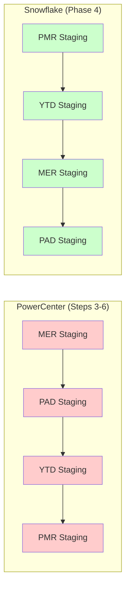
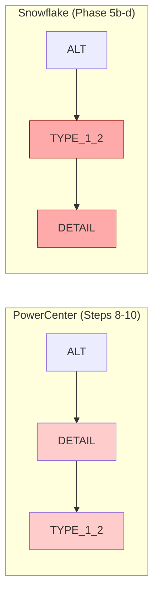
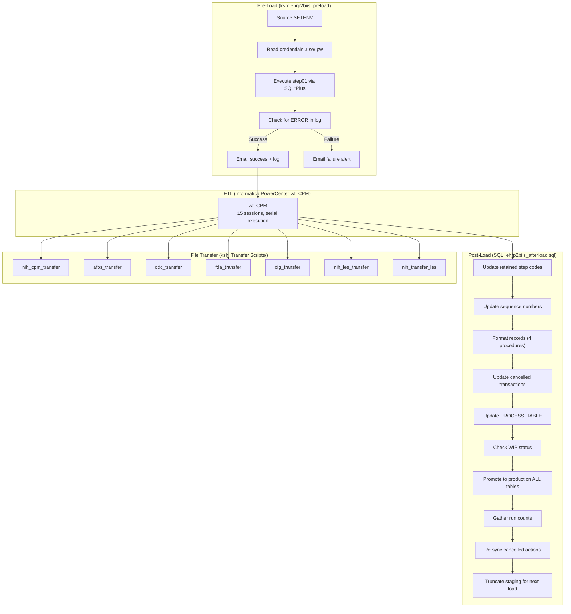

# Orchestration Validation: PowerCenter → Snowflake

## 1. Executive Summary

This document validates that the Snowflake `SP_CPM_ETL_ORCHESTRATOR` stored procedure faithfully reproduces the execution order, dependency graph, and error-handling semantics of the original Informatica PowerCenter `wf_CPM` workflow, KornShell (ksh) orchestration scripts, and the pre/post-load SQL.

**Verdict: Needs Review** — The Snowflake orchestrator correctly reproduces the critical path and overall execution order of the PowerCenter workflow. However, several gaps were identified that require manual review before production deployment.

| Category | Count |
|----------|-------|
| Execution-order mismatches | 2 |
| Error-handling gaps | 3 |
| Missing functionality | 3 |
| Total gaps | 8 |

---

## 2. Side-by-Side Execution Sequence

### 2.1 PowerCenter wf_CPM Workflow (from XML/CPM WORKFLOWLINK definitions)

The original workflow is defined in `XML/CPM` starting at line 31456. It contains 15 session task instances and 16 workflow links that form a strictly sequential dependency chain.

**Reconstructed Execution Order (from WORKFLOWLINK edges):**

| Step | PowerCenter Session | FAIL_PARENT_IF_FAILS |
|------|---------------------|---------------------|
| 1 | Start | — |
| 2 | s_CPM_Current_Pay_Period | YES |
| 3 | s_CPM_Load_CPM_MER_Staging_Tables | YES |
| 4 | s_CPM_Load_CPM_PAD_Staging_Tables | YES |
| 5 | s_CPM_Load_CPM_YTD_Staging_Tables | YES |
| 6 | s_CPM_Load_CPM_PMR_Staging_Tables | YES |
| 7 | s_CPM_Load_CPM_NEWPAY_STG_YTD_STATE_TBL | YES |
| 8 | s_CPM_Load_CPM_NEWPAY_STG_ALT_TBL | YES |
| 9 | s_CPM_Load_CPM_NEWPAY_STG_DETAIL_TBL | YES |
| 10 | s_CPM_Load_CPM_NEWPAY_STG_TYPE_1_2_TBL | YES |
| 11 | s_CPM_Load_CPM_NEWPAY_STG_TYPE_3_FDR_TBL | NO |
| 12 | s_CPM_Load_From_FDR_CPM_NEWPAY_STG_TYPE_3_TBL | YES |
| 13 | s_CPM_Load_FDR_CPM_NEWPAY_TBL | YES |
| 14 | s_CPM_Load_CPM_NEWPAY_TBL | YES |
| 15 | s_CPM_Build_Message_Counters | YES |
| 16 | s_CPM_Send_Counts | NO |

### 2.2 Snowflake SP_CPM_ETL_ORCHESTRATOR (from stored_procedures/sp_cpm_etl_orchestrator.sql)

| Phase | Step | Snowflake Procedure Call | v_step label |
|-------|------|------------------------|-------------|
| 1 | 1 | SP_EHRP2BIIS_PRELOAD() | PRELOAD |
| 2 | 2 | COPY INTO YTD_FILE_RAW | STAGE_FLAT_FILES |
| 2 | 3 | COPY INTO MER_FILE_RAW | STAGE_FLAT_FILES |
| 2 | 4 | COPY INTO PAYMASTER_THREE_RAW | STAGE_FLAT_FILES |
| 2 | 5 | COPY INTO PAYMASTER_FILE_RAW | STAGE_FLAT_FILES |
| 2 | 6 | COPY INTO PAD_FILE_RAW | STAGE_FLAT_FILES |
| 3 | 7 | SP_CPM_CURRENT_PAY_PERIOD() | CURRENT_PAY_PERIOD |
| 4 | 8 | SP_CPM_LOAD_CPM_PMR_STAGING_TABLES() | LOAD_PMR_STAGING |
| 4 | 9 | SP_CPM_LOAD_CPM_YTD_STAGING_TABLES() | LOAD_YTD_STAGING |
| 4 | 10 | SP_CPM_LOAD_CPM_MER_STAGING_TABLES() | LOAD_MER_STAGING |
| 4 | 11 | SP_CPM_LOAD_CPM_PAD_STAGING_TABLES() | LOAD_PAD_STAGING |
| 5 | 12 | SP_CPM_LOAD_CPM_NEWPAY_STG_YTD_STATE_TBL() | LOAD_NEWPAY_STG_YTD_STATE |
| 5 | 13 | SP_CPM_LOAD_CPM_NEWPAY_STG_ALT_TBL() | LOAD_NEWPAY_STG_ALT |
| 5 | 14 | SP_CPM_LOAD_CPM_NEWPAY_STG_TYPE_1_2_TBL() | LOAD_NEWPAY_STG_TYPE_1_2 |
| 5 | 15 | SP_CPM_LOAD_CPM_NEWPAY_STG_DETAIL_TBL() | LOAD_NEWPAY_STG_DETAIL |
| 6 | 16 | SP_CPM_LOAD_CPM_NEWPAY_STG_TYPE_3_FDR_TBL() | LOAD_NEWPAY_STG_TYPE_3_FDR |
| 6 | 17 | SP_CPM_LOAD_CPM_NEWPAY_STG_TYPE_3_TBL() | LOAD_NEWPAY_STG_TYPE_3 |
| 7 | 18 | SP_CPM_LOAD_PMR_TO_CPM_NEWPAY_TBL() | LOAD_PMR_TO_NEWPAY |
| 7 | 19 | SP_CPM_LOAD_FDR_CPM_NEWPAY_TBL() | LOAD_FDR_TO_NEWPAY |
| 8 | 20 | SP_CPM_BUILD_MESSAGE_COUNTERS() | BUILD_MESSAGE_COUNTERS |
| 9 | 21 | SP_EHRP2BIIS_AFTERLOAD() | AFTERLOAD |

### 2.3 Mapping Comparison

| # | PowerCenter Session | Snowflake Procedure | Match? |
|---|---------------------|---------------------|--------|
| 1 | *(no pre-load in workflow)* | SP_EHRP2BIIS_PRELOAD | **Added** (was separate ksh script) |
| 2 | s_CPM_Current_Pay_Period | SP_CPM_CURRENT_PAY_PERIOD | **Yes** |
| 3 | s_CPM_Load_CPM_MER_Staging_Tables | SP_CPM_LOAD_CPM_MER_STAGING_TABLES | **Yes** |
| 4 | s_CPM_Load_CPM_PAD_Staging_Tables | SP_CPM_LOAD_CPM_PAD_STAGING_TABLES | **Yes** |
| 5 | s_CPM_Load_CPM_YTD_Staging_Tables | SP_CPM_LOAD_CPM_YTD_STAGING_TABLES | **Yes** |
| 6 | s_CPM_Load_CPM_PMR_Staging_Tables | SP_CPM_LOAD_CPM_PMR_STAGING_TABLES | **Yes** |
| 7 | s_CPM_Load_CPM_NEWPAY_STG_YTD_STATE_TBL | SP_CPM_LOAD_CPM_NEWPAY_STG_YTD_STATE_TBL | **Yes** |
| 8 | s_CPM_Load_CPM_NEWPAY_STG_ALT_TBL | SP_CPM_LOAD_CPM_NEWPAY_STG_ALT_TBL | **Yes** |
| 9 | s_CPM_Load_CPM_NEWPAY_STG_DETAIL_TBL | SP_CPM_LOAD_CPM_NEWPAY_STG_DETAIL_TBL | **Yes** |
| 10 | s_CPM_Load_CPM_NEWPAY_STG_TYPE_1_2_TBL | SP_CPM_LOAD_CPM_NEWPAY_STG_TYPE_1_2_TBL | **Yes** |
| 11 | s_CPM_Load_CPM_NEWPAY_STG_TYPE_3_FDR_TBL | SP_CPM_LOAD_CPM_NEWPAY_STG_TYPE_3_FDR_TBL | **Yes** |
| 12 | s_CPM_Load_From_FDR_CPM_NEWPAY_STG_TYPE_3_TBL | SP_CPM_LOAD_CPM_NEWPAY_STG_TYPE_3_TBL | **Yes** |
| 13 | s_CPM_Load_FDR_CPM_NEWPAY_TBL | SP_CPM_LOAD_FDR_CPM_NEWPAY_TBL | **Yes** |
| 14 | s_CPM_Load_CPM_NEWPAY_TBL | SP_CPM_LOAD_PMR_TO_CPM_NEWPAY_TBL | **Yes** |
| 15 | s_CPM_Build_Message_Counters | SP_CPM_BUILD_MESSAGE_COUNTERS | **Yes** |
| 16 | s_CPM_Send_Counts | *(missing)* | **Gap** |
| — | *(no post-load in workflow)* | SP_EHRP2BIIS_AFTERLOAD | **Added** (was separate SQL script) |

---

## 3. Dependency Analysis

### 3.1 PowerCenter Dependency Chain (from WORKFLOWLINK edges)

The workflow link conditions are all `$<TaskName>.Status = Succeeded`, forming a strict serial chain:

```
Start
  └─► s_CPM_Current_Pay_Period
        └─► s_CPM_Load_CPM_MER_Staging_Tables
              └─► s_CPM_Load_CPM_PAD_Staging_Tables
                    └─► s_CPM_Load_CPM_YTD_Staging_Tables
                          └─► s_CPM_Load_CPM_PMR_Staging_Tables
                                └─► s_CPM_Load_CPM_NEWPAY_STG_YTD_STATE_TBL
                                      └─► s_CPM_Load_CPM_NEWPAY_STG_ALT_TBL
                                            └─► s_CPM_Load_CPM_NEWPAY_STG_DETAIL_TBL
                                                  └─► s_CPM_Load_CPM_NEWPAY_STG_TYPE_1_2_TBL
                                                        └─► s_CPM_Load_CPM_NEWPAY_STG_TYPE_3_FDR_TBL
                                                              └─► s_CPM_Load_From_FDR_CPM_NEWPAY_STG_TYPE_3_TBL
                                                                    └─► s_CPM_Load_FDR_CPM_NEWPAY_TBL
                                                                          └─► s_CPM_Load_CPM_NEWPAY_TBL
                                                                                └─► s_CPM_Build_Message_Counters
                                                                                      └─► s_CPM_Send_Counts
```

**Key observation:** The PowerCenter workflow is entirely sequential — every session waits for its predecessor to succeed before executing. There is no parallelism in the original workflow despite some stages having logically independent data flows.

### 3.2 Snowflake Execution Order

The Snowflake orchestrator (`SP_CPM_ETL_ORCHESTRATOR`) is also strictly sequential — all `CALL` statements execute one after another within a single stored procedure. However, the execution order differs from PowerCenter in two places:

**Difference 1 — First-Level Staging Order:**
| Position | PowerCenter Order | Snowflake Order |
|----------|------------------|----------------|
| After Current Pay Period | MER → PAD → YTD → PMR | PMR → YTD → MER → PAD |

- **PowerCenter:** Current_Pay_Period → MER → PAD → YTD → PMR
- **Snowflake:** Current_Pay_Period → PMR → YTD → MER → PAD

**Impact:** Low risk. These four staging loads read from independent flat-file sources (PAYMASTER_FILE_RAW, YTD_FILE_RAW, MER_FILE_RAW, PAD_FILE_RAW) and write to non-overlapping staging tables. The reordering does not break any data dependency, but it deviates from the original execution sequence.

**Difference 2 — NEWPAY Staging Order:**
| Position | PowerCenter Order | Snowflake Order |
|----------|------------------|----------------|
| After PMR Staging | YTD_STATE → ALT → DETAIL → TYPE_1_2 | YTD_STATE → ALT → TYPE_1_2 → DETAIL |

- **PowerCenter:** YTD_STATE → ALT → DETAIL → TYPE_1_2
- **Snowflake:** YTD_STATE → ALT → TYPE_1_2 → DETAIL

**Impact:** Needs review. `s_CPM_Load_CPM_NEWPAY_STG_TYPE_1_2_TBL` uses lookups against DETAIL staging data. In PowerCenter, DETAIL is loaded before TYPE_1_2. In Snowflake, TYPE_1_2 runs before DETAIL. If `SP_CPM_LOAD_CPM_NEWPAY_STG_TYPE_1_2_TBL` reads from `CPM_NEWPAY_STG_DETAIL_TBL`, this swap could produce incorrect results because DETAIL has not yet been populated.

### 3.3 Dependency Match Summary

| Dependency | PowerCenter | Snowflake | Status |
|-----------|-------------|-----------|--------|
| Pre-load before all sessions | External ksh script | Phase 1: SP_EHRP2BIIS_PRELOAD | **Match** |
| Flat-file ingestion before staging | External (pmcmd/Informatica native) | Phase 2: COPY INTO statements | **Match** |
| Current Pay Period before staging | Start → s_CPM_Current_Pay_Period | Phase 3: SP_CPM_CURRENT_PAY_PERIOD | **Match** |
| First-level staging after pay period | Sequential chain (different order) | Phase 4: Sequential (different order) | **Reordered** |
| Second-level staging after first-level | Sequential chain (different order) | Phase 5: Sequential (different order) | **Reordered** |
| Type 3 FDR before Type 3 | WORKFLOWLINK explicit | Phase 6: Sequential | **Match** |
| FDR NEWPAY before PMR NEWPAY | WORKFLOWLINK explicit | Phase 7: Sequential | **Match** |
| NEWPAY_TBL before Build Counters | WORKFLOWLINK explicit | Phase 8 after Phase 7 | **Match** |
| Post-load after all sessions | External SQL script | Phase 9: SP_EHRP2BIIS_AFTERLOAD | **Match** |

---

## 4. Error Handling Comparison

### 4.1 PowerCenter Error Handling

| Mechanism | Implementation |
|-----------|---------------|
| **FAIL_PARENT_IF_INSTANCE_FAILS** | Most sessions set to YES (workflow aborts on failure). Two exceptions: `s_CPM_Load_CPM_NEWPAY_STG_TYPE_3_FDR_TBL` (NO) and `s_CPM_Send_Counts` (NO) |
| **FAIL_PARENT_IF_INSTANCE_DID_NOT_RUN** | All sessions set to NO |
| **SUSPEND_ON_ERROR** | Workflow-level: NO (no suspend, immediate failure) |
| **WORKFLOWLINK conditions** | All links use `$<TaskName>.Status = Succeeded` (downstream tasks only run on success) |
| **Email notifications** | KornShell scripts send emails on success/failure via `mailx` |
| **Log files** | KornShell scripts write to `/home/sa-biisint/data/int/log/` with timestamped filenames |

### 4.2 Snowflake Error Handling

| Mechanism | Implementation |
|-----------|---------------|
| **Exception handler** | `WHEN OTHER THEN` block logs to ERROR_TBL and re-raises |
| **Step tracking** | `v_step` variable records current phase for diagnostics |
| **Error logging** | Inserts to ERROR_TBL with (PROCESS_NAME, ERROR_MESSAGE, ERROR_DATE) |
| **Error message truncation** | `LEFT(..., 200)` truncates error messages to 200 chars |
| **COPY INTO ON_ERROR** | Set to CONTINUE (does not abort on bad rows during file ingestion) |

### 4.3 Gap Analysis — Error Handling

| # | Gap | Severity | Details |
|---|-----|----------|---------|
| **E1** | No email/notification on failure | Medium | PowerCenter ksh scripts send emails via `mailx` on both success and failure. The Snowflake orchestrator only logs to ERROR_TBL. No notification mechanism exists. Consider Snowflake notification integrations or external monitoring. |
| **E2** | Missing non-fatal error tolerance for FDR Type 3 | Medium | In PowerCenter, `s_CPM_Load_CPM_NEWPAY_STG_TYPE_3_FDR_TBL` has `FAIL_PARENT_IF_INSTANCE_FAILS="NO"`, meaning the workflow continues if this session fails. In Snowflake, a failure in `SP_CPM_LOAD_CPM_NEWPAY_STG_TYPE_3_FDR_TBL` would trigger the exception handler and abort the entire pipeline. The orchestrator should wrap this call in a BEGIN/EXCEPTION block to match the original non-fatal behavior. |
| **E3** | Error message truncation | Low | Error messages are truncated to 200 characters. For complex SQL errors, this may lose diagnostic detail. Consider increasing to 4000 or logging the full SQLERRM to a VARIANT column. |

---

## 5. Gap Analysis

### 5.1 Functional Gaps

| # | Gap | Category | Severity | Details |
|---|-----|----------|----------|---------|
| **G1** | s_CPM_Send_Counts session not migrated | Missing | Medium | The PowerCenter workflow includes `s_CPM_Send_Counts` which sends the message counters file via email. This session has no corresponding Snowflake procedure. The counters are built by `SP_CPM_BUILD_MESSAGE_COUNTERS` but never dispatched. |
| **G2** | Transfer scripts not migrated | Missing | Medium | Seven ksh transfer scripts (`nih_cpm_transfer`, `afps_transfer`, `cdc_transfer`, `fda_transfer`, `oig_transfer`, `nih_les_transfer`, `nih_transfer_les`) handle SFTP file delivery to `m1csv301.hhs.gov`. These have no Snowflake equivalent. File distribution must be handled externally or via Snowflake external functions. |
| **G3** | Pre-load ksh orchestration (ehrp2biis_preload) credential handling | Missing | Low | The original ksh script reads database credentials from `.use`/`.pw` files and invokes SQL*Plus. The Snowflake procedure uses `EXECUTE AS CALLER` authentication. The credential management approach is fundamentally different but functionally equivalent for the ETL logic. |

### 5.2 Ordering Gaps (from Section 3.2)

| # | Gap | Category | Severity | Details |
|---|-----|----------|----------|---------|
| **G4** | First-level staging order differs | Reordering | Low | MER→PAD→YTD→PMR (PowerCenter) vs PMR→YTD→MER→PAD (Snowflake). No data dependency impact — these read from independent sources. |
| **G5** | NEWPAY staging DETAIL vs TYPE_1_2 swap | Reordering | High | DETAIL loaded before TYPE_1_2 in PowerCenter; TYPE_1_2 before DETAIL in Snowflake. If TYPE_1_2 references DETAIL data, this could produce incorrect results. **Requires verification of data dependencies in SP_CPM_LOAD_CPM_NEWPAY_STG_TYPE_1_2_TBL.** |

### 5.3 Error Handling Gaps (from Section 4.3)

| # | Gap | Category | Severity | Details |
|---|-----|----------|----------|---------|
| **G6** | No email notifications | Error handling | Medium | See E1 |
| **G7** | FDR Type 3 non-fatal behavior not preserved | Error handling | Medium | See E2 |
| **G8** | Error message truncation | Error handling | Low | See E3 |

### 5.4 Overall Gap Summary

| Severity | Count | Gaps |
|----------|-------|------|
| High | 1 | G5 |
| Medium | 4 | G1, G2, G6, G7 |
| Low | 3 | G3, G4, G8 |
| **Total** | **8** | |

---

## 6. Mermaid Diagrams

### 6.1 PowerCenter wf_CPM Workflow (Original)


> Yellow nodes indicate sessions with `FAIL_PARENT_IF_INSTANCE_FAILS = NO` (non-fatal).

### 6.2 Snowflake SP_CPM_ETL_ORCHESTRATOR (Migration)

```mermaid
graph TD
    subgraph "Snowflake SP_CPM_ETL_ORCHESTRATOR"
        P1["Phase 1: PRELOAD<br/>SP_EHRP2BIIS_PRELOAD"]
        P2["Phase 2: STAGE_FLAT_FILES<br/>COPY INTO (5 tables)"]
        P3["Phase 3: CURRENT_PAY_PERIOD<br/>SP_CPM_CURRENT_PAY_PERIOD"]
        P4A["Phase 4a: LOAD_PMR_STAGING"]
        P4B["Phase 4b: LOAD_YTD_STAGING"]
        P4C["Phase 4c: LOAD_MER_STAGING"]
        P4D["Phase 4d: LOAD_PAD_STAGING"]
        P5A["Phase 5a: LOAD_NEWPAY_STG_YTD_STATE"]
        P5B["Phase 5b: LOAD_NEWPAY_STG_ALT"]
        P5C["Phase 5c: LOAD_NEWPAY_STG_TYPE_1_2"]
        P5D["Phase 5d: LOAD_NEWPAY_STG_DETAIL"]
        P6A["Phase 6a: LOAD_NEWPAY_STG_TYPE_3_FDR"]
        P6B["Phase 6b: LOAD_NEWPAY_STG_TYPE_3"]
        P7A["Phase 7a: LOAD_PMR_TO_NEWPAY"]
        P7B["Phase 7b: LOAD_FDR_TO_NEWPAY"]
        P8["Phase 8: BUILD_MESSAGE_COUNTERS"]
        P9["Phase 9: AFTERLOAD<br/>SP_EHRP2BIIS_AFTERLOAD"]

        P1 --> P2 --> P3
        P3 --> P4A --> P4B --> P4C --> P4D
        P4D --> P5A --> P5B --> P5C --> P5D
        P5D --> P6A --> P6B
        P6B --> P7A --> P7B
        P7B --> P8 --> P9
    end

    style P1 fill:#adf,stroke:#08a
    style P9 fill:#adf,stroke:#08a
```



> Blue nodes indicate procedures added in migration that were not part of the original PowerCenter workflow (pre/post-load).

### 6.3 Side-by-Side Comparison — Critical Path Differences





> Red-highlighted Snowflake nodes indicate the swapped DETAIL/TYPE_1_2 order (Gap G5).

### 6.4 Full Pipeline — KornShell + PowerCenter + Post-Load (Original)



---

## 7. Recommendations

### 7.1 Critical (must fix before production)

1. **G5 — Verify and fix DETAIL/TYPE_1_2 ordering.** Examine `SP_CPM_LOAD_CPM_NEWPAY_STG_TYPE_1_2_TBL` for any references to `CPM_NEWPAY_STG_DETAIL_TBL`. If found, swap the call order in the orchestrator so DETAIL executes before TYPE_1_2, matching PowerCenter. If TYPE_1_2 does not reference DETAIL data, document the safe reordering.

### 7.2 High Priority

2. **G7 — Wrap FDR Type 3 call in non-fatal exception handler.** In the orchestrator, wrap the `SP_CPM_LOAD_CPM_NEWPAY_STG_TYPE_3_FDR_TBL` call in a BEGIN/EXCEPTION block that logs the error but allows the pipeline to continue, matching the `FAIL_PARENT_IF_INSTANCE_FAILS = NO` behavior.

3. **G1 — Implement SP_CPM_Send_Counts or equivalent.** The message counters file is generated but never dispatched. Add a procedure to write counters to a Snowflake stage for external pickup or use a Snowflake notification integration.

### 7.3 Medium Priority

4. **G6 — Add notification mechanism.** Implement Snowflake email notifications or external alerts for pipeline success/failure events.

5. **G2 — Plan file transfer replacement.** The seven SFTP transfer scripts need an external replacement (e.g., Snowflake external functions, a lightweight orchestration layer, or Snowflake file-export-to-stage for external pickup).

### 7.4 Low Priority

6. **G4 — Document the first-level staging reorder.** Since there is no data dependency impact, simply document that the order was intentionally changed for the audit trail.

7. **G8 — Increase error message length.** Change `LEFT(..., 200)` to `LEFT(..., 4000)` in all exception handlers.

---

## 8. Appendix: Source Artifacts Analyzed

| Artifact | Path | Lines | Type |
|----------|------|-------|------|
| CPM PowerCenter XML | XML/CPM | 33,591 | Informatica POWERMART XML |
| ehrp2biis_preload | ehrp2biis_preload | 71 | KornShell (ksh) |
| actstage_load | actstage_load | 66 | KornShell (ksh) |
| ehrp2biis_afterload.sql | ehrp2biis_afterload.sql | 288 | Oracle SQL |
| nih_cpm_transfer | Transfer Scripts/nih_cpm_transfer | 41 | KornShell (ksh) |
| afps_transfer | Transfer Scripts/afps_transfer | 43 | KornShell (ksh) |
| cdc_transfer | Transfer Scripts/cdc_transfer | 43 | KornShell (ksh) |
| fda_transfer | Transfer Scripts/fda_transfer | 43 | KornShell (ksh) |
| oig_transfer | Transfer Scripts/oig_transfer | 42 | KornShell (ksh) |
| nih_les_transfer | Transfer Scripts/nih_les_transfer | 43 | KornShell (ksh) |
| nih_transfer_les | Transfer Scripts/nih_transfer_les | 42 | KornShell (ksh) |
| SP_CPM_ETL_ORCHESTRATOR | snowflake_migration/stored_procedures/sp_cpm_etl_orchestrator.sql | 143 | Snowflake SQL |
| SP_EHRP2BIIS_PRELOAD | snowflake_migration/stored_procedures/sp_ehrp2biis_preload.sql | 77 | Snowflake SQL |
| SP_EHRP2BIIS_AFTERLOAD | snowflake_migration/stored_procedures/sp_ehrp2biis_afterload.sql | 218 | Snowflake SQL |
| INFORMATICA_MIGRATION_RUNBOOK | snowflake_migration/INFORMATICA_MIGRATION_RUNBOOK.md | 341 | Markdown |
